# Лабораторная работа №1 - эмпирический анализ локальных LLM

## Описание работы

В рамках лабораторной работы необходимо было развернуть три большие языковые модели из разных семейств с доступом через OpenAI-совместимый REST API и провести их эмпирическое сравнение.

Для каждой модели требовалось подготовить и выполнить три типа запросов на русском языке:

1. **Генерация текста** — создание текста заданного формата и содержания.
2. **Классификация** — отнесение входных текстов к одному из заранее заданных классов.
3. **Извлечение, суммаризация или переформулирование** — обработка предоставленного текста с получением структурированного или сокращённого результата.

Каждый запрос выполнялся в двух режимах:

- **базовом** — с параметрами генерации по умолчанию;
- **настроенном** — с изменением как минимум двух параметров генерации, например `temperature`, `max_tokens`, `top_p`, `top_k` или `repeat_penalty`.

Все ответы моделей необходимо было сохранить и сравнить по качественным и количественным характеристикам. Анализ включал длину ответов, соответствие заданию, стабильность и повторяемость генерации, наличие ошибок и галлюцинаций, а также технические показатели: время отклика, количество входных и выходных токенов и скорость обработки и генерации токенов.

## Использованные модели

### Описание выбранных моделей

Для эксперимента были выбраны три компактные языковые модели из разных семейств: **Qwen, Gemma и Phi**. Все они основаны на архитектуре *decoder-only Transformer*, однако различаются механизмами внимания, организацией нейросетевых блоков и подходами к оптимизации вычислений.

- **Qwen3.5-4B (Alibaba)** — модель с 4 млрд параметров, использующая гибридную архитектуру внимания. Она сочетает *Gated DeltaNet* (линейное внимание) и традиционное *Full Attention* в соотношении 3:1. Такой подход позволяет эффективнее обрабатывать длинные последовательности. Модель также поддерживает мультимодальный ввод, включая изображения.

- **Gemma-4-E2B-it (Google)** — компактная instruction-tuned модель с 2,3 млрд эффективных параметров (около 5,1 млрд с учётом эмбеддингов). Использует чередование локального *Sliding Window Attention* и глобального *Full Attention*, а также механизм *Per-Layer Embeddings (PLE)* для повышения эффективности небольших моделей. Поддерживает работу с текстом, изображениями и аудио.

- **Phi-4-mini-instruct (Microsoft)** — текстовая модель с 3,8 млрд параметров, основанная на более традиционной плотной (*Dense*) архитектуре Transformer. Использует *Grouped-Query Attention (GQA)* для сокращения затрат памяти при обработке контекста. Ориентирована на эффективное выполнение инструкций, логические рассуждения, математические задачи и программирование.

### Версии весов моделей

Все модели использовались в формате **GGUF** с посттренировочным квантованием (**PTQ**) по схеме **Q4_K_M**, что позволяет уменьшить потребление памяти и обеспечить локальный запуск моделей без дополнительного обучения. Таким образом, выбор обеспечивает сравнение моделей трёх независимых семейств с различными архитектурными особенностями в близких условиях локального запуска. В качестве реализации квантования взяты версии весов от **Unsloth**, т.е. все три модели квантовались в рамках одного фреймворка. Методологически более чистым выбором было бы взять реализации квантизаций от другого популярного автора *Bartkoswki*, чья квантизация гаранитирует полную методологическую идентичность конвеера квантизации для всех семейств моделей. Но итоговый выбор был сделан в пользу *Unsloth* по причине большей компактности моделей эквивалентной степени квантизации, а так же из-за наличия фиксов в системных промптах для модели `Phi-4-mini-instruct` в версии от *Unlsoth* (и сохранении единого источника квантованных весов). Таблица с ссылками на выбранные модели представлена ниже.

| Model Family | Model Name          | Model Version     | Link                                                          |
|--------------|---------------------|-------------------|---------------------------------------------------------------|
| Qwen         | Qwen3.5-4B          | Q4_K_M            | [hf](https://huggingface.co/unsloth/Qwen3.5-4B-GGUF)          |
| Gemma        | Gemma-4-E2B-it      | Q4_K_M            | [hf](https://huggingface.co/unsloth/gemma-4-E2B-it-GGUF)      |
| Phi          | Phi-4-mini-instruct | Q4_K_M            | [hf](https://huggingface.co/unsloth/Phi-4-mini-instruct-GGUF) |

## Выбор движка для локального инференса

В качестве движка для локального развертывания моделей первоначально рассматривались `Ollama`, `llama.cpp`, `LM Studio`, `vLLM` и `SGLang`.

На первом этапе была протестирована `Ollama`, поскольку она позволяет быстро загрузить и запустить квантованные модели и предоставляет OpenAI-совместимый API. Однако для лабораторной работы было решено перейти к прямому использованию `llama.cpp`. Основной причиной стало то, что `Ollama` в значительной степени скрывает детали инференса за собственной оболочкой и системой распространения моделей, тогда как `llama.cpp` предоставляет более непосредственный доступ к настройкам запуска, параметрам генерации и метрикам производительности. Это оказалось особенно полезно для данной работы, где требовалось не только получать ответы моделей, но и измерять время обработки запросов, скорость генерации и другие характеристики инференса.

`LM Studio` также рассматривалася, как удобный вариант для локального запуска моделей, однако ее основное преимущество связано с графическим интерфейсом, который для автоматизированного проведения серии экспериментов не являлся необходимым. `vLLM` и `SGLang`, напротив, представляют интерес как более производительные серверные решения с собственными механизмами планирования и обработки запросов, однако для первого этапа работы они были сочтены избыточными по сложности.

Таким образом, в качестве основного движка была выбрана `llama.cpp`. Она обеспечивает достаточно низкоуровневый контроль над инференсом, поддерживает GGUF-модели и квантование, предоставляет OpenAI-совместимый REST API и позволяет удобно собирать необходимые для лабораторной работы технические метрики.

## Описание промптов к заданиям

Промпты к каждому заданию представлены в папке `prompts/`. Коротко про каждый промпт.

### Генерация текста

Для первого задания подготовлен промпт с формулировкой основного задания, списком основных позиций, которые должны быть выражены в конечном тексте и короткими правилами форматирования генеруемого текста. Суть задания - написать небольшой пост с отзывом на эпизод сериала с описанием впечатлений и мнения автора после просмотра серии, похожий на те, что пишут люди в твиттере или телеграме. [Ссылка на промпт](../prompts/p1_generation.md).

Данное задание проверят, как хорошо модель следует инструкциям, выдерживает заданные рамки содержания текста, и как в целом справляется с написанием небольших текстов по заданному контексту.

**Замечание**: в промпте данного задания имеется опечатка в 9-ом пункте, где вместо слова `актерскую (игру)` написано `актурскую`. Опечатка не исправлялась, и эксперименты из-за этого заново не прогонялись. Контекста 9-го пункта все еще должно было быть достаточно, чтобы определить ошибку и восстановить неправильное слово. С другой стороны, наличие такой опечатки позволяет оценить, как модели справляются с подобными огрехами во входных запросах, и может ли такая незначительная опечатка повлиять на качество генерации.

### Классиификация (zero-shot)

Второй промпт в самом начале коротко описывает задание - классификацию текстов пользовательских отзывов на фильмы - затем доступные для разметки классы и список из 18 отзывов на русском языке. Отзывы были взяты случайным образом из [датасета отзывов с кинопоиска](https://huggingface.co/datasets/blinoff/kinopoisk). В качестве метки классов брались значения признака `grade3`. Для каждой из трех возможных значений данного признака извлекалось случайным образом вручную по 6 соответствующих отзывов. Для оценки качества классификации оригинальная разметка отзывов сохранялась в отдельный [текстовый файл](../prompts/p2_answers.txt). [Ссылка на сам промпт](../prompts/p2_classification.md).

Данное задание проверяет навыки модели в zero-shot классификации, т.е. как хорошо модель способна выполнять классификацию новых (скорее всего ранее не встречавшихся при обучении модели) данных с четким заданием категорий.

### Суммаризация

Из доступных опций в третьем задании была выбрана суммаризация. Суммаризация, как задание, по своей сути интереснее для человека, чем банальное извлечение сущностей из текста. А в сравнении с переформулированием, требует не простого повторения мысли, а ее компактизации, что требует лучшего осмысления и понимания прочитанного. В целом, суммаризация - извлечение сути из прочитанного - естественный навык любого человека, поэтому проверить, как с таким заданием справляется языковая модель кажется интереснее, чем проверка тех навыков, которые затрагивают два других задания. Коротко - суммаризация является более комплексным навыком, чем извлечение сущностей или перефразирование.

Для суммаризации был взят относительно небольшой отзыв пользователя из **X** на все тот же сериал, что был задействован в первом задании, но рецензия пользователя была составлена на другой эпизод. В данном задании проверяется, как хорошо модель выделяет все ключевые мысли и позиции автора, не придумывает ли того, чего в исходном тексте не было (не галлюцинирует) и, как и в первом задании, как модель справляется с написанием коротких текстов при наличие контекста и инструкций.

## Выбранные конфигурации настроек

В качестве альтернативных настроек генерации в движке было подготовлено три пресета настроек (вместе с дефолтными настройками - 4):

- `baseline` - дефолтные настройки движка: `temperature = 1.0`, `top_k = 64`, `top_p = 0.95`;
- `conservative` - настройки для более стабильные и менее вариативные генерации: `temperature = 0.2`, `top_k = 64`, `top_p = 0.8`;
- `top_k_focused` - аналог *conservative*-конфига, но через другой механизм ограничения случайности: `temperature = 0.5`, `top_k = 20`, `top_p = 0.95`;
- `creative` - более свободная и креативная генерация: `temperature = 1.1`, `top_k = 64`, `top_p = 0.98`.

Приведённые значения по умолчанию соответствуют серверу **Gemma 4**. Согласно сохранённым `metadata.json`, у **Phi-4-mini** и **Qwen3.5-4B** baseline использует `temperature = 0.8` и `top_k = 40` при том же `top_p = 0.95`. Пресеты conservative и creative переопределяют только temperature и top_p, поэтому top_k у этих двух моделей остаётся равным 40. В top_k_focused для всех трёх моделей задаются temperature = 0.5 и top_k = 20. При дальнейшем обсуждении учитываются эти фактические настройки запусков.

## Метрики для анализа

Для каждого измеряемого запроса сохраняются показатели объёма текста, задержки ответа и скорости инференса. Число токенов и тайминги обработки поступают из статистики `llama.cpp`, а TTFT и полное время запроса измеряются на стороне HTTP-клиента. Эти метрики позволяют сравнивать производительность моделей и влияние пресетов генерации.

| Показатель | Поле данных | Единицы | Значение для анализа |
| --- | --- | --- | --- |
| Входные токены | `prompt_tokens` | токены | Объём входного промпта, который должна обработать модель. |
| Выходные токены | `completion_tokens` | токены | Длина сгенерированного ответа и объём работы на этапе генерации. |
| Общее число токенов | `total_tokens` | токены | Сумма входных и выходных токенов. |
| TTFT (Time To First Token) | `ttft_ms` | мс | Задержка от отправки запроса до первого непустого текстового фрагмента; характеризует ожидание начала ответа. |
| Полное время запроса | `wall_time_ms` | мс | Время от отправки запроса до завершения чтения потока; характеризует ожидание готового ответа и включает обмен по HTTP. |
| Время обработки промпта (prefill) | `prompt_ms` | мс | Серверное время обработки входного контекста перед генерацией. |
| Скорость обработки промпта | `prompt_tokens_per_second` | токены/с | Производительность модели при обработке входного контекста. |
| Время на входной токен | `prompt_per_token_ms` | мс/токен | Среднее серверное время обработки одного токена промпта. |
| Время генерации (decode) | `generation_ms` | мс | Серверное время генерации ответа. |
| Скорость генерации | `generation_tokens_per_second` | токены/с | Скорость выдачи выходных токенов; позволяет сопоставлять генерацию ответов разной длины. |
| Время на выходной токен | `predicted_per_token_ms` | мс/токен | Среднее серверное время генерации одного выходного токена. |

Для временных показателей меньшие значения означают меньшую задержку, для скоростей — большие значения означают более высокую производительность. Полное время запроса рассматривается вместе с длиной ответа: более длинная генерация требует большего объёма работы. При сравнении числа токенов учитывается различие токенизаторов моделей.

По пяти повторам каждой комбинации модели, задания и пресета вычисляются **среднее и выборочное стандартное отклонение (std)**: среднее характеризует типичный результат, а std — разброс между запусками. Дополнительно сохраняются счётчики кешированных токенов `cached_tokens` и `cache_n` для контроля повторного использования контекста; в проведённых экспериментах они равны нулю, поскольку кеш промпта отключён.

## Реализация и воспроизведение экспериментов

### Структура проекта

Код запуска экспериментов, промпты, исходные результаты и материалы анализа разделены по каталогам:

```text
lab1/
├── src/
│   ├── globals.py            # пути, список заданий и пресеты генерации
│   ├── cli.py                # аргументы запуска и вывод прогресса
│   ├── server.py             # управление процессом сервера llama.cpp
│   ├── client.py             # HTTP-клиент и измерение времени запроса
│   └── run_experiments.py    # точка входа и выполнение серии экспериментов
├── prompts/
│   ├── p1_generation.md      # генерация текста
│   ├── p2_classification.md  # классификация отзывов
│   ├── p2_answers.txt        # эталонные метки для последующего анализа
│   ├── p2_orig.md            # оригинальные отзывы без перемешивания
│   └── p3_summary.md         # суммаризация
├── results/
│   ├── qwen3.5-4b/          # исходные результаты Qwen
│   ├── gemma4/              # исходные результаты Gemma
│   ├── phi-4-mini/          # исходные результаты Phi
│   └── report_materials/    # таблицы, графики и тексты ответов для отчёта
├── notebooks/
│   └── analysis.ipynb       # обработка сохранённых результатов и экспорт материалов
├── report/
│   └── report.md            # текст отчёта
├── pyproject.toml           # требования к Python и зависимости
├── uv.lock                  # зафиксированные версии зависимостей
└── .python-version          # используемая версия Python
```

Эксперименты запускаются через `src/run_experiments.py`. Один запуск работает с одной GGUF-моделью; для сравнения трёх семейств скрипт запускается последовательно три раза. Notebook выполняет последующую обработку сохранённых файлов. Файл `p2_answers.txt` используется при анализе качества классификации и не передаётся модели в запросах.

### Назначение модулей в src/

#### `globals.py`

[Модуль конфигурации](../src/globals.py) определяет корень проекта относительно собственного расположения, стандартные каталоги `prompts/` и `results/`, соответствие идентификаторов заданий файлам промптов и четыре пресета генерации:

| Пресет | Параметры, переопределяемые в запросе |
| --- | --- |
| `baseline` | Нет переопределений; используются настройки сервера по умолчанию |
| `conservative` | `temperature=0.2`, `top_p=0.8` |
| `top_k_focused` | `temperature=0.5`, `top_k=20` |
| `creative` | `temperature=1.1`, `top_p=0.98` |

Остальные sampling-параметры наследуются от серверной конфигурации. Поэтому для воспроизведения важны и пресет, и настройки по умолчанию конкретной модели: они сохраняются в `metadata.json` в ответе `/props`.

#### `cli.py`

[Модуль командной строки](../src/cli.py) разбирает аргументы с помощью `argparse`. Обязательны путь к весам `--model` и имя модели `--name`; остальные параметры задают количество повторов, начальный seed, каталог результатов, адрес сервера и размер контекста. Значение `--repeats` проверяется на положительность.

Для вывода используется библиотека `rich`: отображаются общий прогресс, текущие задание и пресет, seed, TTFT и скорость генерации. После каждой группы повторов выводится сводка со средним и выборочным стандартным отклонением TTFT, полного времени запроса, скорости генерации и числа выходных токенов.

#### `server.py`

[Модуль сервера](../src/server.py) содержит класс `LlamaServer`, управляющий отдельным процессом движка. Процесс запускается через `subprocess.Popen`, а его stdout и stderr записываются в `server.log`. К выбранной серверной команде добавляются путь к модели, адрес, порт, размер контекста и фиксированные параметры `--parallel 1`, `--no-cache-prompt`, `--reasoning off`.

Перед отправкой запросов модуль опрашивает `/health` каждые 0,5 секунды, ожидая готовности не более 120 секунд. Если процесс завершается раньше, запуск прекращается с ошибкой. Класс реализован, как контекстный менеджер: при выходе из блока сервер получает сигнал завершения, а если не останавливается за пять секунд — принудительно завершается. Затем закрывается файл журнала.

#### `client.py`

[Модуль клиента](../src/client.py) содержит `LlamaClient` на основе синхронного `httpx.Client`. Он получает свойства сервера через `GET /props`, считает входные токены через `POST /v1/chat/completions/input_tokens` и отправляет запросы генерации через `POST /v1/chat/completions`.

Генерация запрашивается в потоковом режиме SSE с передачей статистики usage. Клиент последовательно разбирает события `data:`, собирает текст из `delta.content` и сохраняет полученные `usage`, `timings`, `finish_reason` и идентификатор ответа. Для запросов явно передаются seed и параметры выбранного пресета.

Время измеряется с помощью `perf_counter_ns()`. **TTFT** — интервал от начала отправки запроса до первого непустого текстового фрагмента; **wall-clock time** — интервал до завершения чтения потока. Число токенов, время prefill и decode, а также скорости обработки и генерации берутся из статистики движка. Результат возвращается в структуре `CompletionResult`; отсутствие обязательных блоков `usage` или `timings` вызывает ошибку.

#### `run_experiments.py`

[Основной скрипт](../src/run_experiments.py) связывает конфигурацию, CLI, сервер и клиент. Он проверяет наличие модели и непустых файлов промптов, подготавливает каталог результатов, запускает сервер и сохраняет его свойства. Для каждого промпта предварительно вычисляется число входных токенов; запрос отклоняется, если оно достигает или превышает заданный размер контекста.

В текущей реализации перед измерениями выполняются **два warm-up запроса** (я забыл удалить один после добавления *rich*) с текстом «Ответь одним словом: готов.» и ограничением `max_tokens=8`. Их результаты не записываются в экспериментальные данные.

Далее выполняется последовательный обход **задание → пресет → повтор**. В каждом запросе промпт передаётся одним сообщением с ролью `user`. Seed определяется как `base_seed + repetition_index`, поэтому при стандартных настройках каждая комбинация задания и пресета использует одинаковую последовательность `42, 43, 44, 45, 46`. После ответа проверяется отсутствие повторного использования кеша промпта, а запись немедленно добавляется в `runs.jsonl`.

В начале работы создаётся `metadata.json`, затем его статус изменяется на `running` и, при успешном завершении, на `completed`. При ошибке в основном процессе записываются статус `failed`, время завершения и описание ошибки. Уже сохранённые записи прогонов остаются в JSONL-файле.

### Запуск экспериментов и ожидаемый результат

Для воспроизведения нужны Python **3.13 или новее**, менеджер окружения **uv**, установленный сервер **llama.cpp** и GGUF-файлы выбранных моделей в квантовании **Q4_K_M**. В сохранённых экспериментах использовалась команда `llama serve` и сборка движка **b11046-60081bb2b**. Для наиболее близкого воспроизведения следует использовать ту же сборку и те же файлы весов. Сервер должен поддерживать `/props`, подсчёт входных токенов и передачу `usage` и `timings` в потоковом ответе.

Все команды ниже выполняются **из корня проекта**. Сначала необходимо установить зависимости:

```bash
uv sync
```

Доступные аргументы запуска можно посмотреть без загрузки модели:

```bash
uv run python src/run_experiments.py --help
```

В следующих командах нужно заменить `/path/to/models` на каталог с весами. Результаты направлены в отдельный каталог `results_reproduced/`, чтобы сохранить исходные данные в `results/`.

```bash
uv run python src/run_experiments.py \
  --model "/path/to/models/Qwen3.5-4B-Q4_K_M.gguf" \
  --name qwen3.5-4b \
  --repeats 5 \
  --base-seed 42 \
  --context-size 4096 \
  --output results_reproduced/qwen3.5-4b

uv run python src/run_experiments.py \
  --model "/path/to/models/gemma-4-E2B-it-Q4_K_M.gguf" \
  --name gemma4 \
  --repeats 5 \
  --base-seed 42 \
  --context-size 4096 \
  --output results_reproduced/gemma4

uv run python src/run_experiments.py \
  --model "/path/to/models/Phi-4-mini-instruct-Q4_K_M.gguf" \
  --name phi-4-mini \
  --repeats 5 \
  --base-seed 42 \
  --context-size 4096 \
  --output results_reproduced/phi-4-mini
```

Скрипт самостоятельно запускает и останавливает сервер. По умолчанию используются адрес `127.0.0.1`, порт `9931` и промпты из `prompts/`. Если установлен отдельный исполняемый файл `llama-server`, серверную команду можно заменить аргументом `--server-command "llama-server"` или указать полный путь к нему. Для изменения расположения промптов предусмотрен `--prompts-dir`.

При отсутствии `--output` результаты записываются в `results/<model-name>/`. Если выбранный каталог уже содержит `metadata.json`, `runs.jsonl` или `server.log`, скрипт откажется продолжать. Для повторного запуска следует выбрать новый каталог; параметр `--overwrite` позволяет явно удалить эти три файла перед началом новой серии.

При успешном выполнении для каждой модели создаётся следующий набор файлов:

```text
results_reproduced/<model-name>/
├── metadata.json
├── runs.jsonl
└── server.log
```

| Файл | Содержимое |
| --- | --- |
| `metadata.json` | Путь и имя модели, параметры эксперимента, свойства и настройки сервера, полные тексты промптов и число входных токенов, время начала и завершения, итоговый статус |
| `runs.jsonl` | По одной JSON-записи на измеряемый прогон: модель, задание, пресет, номер повтора, seed, параметры запроса, ответ, метрики, исходные `usage` и `timings` |
| `server.log` | Журнал процесса llama.cpp, включая загрузку модели и сообщения сервера |

Стандартная серия содержит **3 задания × 4 пресета × 5 повторов = 60 измеряемых прогонов на модель**, то есть **180 прогонов для трёх моделей**. Warm-up запросы в это число не входят. В терминале отображаются прогресс и промежуточные сводки, а в конце — сообщение `Experiment completed`; в `metadata.json` устанавливается статус `completed`.

Полученные файлы имеют тот же формат, что и исходные результаты, и могут использоваться для дальнейшего анализа в `notebooks/analysis.ipynb`. Чтобы анализировать данные из приведённых примеров, в notebook нужно направить `RESULTS_DIR` на `PROJECT_ROOT / 'results_reproduced'`. Экспорт таблиц и графиков выполняется отдельно при запуске ячеек notebook. Воспроизведение сохраняет схему запросов, настройки и последовательность seed; абсолютные времена и скорости зависят от оборудования и условий запуска.

---

## Анализ результатов

### Анализ моделей

Сначала рассмотрим результаты работы каждой модели по отдельности, без прямого сравнения между моделями. Проверим, как каждая модель справилась с заданиями, как разные настройки повлияли на их ответы, и какую производительность они показали.

С ответами каждой модели с различными конфигурациями настроек можно ознакомиться в `results/report_materials/preset_comparison/<model_name>/<task_name>/responses_<config_name>.md`, либо в `results/<model_name>/runs.jsonl`.

Содержательная оценка выполняется в роли **LLM as a judge**: ответ сопоставляется с инструкциями и предоставленным исходным материалом. Это качественное суждение, подкреплённое примерами, а не независимый эталон качества. Для генерации отдельно проверяется наличие смысловых фрагментов, соответствующих 12 тезисам; в таблицах полное и частичное раскрытие составных тезисов различаются. Для суммаризации оцениваются сохранение основных фактов и позиции автора, отсутствие добавлений и формат, без искусственного подсчёта тезисов.

Для всех трёх моделей слова подсчитываются как последовательности букв или цифр с допустимым внутренним дефисом или апострофом. Знаки пунктуации и эмодзи не считаются словами; в объём поста включаются его заголовок, приветствия, подписи и хештеги, а отдельное служебное вступление учитывается отдельно. Такая договорённость нужна для воспроизводимого сравнения с ограничением 80–120 слов. Подробно разбираются два явно пронумерованных примера на пресет; выводы о покрытии P1 дополнительно опираются на все пять сохранённых ответов.

### Gemma 4

#### 1. Генерация

Ответы модели по конфигурациям настроек:

- [baseline](../results/report_materials/preset_comparison/gemma4/p1_generation/responses_baseline.md);
- [conservative](../results/report_materials/preset_comparison/gemma4/p1_generation/responses_conservative.md);
- [top_k_focused](../results/report_materials/preset_comparison/gemma4/p1_generation/responses_top_k_focused.md);
- [creative](../results/report_materials/preset_comparison/gemma4/p1_generation/responses_creative.md).

В роли **LLM as a judge** проверяется смысловая передача всех 12 тезисов [промпта](../prompts/p1_generation.md), русский язык, свободный разговорный стиль, ограничение 80–120 слов и отсутствие добавленных сведений. Для каждого пресета подробно рассматривается один ответ и коротко — второй; таблицы охватывают все пять сохранённых ответов. Это содержательная оценка выполнения конкретной инструкции, а не новая объективная метрика эксперимента.

В таблицах **Fully covered** означает, что переданы основная мысль и значимые части составного тезиса; **Partially covered** — мысль узнаваема, но часть деталей потеряна или сформулирована неточно; **Absent** — мысль отсутствует либо её основная оценка заменена противоположной. **Covered (incl. partial)** объединяет полное и частичное покрытие. Поэтому 12/12 не означает, что сохранены все подробности исходного списка. В частности, для тезиса 2 различаются общее плохое качество и весь перечень проблем, для 5 — отсутствие режиссуры и сравнение с предыдущим эпизодом, для 7 — превосходство прошлого эпизода и его меньшая ожидаемость и важность, для 8 — пустая оболочка антагониста и конкретные потери его ветки, темы счастья и предыстории. Удаление ветки антагониста само по себе не заменяет отдельную мысль 6 о вырезанном материале, который мог усилить остроту и эмоциональность.

Слова подсчитываются по общей договорённости: выражение `[^\W_]+(?:[-’'][^\W_]+)*` учитывает буквенные и числовые последовательности, сохраняя внутренний дефис или апостроф. **Заголовок входит в длину поста**, эмодзи и знаки Markdown словами не считаются. Служебные вводные «Вот вариант поста» и подобные строки подсчитаны отдельно: запись `108 + 3 intro` означает 108 слов поста и ещё 3 слова перед ним. Для ограничения 80–120 проверяется первый показатель. В цитатах ниже сохранены ответы целиком, включая эти вводные.

##### baseline

###### Пример — Response 1

> **16 эпизод 4-го сезона Re:Zero: Большое разочарование!** 😭
>
> Честно говоря, этот эпизод — просто отстой. Главная проблема — ужасная адаптация первоисточника, и это не единственная фигня. Качество просто никудышное: нет никаких крутых визуалов, мимики, настоящих эмоций. Сцены с чтением книг мертвых — это просто скучный рекап прошлых сезонов. Самая культовая фраза про Нацуки ("Ты потрясающий парень...") — это блеклая копия оригинала. Внутренний конфликт героя смазан до мути. Режиссура отсутствует, качество падает ниже плинтуса. Много важного контента вырезано! Антагонист просто превратили в оболочку, убрав всю суть его мотивации. Почти всё, что могло бы дать остроты, просто стерли. Озвучка и музыка — пару баллов, но это мелочи. Это худший эпизод сезона с точки зрения адаптации. Советую всем — читайте оригинал! Надеюсь, следующий будет лучше! 🙏

###### Субъективный анализ содержания

Текст в целом выполняет задачу эмоционального интернет-поста: отрицательное впечатление понятно сразу, разговорная лексика и эмодзи соответствуют выбранному формату. Однако естественность речи страдает из-за отдельных формулировок. «И это не единственная фигня» выглядит как механическая попытка добавить оговорку о других проблемах; связку можно было бы сделать проще и менее нарочитой.

«Внутренний конфликт героя смазан до мути» передаёт требуемую мысль, но сочетание звучит неестественно. В «Антагонист просто превратили в оболочку» нарушено согласование формы существительного с конструкцией предложения; яснее было бы «Антагониста превратили в пустую оболочку». Глагол «стерли» в следующем предложении тоже менее удачен, чем «вырезали» или «выбросили». Оборот «качество падает ниже плинтуса» описывает продолжающееся падение; для оценки уже просмотренного эпизода естественнее констатация «качество ниже плинтуса» или «качество упало».

Сокращение реплики до «Ты потрясающий парень...» и выражение «фраза про Нацуки» делают ключевую сцену менее конкретной, чем в задании. При этом основной смысл претензии — блеклая копия книжного оригинала — остаётся узнаваемым. Переход к озвучке и музыке резкий, но положительное исключение сохранено, а рекомендация прочитать оригинал и надежда на следующий эпизод завершают пост уместно.

###### Следование инструкциям

Пост содержит **116 слов**, служебного вступления нет: ограничение длины соблюдено. Русский язык и эмоциональная разговорная манера присутствуют, хотя готовый текст нуждается в языковой редакции.

Смысловые фрагменты есть для **10 из 12 тезисов**. Пропущены 4 — более удачные фан-версии главной сцены — и 7 — преимущество предыдущего эпизода. В составном тезисе 2 потеряны половина эпизода с рекапами и отсутствие акцентов на ключевых сценах. Отсутствие режиссуры названо без прямого сравнения с предыдущей серией. У антагониста остаётся оболочка и утраченная мотивация, но не переданы конкретная тема счастья и предыстория. Основные заданные оценки не меняются на противоположные; главная проблема ответа — сокращение содержания и неаккуратный язык.

###### Другой пример генерации

**Response 3**

> Вот вариант поста:
>
> **16 эпизод 4-го сезона Re:Zero: Полный провал адаптации! 🤦‍♂️**
>
> Честно говоря, этот эпизод оказался крайне разочаровывающим. Главная проблема – это ужасная адаптация первоисточника. Качество никудышное: нет ни интересных визуальных моментов, ни богатой мимики. Сцены с чтением книг мертвых — это просто рекапы! Главная фраза "Ты потрясающий парень, Нацуки Субару" — блеклая копия оригинала. Внутренний конфликт героя смазан до предела. Режиссура отсутствует, качество ниже плинтуса. Вырезали слишком много контента, и это убило всю остроту. Прошлый эпизод был намного лучше! Всю сюжетную ветку антагониста просто вырезали, оставив оболочку. Музыка и озвучка спасли ситуацию, но это мелочи. Это худший эпизод сезона с точки зрения адаптации. Советую всем — читайте оригинал! Надеюсь, следующий эпизод будет лучше! 😔

Здесь **108 слов поста и 3 слова вводной**. Формулировки в целом аккуратнее: «смазан до предела» естественнее, чем «до мути», а описание вырезанной сюжетной ветки грамматически лучше организовано. По впечатлению это более удачный вариант того же короткого отрицательного отзыва.

Появляется мысль о том, что прошлый эпизод был намного лучше, поэтому покрытие повышается до **11/12**. Однако это частичный тезис 7: меньшая ожидаемость и важность прошлого эпизода не сохранены. Тезис 4 по-прежнему отсутствует; детали качества, сравнения режиссуры и содержания антагониста снова сокращены. Ответ удачнее первого по языку и широте охвата, но не выполняет весь перечень полностью.

###### Покрытие по тезисам

| Response | Words | Covered (incl. partial) | Fully covered | Partially covered | Absent | Notes |
| --- | --- | --- | --- | --- | --- | --- |
| 1 | 116 | 10/12 | 1, 3, 6, 9, 10, 11, 12 | 2, 5, 8 | 4, 7 | Нет фан-версий и сравнения с прошлым эпизодом; не сохранены доля рекапов и акценты; режиссура без сравнения; мотив и предыстория антагониста не раскрыты. |
| 2 | 110 + 3 intro | 10/12 | 1, 3, 6, 9, 10, 11, 12 | 2, 5, 8 | 4, 7 | Нет 4 и 7; у 2 отсутствуют доля рекапов и акценты; у 5 нет сравнения; тема счастья названа, предыстория антагониста нет. |
| 3 | 108 + 3 intro | 11/12 | 1, 3, 6, 9, 10, 11, 12 | 2, 5, 7, 8 | 4 | Нет фан-версий; прежний эпизод лишь «намного лучше», без ожидаемости и важности; сокращены детали качества, сравнение режиссуры, мотив и предыстория злодея. |
| 4 | 98 + 6 intro | 9/12 | 1, 3, 9, 10, 11, 12 | 2, 5, 8 | 4, 6, 7 | Нет 4, 6 и 7; составные 2 и 5 сокращены; вырезанная ветка антагониста названа без темы счастья и предыстории. |
| 5 | 98 + 6 intro | 9/12 | 1, 3, 9, 10, 11, 12 | 2, 5, 8 | 4, 6, 7 | Нет 4, 6 и 7; дополнительно сокращена ключевая цитата; отсутствуют эмоции, доля рекапов и акценты из 2, сравнение режиссуры, содержание антагониста. |

###### Оценка LLM as a judge

**Компактный и узнаваемый отзыв с неполным содержанием.** Все пять постов укладываются в 80–120 слов, но ни один не сохраняет мысль о фан-версиях. Response 3 добавляет сравнение с прошлым эпизодом; Response 4 и 5, напротив, упускают ещё и отдельную мысль о ценном вырезанном контенте. Сжатие в этих ответах нельзя считать полным выполнением инструкции: приоритизация отдельных претензий помогает уложиться в объём, но пользователь явно попросил включить все 12 мыслей. Из двух приведённых примеров Response 3 лучше подходит как основа поста после языковой правки и добавления пропущенного содержания.

##### conservative

###### Пример — Response 1

> Вот вариант поста:
>
> **16 эпизод 4-го сезона Re:Zero: Полный провал адаптации.** 🤦‍♂️
>
> Честно говоря, этот эпизод оказался крайне разочаровывающим. Главная проблема — ужасная адаптация первоисточника, а других проблем предостаточно. Качество никудышное: нет интересных визуалов, мимики, вопиющих эмоций. Сцены с чтением книг мертвых — это просто рекапы! Главная фраза "Ты потрясающий парень, Нацуки Субару" — блеклая копия оригинала. Внутренний конфликт героя смазан до предела. Даже фан-версии были намного лучше! Режиссура отсутствует, качество ниже плинтуса. Вырезали слишком много контента, и остроты не хватило. Прошлый эпизод был на 3 головы выше по качеству. Антагониста просто вырезали, оставив оболочку, без темы "хотим стать счастливыми". Плюс — актеры озвучки и музыка спасли ситуацию. Это худший эпизод сезона с точки зрения адаптации. Всем советую прочитать оригинал. Надеюсь, следующий будет лучше! 😔

###### Субъективный анализ содержания

По общей структуре ответ близок к baseline, но в нём появляются дополнительные мысли: фан-версии были лучше, а прошлый эпизод заметно превосходил текущий. Для короткого интернет-поста текст достаточно удобен: отрицательная оценка разворачивается последовательно, положительное исключение вынесено ближе к концу, финальная рекомендация и надежда сохраняются.

Языковые замечания остаются. «Антагониста просто вырезали, оставив оболочку» понятно, но слишком грубо сводит потерю сюжетной ветки к удалению самого персонажа. «Актеры озвучки и музыка спасли ситуацию» усиливает исходную похвалу: в промпте за них предложено лишь добавить несколько баллов, а не считать ситуацию спасённой. Положительная направленность тезиса 9 при этом не теряется, но степень похвалы передана свободнее. Фраза про фан-версии не называет явно главную сцену и эмоциональность; связь восстанавливается по ближайшему контексту.

###### Следование инструкциям

Пост содержит **117 слов**, вводная — **3 слова**. Все основные мысли представлены: **12/12 с учётом частичного покрытия**. Это улучшение относительно выбранного baseline / Response 1, где нет фан-версий и предыдущего эпизода.

Однако полное покрытие составных требований не достигнуто. Нет половины эпизода с рекапами и отсутствия акцентов; не сравнивается режиссура двух серий; прошлый эпизод не назван менее ожидаемым и важным. У антагониста сохранён мотив «хотим стать счастливыми», но потеря предыстории не упомянута. Поэтому 12/12 здесь означает присутствие смыслового каркаса, а не точный перенос всех деталей.

###### Другой пример генерации

**Response 5**

> Вот вариант поста:
>
> **16 эпизод 4-го сезона Re:Zero: Полный провал адаптации! 💔**
>
> Честно говоря, этот эпизод оказался крайне разочаровывающим. Главная проблема — это ужасная адаптация первоисточника. Качество никудышное: нет интересных визуалов, мимики, вопиющих эмоций. Сцены с чтением книг мертвых — это просто рекапы! Самая главная сцена, "Ты потрясающий парень, Нацуки Субару", — блеклая копия оригинала. Внутренний конфликт героя смазан до предела. Режиссура отсутствует, качество ниже плинтуса. Вырезали слишком много контента, и остроты не хватает. Прошлый эпизод был на голову выше! Антагонист просто вырезан, убрана вся суть его темы. Музыка и озвучка — единственное спасение. Это худший эпизод сезона с точки зрения адаптации. Всем советую прочитать оригинал. Надеюсь, следующий будет лучше! 🙏

В этом примере **103 слова поста и 3 слова вводной**. Повторяются почти все опорные конструкции первого ответа: оценка адаптации, список проблем качества, смазанный конфликт, режиссура, контент, антагонист и заключение. Сходство структуры заметно, хотя варианты различаются не только отдельными словоформами.

Содержательно второй пример слабее: **11/12**, поскольку полностью исчезает упоминание фан-версий. Тема антагониста названа только как утраченная «суть», без конкретного стремления к счастью и без предыстории. Сравнение с предыдущим эпизодом остаётся, но вновь без его меньшей ожидаемости и важности. Более короткий текст не использует оставшийся запас длины для восстановления этих потерь.

###### Покрытие по тезисам

| Response | Words | Covered (incl. partial) | Fully covered | Partially covered | Absent | Notes |
| --- | --- | --- | --- | --- | --- | --- |
| 1 | 117 + 3 intro | 12/12 | 1, 3, 6, 9, 10, 11, 12 | 2, 4, 5, 7, 8 | — | Каркас всех мыслей есть; фан-версии без явной сцены и эмоциональности; нет доли рекапов, акцентов, сравнения режиссуры, меньшей ожидаемости и важности; тема счастья без предыстории. |
| 2 | 118 + 3 intro | 12/12 | 1, 3, 6, 9, 10, 11, 12 | 2, 4, 5, 7, 8 | — | Главная сцена фан-версий названа, эмоциональное превосходство нет; 2, 5 и 7 сокращены; «суть темы» не раскрывает счастье и предысторию антагониста. |
| 3 | 114 + 3 intro | 11/12 | 1, 3, 6, 9, 10, 11, 12 | 2, 5, 7, 8 | 4 | Нет фан-версий; 2 без доли рекапов и акцентов; 5 без сравнения; 7 без меньшей ожидаемости и важности; тема и предыстория злодея не раскрыты. |
| 4 | 114 + 3 intro | 12/12 | 1, 3, 6, 9, 10, 11, 12 | 2, 4, 5, 7, 8 | — | Все основные мысли есть, но нет эмоциональной конкретики фан-версий и деталей 2, 5, 7; тема антагониста названа без мотива счастья и предыстории. |
| 5 | 103 + 3 intro | 11/12 | 1, 3, 6, 9, 10, 11, 12 | 2, 5, 7, 8 | 4 | Нет фан-версий; сохранены контент и прошлый эпизод, но составные детали 2, 5, 7 и конкретное содержание антагониста сокращены. |

###### Оценка LLM as a judge

**Наиболее последовательное сохранение основных мыслей среди этой серии, но без гарантии полноты.** Во всех пяти ответах соблюдается длина; три содержат смысловые фрагменты всех 12 тезисов, два теряют тезис 4. Выбранные примеры близки по формулировкам и структуре, что согласуется с меньшей вариативностью текста при этом пресете, но не доказывает воспроизводимость для любого нового запуска. Response 1 содержательно удачнее Response 5. При этом повторяемость одинаковых сокращений означает, что детали составных тезисов остаются неполными даже у ответов с 12/12.

##### top_k_focused

###### Пример — Response 5

> Вот вариант поста:
>
> **16 эпизод 4-го сезона Re:Zero: Полный провал адаптации!** 😩
>
> Честно говоря, этот эпизод оказался крайне разочаровывающим. Главная проблема — это ужасная адаптация первоисточника и куча других недочетов. Качество просто никудышное: нет интересных визуальных моментов, мимики, вопиющих эмоций. Сцены с чтением книг мертвых — это просто рекап прошлых сезонов! Самая главная сцена, "Ты потрясающий парень, Нацуки Субару", — это блеклая копия оригинала. Внутренний конфликт героя смазан до предела. Даже фан-версии были намного лучше! Режиссура отсутствует, качество ниже плинтуса. Вырезали слишком много контента, который мог бы добавить остроты. Прошлый эпизод был на голову выше! Антагонист просто вырезан, убрали всю его предысторию и тему "хотим стать счастливыми". Почти не могу отметить актеров озвучки и музыку. Это худший эпизод сезона с точки зрения адаптации. Всем советую прочитать оригинал. Надеюсь, следующий будет лучше! 😔

###### Субъективный анализ содержания

Ответ напоминает предыдущие генерации по построению и части речевых ошибок. Смысл многих предложений понятен, но встречаются механические связки: «Главная проблема — это ужасная адаптация первоисточника и куча других недочетов», затем очередной перечень качества. Текст стремится перечислить больше содержания, однако не становится заметно естественнее.

Особенно важна фраза «Почти не могу отметить актеров озвучки и музыку». В исходном списке это положительное исключение: за озвучку и музыку можно добавить пару баллов. Здесь оно ослаблено до почти невозможности отметить их и приобретает отрицательную направленность. Наличие тех же слов не означает сохранение тезиса; пункт 9 **не засчитывается**.

Описание антагониста в этом ответе подробнее многих других: названы и предыстория, и тема счастья. Но формулировка «Антагонист просто вырезан» не сохраняет различие между удалением его сюжетной ветки и оставлением пустой оболочки персонажа. Поэтому даже этот сравнительно подробный пункт 8 остаётся частичным.

###### Следование инструкциям

Пост содержит **125 слов**, вводная — ещё **3 слова**. Верхняя граница нарушена уже самим постом; причина не сводится к наличию служебной строки.

Корректные смысловые фрагменты присутствуют для **11/12** тезисов, а тезис 9 искажён. Фан-версии, ценность вырезанного материала и преимущество предыдущего эпизода названы, но детали качества, сравнения режиссуры и меньшей важности прошлой серии снова сокращены. Таким образом, большая длина не обеспечивает более точного следования инструкции.

###### Другой пример генерации

**Response 2**

> Вот вариант поста:
>
> **16 эпизод 4-го сезона Re:Zero: Полный провал адаптации.** 😩
>
> Честно говоря, этот эпизод оказался крайне разочаровывающим. Главная проблема — это ужасная адаптация первоисточника, но проблем предостаточно! Качество никудышное: нет никаких интересных визуальных моментов, мимики или настоящих эмоций. Сцены с чтением книг мертвых — это просто рекапы! Самая "фирменная" фраза про Нацуки ("Ты потрясающий парень...") — это блеклая копия оригинала. Внутренний конфликт героя смазан до состояния неразличимости. Режиссура отсутствует, качество ниже плинтуса. Всю сюжетную ветку антагониста просто вырезали, оставив лишь оболочку. Это худший эпизод сезона с точки зрения адаптации. Музыка и актеры озвучки спасают ситуацию, но это мелочи. Советую всем: читайте оригинал! Надеюсь, следующий эпизод будет лучше. 🙏

Этот пост содержит **103 слова**, вводная — **3 слова**. Он короче, но его покрытие составляет только **9/12**: нет фан-версий, общего тезиса о ценном вырезанном контенте и сравнения с прошлым эпизодом. Положительная оценка музыки и озвучки восстановлена, поэтому ошибка полярности из первого примера исчезает.

Языковые проблемы остаются. «Самая “фирменная” фраза про Нацуки» и «смазан до состояния неразличимости» звучат нарочито и хуже подходят живому короткому посту. Сокращённая цитата узнаваема, но конкретики меньше, чем в исходном задании. По сравнению с Response 5 второй пример выполняет ограничение длины и точнее сохраняет положительное исключение, зато значительно беднее по содержанию.

###### Покрытие по тезисам

| Response | Words | Covered (incl. partial) | Fully covered | Partially covered | Absent | Notes |
| --- | --- | --- | --- | --- | --- | --- |
| 1 | 115 | 12/12 | 1, 3, 6, 9, 10, 11, 12 | 2, 4, 5, 7, 8 | — | Все основные мысли есть; фан-версии лучше без указания эмоциональности; 2, 5 и 7 сокращены; ветка и оболочка злодея без темы и предыстории. |
| 2 | 103 + 3 intro | 9/12 | 1, 3, 9, 10, 11, 12 | 2, 5, 8 | 4, 6, 7 | Нет 4, 6 и 7; цитата сокращена; отсутствуют доля рекапов, акценты, сравнение режиссуры, тема и предыстория антагониста. |
| 3 | 103 + 3 intro | 10/12 | 1, 3, 9, 10, 11, 12 | 2, 5, 6, 8 | 4, 7 | Нет 4 и 7; вырезанный контент только назван, его роль не объяснена; составные 2, 5 и 8 сокращены; «Плюс» — неясная связка. |
| 4 | 113 + 3 intro | 11/12 | 1, 3, 6, 9, 10, 11, 12 | 2, 5, 7, 8 | 4 | Нет фан-версий; у 2 нет доли рекапов и акцентов, у 5 сравнения, у 7 ожидаемости и важности; тема счастья есть, предыстории нет. |
| 5 | 125 + 3 intro | 11/12 | 1, 3, 6, 10, 11, 12 | 2, 4, 5, 7, 8 | 9 | 125 слов — лимит нарушен; 9 меняет положительную оценку; у 8 названы счастье и предыстория, но нет оставленной оболочки; 2, 4, 5 и 7 неполны. |

###### Оценка LLM as a judge

**Неоднородное выполнение задания: полнота и точность не растут вместе.** Response 1 сохраняет основные мысли всех 12 тезисов и укладывается в объём; Response 2 упускает три мысли; наиболее длинный Response 5 искажает положительную оценку озвучки и музыки. В Response 3 вырезанный контент только назван, без его эмоциональной роли, поэтому тезис 6 частичен. Из двадцати ответов этой модели именно выбранный Response 5 — один из двух постов, превышающих 120 слов. По этой серии ограничение top_k не устраняет речевые ошибки и не обеспечивает постоянной содержательной полноты.

##### creative

###### Пример — Response 1

> **16 эпизод 4-го сезона Re:Zero: Большое разочарование!** 😥
>
> Честно говоря, этот эпизод оказался крайне разочаровывающим. Главная проблема — ужасная адаптация первоисточника, но и других проблем предостаточно. Качество просто никудышное: нет интересных визуалов, богатой мимики и вопиющих эмоций. Сцены с чтением книг мертвых — это просто рекапы! Главная фраза «Ты потрясающий парень, Нацуки Субару» — блеклая копия оригинала. Внутренний конфликт героя смазан до предела. Даже фан-версии главной сцены были намного лучше! Режиссура отсутствует, качество ниже плинтуса. Всю сюжетную ветку антагониста вырезали, оставив только оболочку, убрали всю тему "хотим стать счастливыми". Пару баллов могу за актеров и музыку. Это худший эпизод сезона с точки зрения адаптации. Всем советую читать оригинал! Надеюсь, следующий эпизод будет лучше. 🙏

###### Субъективный анализ содержания

Субъективно это одна из более удачных генераций по языку: отрицательный тон выдержан, перечисление не выглядит столь скомканным, внутренняя логика претензий понятна. Фан-версии явно относятся к главной сцене, а в описании антагониста названа утраченная тема счастья. По сравнению с некоторыми baseline-ответами эти связи обозначены конкретнее.

Наиболее заметная языковая ошибка — «Пару баллов могу за актеров и музыку»: пропущено смысловое сказуемое, например «накинуть». В отличие от top_k_focused / Response 5 положительная направленность фразы понятна, поэтому тезис 9 сохранён. Заголовок, эмоциональное начало и финальная рекомендация подходят формату поста.

###### Следование инструкциям

Пост содержит **110 слов**, служебного вступления нет. Смысловые фрагменты представлены для **10/12** тезисов. Отсутствуют 6 — роль ценного вырезанного материала — и 7 — сравнение с прошлой серией. Указание на вырезанную ветку антагониста относится к тезису 8 и не заменяет отдельную общую претензию из пункта 6.

В остальных составных требованиях снова теряются детали: объём рекапов и акценты, сравнение режиссуры, эмоциональное превосходство фан-версий и предыстория антагониста. Поэтому хороший язык не равнозначен полному выполнению содержания. Текст можно было бы улучшить не расширением отрицательных эпитетов, а восстановлением пропущенных мыслей в оставшемся запасе длины.

###### Другой пример генерации

**Response 4**

> Вот вариант поста для твоего мнения:
>
> **16 эпизод 4-го сезона Re:Zero: Полное разочарование!** 😩
>
> Честно говоря, этот эпизод получился крайне разочаровывающим. Главная проблема — ужасная адаптация первоисточника, и это не единственное. Качество просто никудышное: нет интересных визуалов, мимики, вопиющих эмоций. Сцены с чтением книг мертвых — это просто рекапы прошлых сезонов. Самая главная фраза "Ты потрясающий парень, Нацуки Субару" — блеклая копия оригинала! Внутренний конфликт героя смазан до предела. Режиссура отсутствует, качество ниже плинтуса. Всю сюжетную ветку антагониста просто вырезали, оставив оболочку. Даже фан-версии были круче! Это худший эпизод сезона с точки зрения адаптации. Могу отметить актеров озвучки и музыку. Советую всем прочитать оригинал. Надеюсь, следующий эпизод будет лучше! 😔

Второй пост содержит **100 слов**, перед ним — **6 слов вводной**. Язык остаётся сравнительно понятным, но содержательная организация менее аккуратна. Фраза «Даже фан-версии были круче!» стоит непосредственно после описания антагониста, без указания на главную сцену. Поэтому отсылка двусмысленна: нельзя уверенно утверждать, что смысл заменён противоположным, но связь приходится восстанавливать читателю.

Покрытие основных мыслей остаётся тем же — **10/12**, отсутствуют тезисы 6 и 7. Тезис 4 засчитан частично, поскольку общий комплимент фан-версиям присутствует. У антагониста исчезает конкретный мотив счастья, который был в первом примере. Таким образом, количественное покрытие одинаковое, а ясность смысловых связей во втором ответе ниже.

###### Покрытие по тезисам

| Response | Words | Covered (incl. partial) | Fully covered | Partially covered | Absent | Notes |
| --- | --- | --- | --- | --- | --- | --- |
| 1 | 110 | 10/12 | 1, 3, 9, 10, 11, 12 | 2, 4, 5, 8 | 6, 7 | Нет 6 и 7; фан-версии главной сцены без эмоциональной конкретики; 2 и 5 сокращены; мотив счастья есть, предыстория нет; пропущен глагол в 9. |
| 2 | 105 + 3 intro | 10/12 | 1, 3, 9, 10, 11, 12 | 2, 4, 5, 8 | 6, 7 | Нет 6 и 7; 2 без доли рекапов и акцентов; фан-версии лучше без явной эмоциональности; режиссура без сравнения; антагонист без темы и предыстории. |
| 3 | 113 + 3 intro | 11/12 | 1, 3, 6, 9, 10, 11, 12 | 2, 4, 5, 8 | 7 | Нет сравнения с прошлым эпизодом; 2, 4 и 5 сокращены; ветка злодея и оболочка названы без темы счастья и предыстории. |
| 4 | 100 + 6 intro | 10/12 | 1, 3, 9, 10, 11, 12 | 2, 4, 5, 8 | 6, 7 | Нет 6 и 7; отсылка к фан-версиям неоднозначна; 2 и 5 сокращены; антагонист без темы счастья и предыстории. |
| 5 | 122 + 3 intro | 12/12 | 1, 3, 6, 9, 10, 11, 12 | 2, 4, 5, 7, 8 | — | 122 слова — лимит нарушен; все основные мысли есть, но 2, 4, 5 и 7 неполны; тема счастья названа, предыстория и явная ветка антагониста нет. |

###### Оценка LLM as a judge

**Есть удачные формулировки, но свободнее заданные настройки не гарантируют полноты или разнообразия.** Среди приведённых примеров Response 1 лучше по ясности отсылок и описанию антагониста; оба имеют лишь 10/12 основных мыслей. В полной пятёрке Response 3 добавляет ценность вырезанного контента, а Response 5 сохраняет каркас всех 12 тезисов, но содержит **122 слова поста плюс 3 слова вводной** и нарушает длину. Поэтому creative даёт разные компромиссы между языком, охватом и объёмом, а не устойчивое улучшение результата.

По всем четырём пресетам **18 из 20 постов** соответствуют ограничению 80–120 слов. При этом ни один ответ полностью не переносит составные тезисы 2, 5 и 8; во всех ответах, содержащих тезис 7, теряется меньшая ожидаемость и важность предыдущего эпизода. Этот результат показывает отличие компактного эмоционального текста от полного выполнения списка требований: наличие основной мысли и сохранение всех её существенных деталей следует оценивать отдельно.

##### Производительность модели

Рассмотрим теперь более объективные параметры модели, связанные с ее производительностью при обработке запросов и генерации ответов.

###### Latency

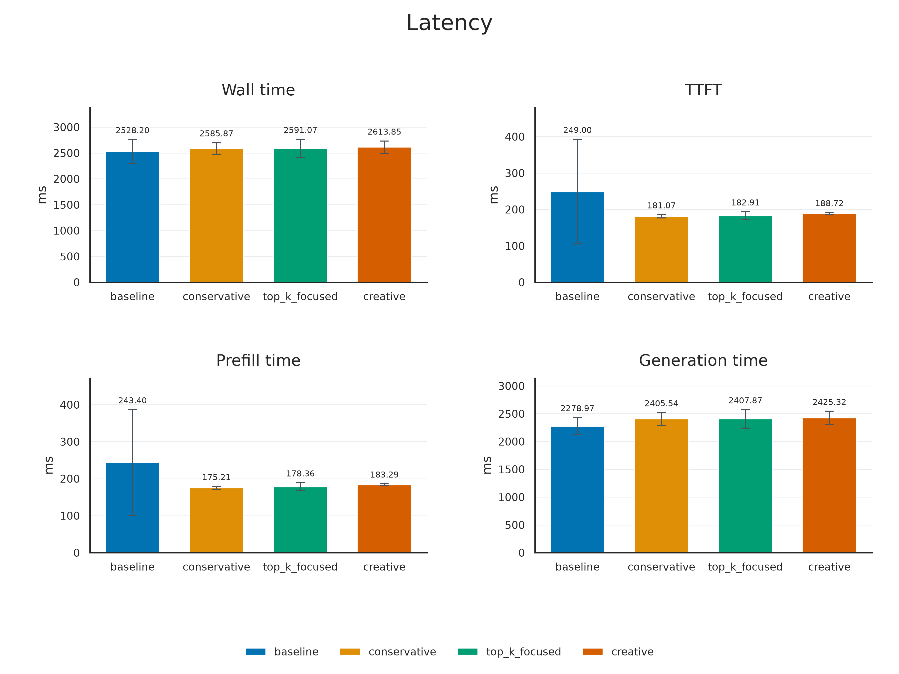

###### Per Token Latency

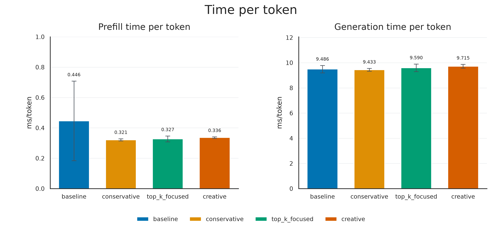

###### Throughput

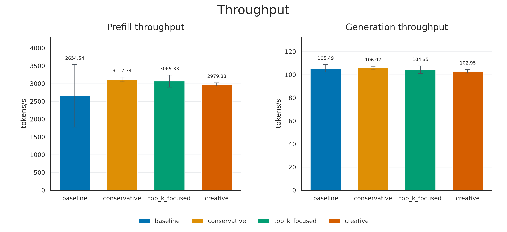

###### Token Counts

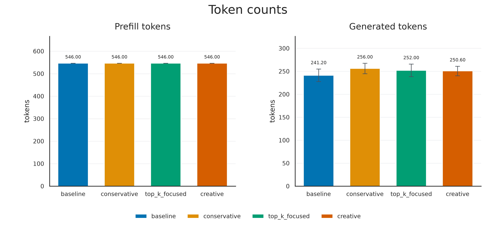

###### Token Usage

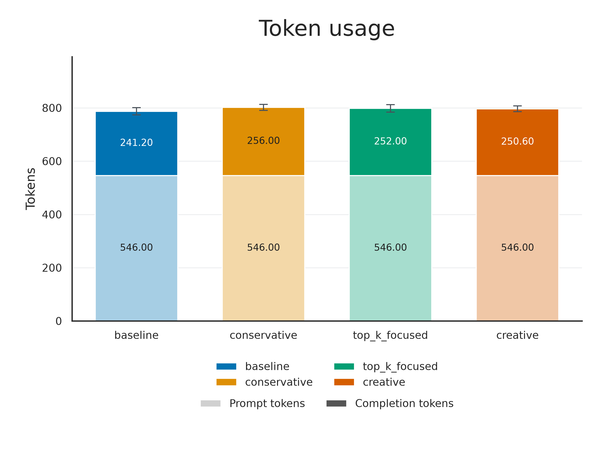

###### Timings Table

| Preset | Cached input tokens (tokens) | Wall time (ms) | TTFT (ms) | Prefill tokens (tokens) | Prefill time (ms) | Prefill time per token (ms/token) | Prefill throughput (tokens/s) | Generated tokens (tokens) | Generation time (ms) | Generation time per token (ms/token) | Generation throughput (tokens/s) |
| --- | --- | --- | --- | --- | --- | --- | --- | --- | --- | --- | --- |
| baseline | 0.00 +- 0.00 | **2528.20 +- 231.90** | 249.00 +- 143.76 | 546.00 +- 0.00 | 243.40 +- 143.02 | 0.446 +- 0.262 | 2654.54 +- 876.95 | 241.20 +- 13.66 | **2278.97 +- 151.67** | 9.486 +- 0.290 | 105.49 +- 3.12 |
| conservative | 0.00 +- 0.00 | 2585.87 +- 112.80 | **181.07 +- 4.56** | 546.00 +- 0.00 | **175.21 +- 3.79** | **0.321 +- 0.007** | **3117.34 +- 67.22** | 256.00 +- 11.34 | 2405.54 +- 114.23 | **9.433 +- 0.113** | **106.02 +- 1.26** |
| top_k_focused | 0.00 +- 0.00 | 2591.07 +- 173.75 | 182.91 +- 10.70 | 546.00 +- 0.00 | 178.36 +- 10.58 | 0.327 +- 0.019 | 3069.33 +- 169.38 | 252.00 +- 13.73 | 2407.87 +- 164.74 | 9.590 +- 0.294 | 104.35 +- 3.22 |
| creative | 0.00 +- 0.00 | 2613.85 +- 118.59 | 188.72 +- 2.86 | 546.00 +- 0.00 | 183.29 +- 2.63 | 0.336 +- 0.005 | 2979.33 +- 43.32 | 250.60 +- 10.33 | 2425.32 +- 119.14 | 9.715 +- 0.148 | 102.95 +- 1.56 |

---

#### 2. Классификация

Ответы моделей по конфигурациям настроек:

- [baseline](../results/report_materials/preset_comparison/gemma4/p2_classification/responses_baseline.md);
- [conservative](../results/report_materials/preset_comparison/gemma4/p2_classification/responses_conservative.md);
- [creative](../results/report_materials/preset_comparison/gemma4/p2_classification/responses_creative.md);
- [top_k_focused](../results/report_materials/preset_comparison/gemma4/p2_classification/responses_top_k_focused.md).

Сводка использует готовые `accuracy` и `n_correct`. В baseline и creative среднее число правильных классификаций равно **14,40 ± 0,55 из 18**, точность — **80,00 ± 3,04%**. В conservative и top_k_focused показатели составляют **14,00 ± 0,00** и **77,78 ± 0,00%**. Максимальный результат отдельного повтора — 15 правильных ответов. Средняя разница между группами равна 0,4 ответа; по одному набору и пяти повторам это не доказывает общего превосходства настройки.

Основные ошибки соответствуют замечаниям к смешанным оценкам в исходном анализе:

- **Отзыв 8:** ожидается **Bad**, предсказано **Neutral** во всех пяти повторах каждого пресета. В тексте «Фильм не произвел должного впечатления» сочетается с похвалой актёров и древнего языка. Модель сохраняет нейтральную метку, хотя эталон относит общее неудовлетворительное впечатление к отрицательному классу.
- **Отзыв 12:** ожидается **Neutral**, предсказано **Good** во всех повторах. Фразы «Не плохой фильм» и «из хорошего: игра актеров» соседствуют с замечанием о затянутости. Положительные слова не делают ответ модели правильным относительно сохранённой разметки.
- **Отзыв 18:** ожидается **Neutral**, предсказано **Good** во всех повторах. Признание, что фильм поднадоел, сочетается с «действительно хороший фильм» и высокой оценкой отдельной сцены. Ошибка повторяется при всех настройках.
- **Отзыв 10:** ожидается **Neutral**. Ошибочная метка **Good** встречается в 3/5 повторов baseline и creative и в 5/5 conservative и top_k_focused. Здесь критика «Само кино слабовато» соседствует с похвалой актёров. Именно изменение ответа на этот отзыв объясняет различие между 14 и 15 верными классификациями.

Матрицы ошибок показывают одинаковую правильную разметку всех положительных отзывов: 30 из 30 предсказаний **Good → Good**. Среди отрицательных отзывов 25 из 30 предсказаний правильны, пять ошибок относятся к отзыву 8 (**Bad → Neutral**). Для нейтральных отзывов baseline и creative дают 17 правильных предсказаний и 13 ошибок **Neutral → Good**, а conservative и top_k_focused — 15 и 15 соответственно. Эти суммы относятся к повторной разметке одних и тех же 18 отзывов, а не к независимой выборке из 90 текстов.

По совпадению полных последовательностей классов все пять ответов conservative и top_k_focused идентичны и совпадают между этими пресетами. В baseline и creative одинаковые последовательности получены в Response 1, 3 и 4, а другая одинаковая пара — Response 2 и 5. Таким образом, менее случайные настройки здесь обеспечивают повторяемость классификации, но закрепляют ошибку на отзыве 10. Это наблюдение о сохранённых прогонах, а не гарантия детерминизма модели в других условиях.

##### Производительность модели

###### Accuracy

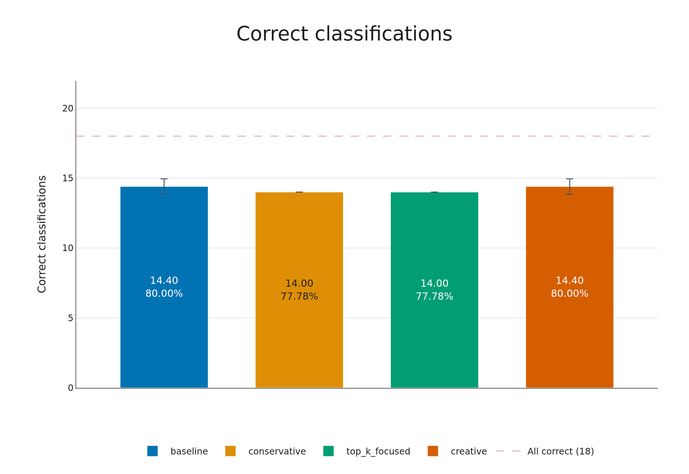

###### Latency

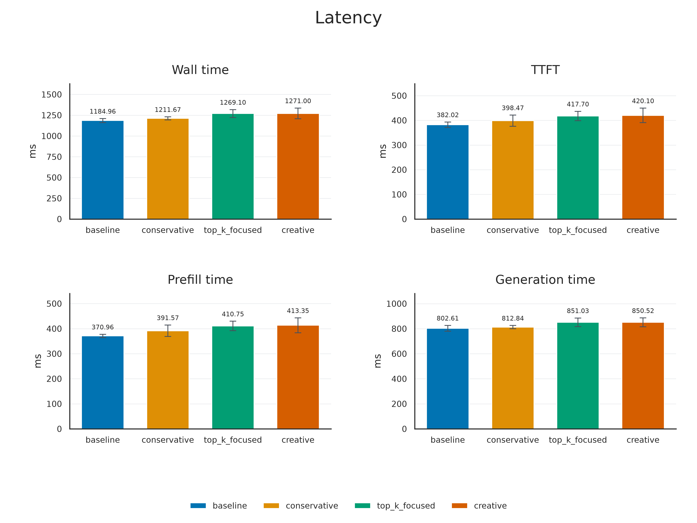

###### Per Token Latency

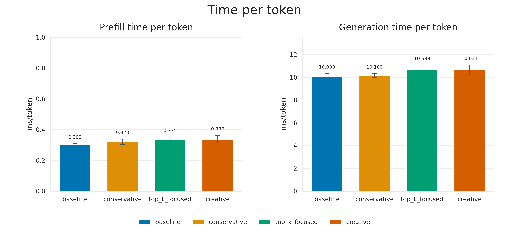

###### Throughput

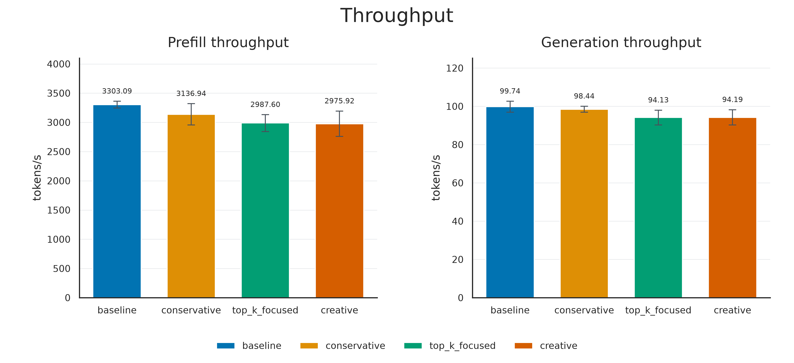

###### Token Counts


###### Token Usage

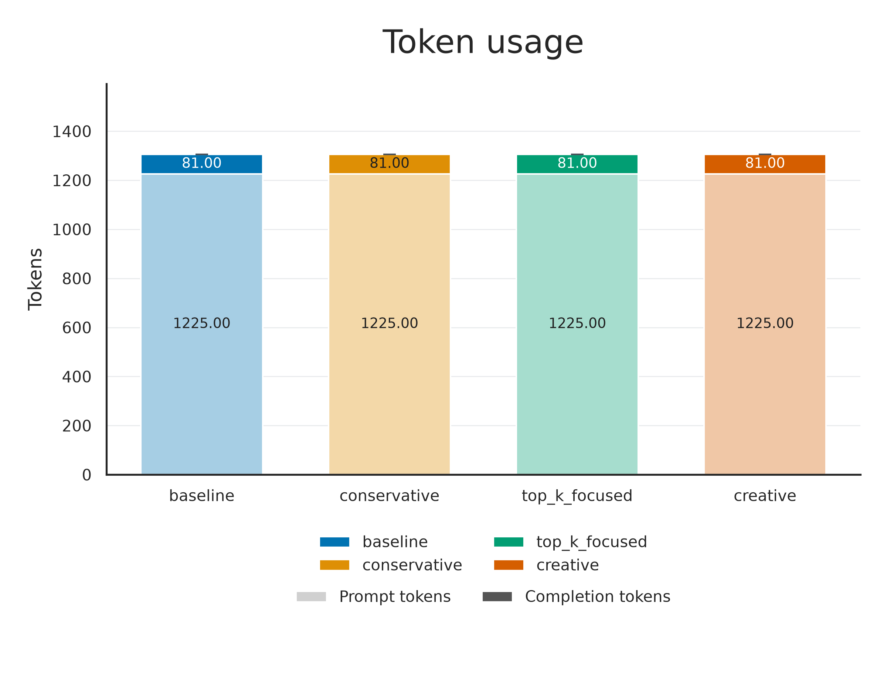

##### Частота ошибок по инстансам

###### baseline

| Measure | 1 | 2 | 3 | 4 | 5 | 6 | 7 | 8 | 9 | 10 | 11 | 12 | 13 | 14 | 15 | 16 | 17 | 18 |
| --- | --- | --- | --- | --- | --- | --- | --- | --- | --- | --- | --- | --- | --- | --- | --- | --- | --- | --- |
| Expected class | Good | Good | Bad | Good | Bad | Bad | Neutral | Bad | Neutral | Neutral | Good | Neutral | Good | Good | Neutral | Bad | Bad | Neutral |
| Incorrect predictions | 0 | 0 | 0 | 0 | 0 | 0 | 0 | 5 | 0 | 3 | 0 | 5 | 0 | 0 | 0 | 0 | 0 | 5 |
| Total predictions | 5 | 5 | 5 | 5 | 5 | 5 | 5 | 5 | 5 | 5 | 5 | 5 | 5 | 5 | 5 | 5 | 5 | 5 |

| Actual / Predicted | Good | Bad | Neutral |
| --- | --- | --- | --- |
| Good | 30 | 0 | 0 |
| Bad | 0 | 25 | 5 |
| Neutral | 13 | 0 | 17 |

###### conservative

| Measure | 1 | 2 | 3 | 4 | 5 | 6 | 7 | 8 | 9 | 10 | 11 | 12 | 13 | 14 | 15 | 16 | 17 | 18 |
| --- | --- | --- | --- | --- | --- | --- | --- | --- | --- | --- | --- | --- | --- | --- | --- | --- | --- | --- |
| Expected class | Good | Good | Bad | Good | Bad | Bad | Neutral | Bad | Neutral | Neutral | Good | Neutral | Good | Good | Neutral | Bad | Bad | Neutral |
| Incorrect predictions | 0 | 0 | 0 | 0 | 0 | 0 | 0 | 5 | 0 | 5 | 0 | 5 | 0 | 0 | 0 | 0 | 0 | 5 |
| Total predictions | 5 | 5 | 5 | 5 | 5 | 5 | 5 | 5 | 5 | 5 | 5 | 5 | 5 | 5 | 5 | 5 | 5 | 5 |

| Actual / Predicted | Good | Bad | Neutral |
| --- | --- | --- | --- |
| Good | 30 | 0 | 0 |
| Bad | 0 | 25 | 5 |
| Neutral | 15 | 0 | 15 |

###### top_k_focused

| Measure | 1 | 2 | 3 | 4 | 5 | 6 | 7 | 8 | 9 | 10 | 11 | 12 | 13 | 14 | 15 | 16 | 17 | 18 |
| --- | --- | --- | --- | --- | --- | --- | --- | --- | --- | --- | --- | --- | --- | --- | --- | --- | --- | --- |
| Expected class | Good | Good | Bad | Good | Bad | Bad | Neutral | Bad | Neutral | Neutral | Good | Neutral | Good | Good | Neutral | Bad | Bad | Neutral |
| Incorrect predictions | 0 | 0 | 0 | 0 | 0 | 0 | 0 | 5 | 0 | 5 | 0 | 5 | 0 | 0 | 0 | 0 | 0 | 5 |
| Total predictions | 5 | 5 | 5 | 5 | 5 | 5 | 5 | 5 | 5 | 5 | 5 | 5 | 5 | 5 | 5 | 5 | 5 | 5 |

| Actual / Predicted | Good | Bad | Neutral |
| --- | --- | --- | --- |
| Good | 30 | 0 | 0 |
| Bad | 0 | 25 | 5 |
| Neutral | 15 | 0 | 15 |

###### creative

| Measure | 1 | 2 | 3 | 4 | 5 | 6 | 7 | 8 | 9 | 10 | 11 | 12 | 13 | 14 | 15 | 16 | 17 | 18 |
| --- | --- | --- | --- | --- | --- | --- | --- | --- | --- | --- | --- | --- | --- | --- | --- | --- | --- | --- |
| Expected class | Good | Good | Bad | Good | Bad | Bad | Neutral | Bad | Neutral | Neutral | Good | Neutral | Good | Good | Neutral | Bad | Bad | Neutral |
| Incorrect predictions | 0 | 0 | 0 | 0 | 0 | 0 | 0 | 5 | 0 | 3 | 0 | 5 | 0 | 0 | 0 | 0 | 0 | 5 |
| Total predictions | 5 | 5 | 5 | 5 | 5 | 5 | 5 | 5 | 5 | 5 | 5 | 5 | 5 | 5 | 5 | 5 | 5 | 5 |

| Actual / Predicted | Good | Bad | Neutral |
| --- | --- | --- | --- |
| Good | 30 | 0 | 0 |
| Bad | 0 | 25 | 5 |
| Neutral | 13 | 0 | 17 |

---

#### 3. Суммаризация


Ответы модели по конфигурациям настроек:

- [baseline](../results/report_materials/preset_comparison/gemma4/p3_summary/responses_baseline.md);
- [conservative](../results/report_materials/preset_comparison/gemma4/p3_summary/responses_conservative.md);
- [top_k_focused](../results/report_materials/preset_comparison/gemma4/p3_summary/responses_top_k_focused.md);
- [creative](../results/report_materials/preset_comparison/gemma4/p3_summary/responses_creative.md).

Здесь оценивается соответствие резюме [исходному посту](../prompts/p3_summary.md): передача восторженного мнения автора, сохранение основных событий и ограничений адаптации, отсутствие добавленных сведений и соблюдение формата в 4–5 предложений. В каждом пресете подробно рассматривается Response 1 и коротко — Response 2. Оценка **LLM as a judge** является содержательным суждением по этим примерам, а не измеренной метрикой или оценкой всех возможных ответов. Служебная строка «Вот короткое резюме поста:» отделяется от собственно резюме при подсчёте предложений.

Во всех 20 сохранённых ответах собственно резюме содержит 4–5 предложений, поэтому ограничение формата соблюдено в каждом пресете. Это не делает ответы равноценными по точности: общая позиция автора сохраняется устойчивее, чем отдельные реплики, границы адаптации и связи между событиями. Ниже эти различия показаны на двух примерах каждого пресета.

##### baseline

Рассмотрим **Response 1** из соответствующего файла ответов.

> Вот короткое резюме поста:
>
> Автор выражает невероятное восхищение новым эпизодом "Re:Zero", оценивая его на 9,5/10. Особо выделяются динамичные и захватывающие битвы, такие как поединок Эмилии и Волканики, а также эмоциональные моменты, например, поцелуй Шаулы с Субару. Автор отмечает великолепную раскадровку в сценах с Шаулой и трогательную сцену с маленьким скорпионом. Финальная сцена, где Рем просыпается и происходит адаптация завершения шестой арки, названа "воплощённым великолепием и великолепностью". В целом, эпизод считается эталонным.

###### Субъективный анализ содержания

Ответ хорошо передаёт главный смысл исходного поста: автор очень доволен финальным эпизодом. Вместо последовательного пересказа всех событий модель выделяет три опорных фрагмента — бой Эмилии и Волканики, эмоциональные сцены с Шаулой и пробуждение Рем. Упоминание оценки 9,5/10 сразу задаёт тон, а раскадровка связывает впечатления автора с качеством адаптации. Резюме читается связно и не превращается в список имён.

Слабее всего выглядит последнее предложение: «В целом, эпизод считается эталонным». По смыслу это допустимое сжатие восторженной оценки, но слово «считается» убирает личную позицию автора и создаёт впечатление общего согласия. Кроме того, предложение повторяет уже сказанное в начале. В пределах пяти предложений его можно было использовать для сохранения более конкретного факта.

###### Соответствие исходнику и формату

Собственно резюме состоит из **пяти предложений**, то есть ограничение соблюдено. Оценка, участники боя, сцены с Шаулой, появление маленького скорпиона и пробуждение Рем присутствуют в исходнике. Нового события модель не придумывает. Выражение «поцелуй Шаулы с Субару» менее точно, чем исходное «поцелуй Шаулы в щёку Субару»: оно не уточняет характер действия, хотя само упоминание сцены остаётся узнаваемым.

Из существенных уточнений отсутствуют номер и финальный статус серии, её продолжительность около 41 минуты и явное указание, что седьмая арка не адаптировалась. Окончание шестой арки сохранено. При таком коротком формате потеря части подробностей неизбежна, однако границу адаптации можно было передать вместо обобщающей заключительной фразы. Неупоминание второстепенных сцен само по себе не является фактической ошибкой.

###### Другой ответ того же пресета

**Response 2:**

> Вот короткое резюме поста:
>
> Автор выражает огромное восхищение новым эпизодом "Re:Zero", оценивая его на 9,5/10. Он высоко хвалит динамичные и зрелищные битвы, такие как поединок Эмилии против Волканики и сцены с Гигантским Скорпионом. Особого восторга вызывает сцена с Шаулой, включая поцелуй и реакцию на момент с багровым скорпионом. Финальная сцена, где Субару встречает Рем, описывается как "воплощённое великолепие и великолепность", и автор считает, что адаптация дошла до самого конца шестой арки.

Второе резюме укладывается в **четыре предложения** и компактнее организовано: оценка, бои, Шаула, финал. Упоминание Гигантского Скорпиона возвращает деталь пустынной части эпизода. При этом «Субару встречает Рем» не передаёт явно ключевой факт её пробуждения, который был в первом ответе. Формулировка «автор считает, что адаптация дошла» также превращает конкретное указание исходного текста в предположение. Поэтому второй вариант экономнее по форме, но первый точнее обозначает главное событие финала.

###### Оценка LLM as a judge

**Хорошее резюме с потерей конкретики.** В обоих примерах сохранены эмоциональная позиция автора и основные смысловые блоки. Первый ответ сильнее в передаче финального события, второй — в компактности. Слабые места пресета в этой паре связаны с обобщениями и пропусками, а не с выдуманными сюжетными событиями. Перед использованием первого текста стоит заменить повторяющееся заключение конкретным уточнением о границе адаптации.

##### conservative

Рассмотрим **Response 1** из соответствующего файла ответов.

> Вот короткое резюме поста:
>
> Автор выражает огромное восхищение новым эпизодом "Re:Zero", оценивая его на 9,5/10. Особо выделяются динамичные и захватывающие битвы, такие как поединок Эмилии против Волканики, и эмоциональные моменты, например, поцелуй Шаулы и взаимодействие Субару с милым скорпионом. Сцена с появлением Ведьмы Зависти и последующий переход к птице Пандоры названы очень жуткими. Финальная сцена, где Рем просыпается и Субару говорит ему о том, что он его герой, описывается как воплощение великолепия и великолепности. Автор считает, что адаптация дошла до конца шестой арки, не затрагивая седьмую.

###### Субъективный анализ содержания

Структура остаётся почти такой же, как у baseline, но распределение информации удачнее. Помимо боя, Шаулы и Рем, модель сохраняет жуткий переход от появления Ведьмы Зависти к птице Пандоры. Последнее предложение сообщает, что экранизация дошла до конца шестой арки и не затронула седьмую. По сравнению с общим «эпизод считается эталонным» здесь заметно больше полезного содержания на том же числе предложений.

Первое и второе предложения по-прежнему звучат как стандартный шаблон краткого резюме. Однако шаблон не мешает читать текст: события сгруппированы по эмоциональному впечатлению, а не перечислены в случайном порядке.

###### Соответствие исходнику и формату

В резюме **пять предложений**. Оценка 9,5/10, сцены с Эмилией, Шаулой и скорпионом, жуткая сцена и границы адаптации переданы по исходному посту. Но фраза «Рем просыпается и Субару говорит ему о том, что он его герой» содержит существенную неаккуратность. В исходнике Субару обращается к Рем словами о том, что он **её** герой. Замена на «ему» и «его» нарушает обозначение адресата и делает отношения между персонажами неоднозначными. Это уже не просто сокращение подробностей, а искажение конкретной реплики.

Здесь важно различать устойчивость текста и его правильность. Низкая температура не защитила от ошибки в местоимениях. При этом пол, отношения и события оцениваются исключительно по представленному исходнику, без привлечения внешних сведений о сериале.

###### Другой ответ того же пресета

**Response 2:**

> Вот короткое резюме поста:
>
> Автор выражает огромное восхищение новым эпизодом "Re:Zero", оценивая его на 9,5/10. Он выделяет динамичные и захватывающие битвы, такие как поединок Эмилии и Волканики, а также шикарные экшен-сцены в пустыне. Особое внимание уделено эмоциональным моментам, включая сцену с Шаулой, поцелуй и взаимодействие с Субару, а также милый момент с багровым скорпионом. Финальная сцена, где Рем просыпается и завершается шестой аркой, названа "воплощённым великолепием и великолепностью". Автор считает, что адаптация дошла до самого конца шестой арки, и не затрагивает события седьмой арки.

Во втором ответе тоже **пять предложений**. Он точнее называет пустынный бой и не содержит ошибки «ему/его». Однако появляется другая проблема: «Финальная сцена, где Рем просыпается и завершается шестой аркой». Из-за неудачной конструкции непонятно, что именно завершается, а окончание шестой арки повторяется в следующем предложении. Основное событие можно восстановить по контексту, но готовый текст требует языковой правки. По сравнению с первым ответом этот вариант менее двусмыслен в обозначении персонажей, зато хуже организован синтаксически.

###### Оценка LLM as a judge

**Содержательно информативно, но оба примера требуют правки.** Preset сохраняет больше конкретных обстоятельств, включая отсутствие адаптации седьмой арки, однако допускает ошибки в передаче реплики и построении предложения. Для аккуратной суммаризации нельзя считать conservative автоматически лучшим: в рассмотренной паре выигрыш в насыщенности сопровождается локальными искажениями.

##### top_k_focused

Рассмотрим **Response 1** из соответствующего файла ответов.

> Вот короткое резюме поста:
>
> Автор выражает огромное восхищение новым эпизодом "Re:Zero", оценивая его как "чистейшее кино". Особое внимание уделено динамичным сценам битвы Эмилии против Волканики и эмоциональным моментам, таким как поцелуй Шаулы и взаимодействие Субару с милым скорпионом. Финальная сцена, где Рем просыпается и Субару выражает свою привязанность, названа "воплощённым великолепием" и является абсолютным пиком. Несмотря на то, что некоторые моменты могут быть сюрпризом, общая оценка эпизода — 9,5/10.

###### Субъективный анализ содержания

Первый ответ заметно компактнее: четыре предложения посвящены общему восторгу, бою и Шауле, финальной сцене и итоговой оценке. Формулировка «Субару выражает свою привязанность» удачно сжимает его обращение к Рем, не пытаясь воспроизвести точную реплику и не создавая ошибки с местоимениями, как в conservative.

Текст читается легче, но часть точности принесена в жертву общему впечатлению. Фраза о том, что некоторые моменты могут быть сюрпризом, передаёт авторскую осторожность со спойлерами, однако занимает место, которое можно было отдать завершению шестой арки. «Чистейшее кино» в исходном посте прежде всего характеризовало бой Эмилии и Волканики; в резюме оно перенесено на оценку эпизода в целом. Это небольшое расширение области авторской оценки, а не добавление нового события.

###### Соответствие исходнику и формату

**Четыре предложения** соответствуют требованию. Сохранены оценка 9,5/10, основные эмоциональные сцены и пробуждение Рем. Утверждение о привязанности опирается на слова Субару, что он скучал по Рем. Явных новых сюжетных фактов в этом примере нет. Не сохранены завершение шестой арки, отсутствие материала седьмой и продолжительность серии. Получилось корректное резюме впечатлений, но менее информативное резюме самого поста.

###### Другой ответ того же пресета

**Response 2:**

> Вот короткое резюме поста:
>
> Автор выражает огромное восхищение новым эпизодом "Re:Zero", оценивая его на 9,5/10. Он выделяет захватывающие битвы Эмилии против Волканики и шикарные экшен-сцены во второй части, включая появление багрового Скорпиона и трогательную сцену поцелуя Шаулы. Особого внимания заслуживает финальная сцена, где Субару встречает Рем, которая просыпается, которую автор называет "воплощённым великолепием". Несмотря на то что некоторые моменты хотелось бы оставить сюрпризом, общая режиссура и качество адаптации считаются невероятными.

Второй ответ также содержит **четыре предложения**. Он добавляет экшен второй части и связывает пробуждение Рем с финальной сценой. Слабое место — цепочка «Рем, которая просыпается, которую автор называет "воплощённым великолепием"»: грамматика привязывает оценку к Рем, хотя в исходнике автор оценивает сцену. Это ухудшает понятность и точность. Поэтому первый ответ выигрывает по языку и ясности, несмотря на более сильное сжатие фактов.

###### Оценка LLM as a judge

**Первый пример удачен как компактный обзор впечатлений; второй слабее по языку.** Ограничение top_k не гарантирует аккуратного синтаксиса. В рассмотренной паре оно даёт короткие ответы с понятной общей оценкой, но без некоторых важных уточнений. Первый текст можно использовать как основу резюме, дополнив его границей адаптации; второй сначала нуждается в исправлении связи между сценой и её оценкой.

##### creative

Рассмотрим **Response 1** из соответствующего файла ответов.

> Вот короткое резюме поста:
>
> Автор выражает невероятное восхищение новым эпизодом "Re:Zero", оценивая его на 9,5/10. Особо выделяются динамичные и захватывающие битвы, такие как поединок Эмилии и Волканики, а также эмоциональные моменты, например, поцелуй Шаулы с Субару. Автор отмечает великолепную раскадровку в сценах с Шаулой и трогательную сцену с маленьким скорпионом. Финальная сцена, где Рем просыпается и происходит адаптация завершения шестой арки, названа "воплощённым великолепием и великолепностью". В целом, эпизод считается эталонным.

###### Субъективный анализ содержания

Response 1 **дословно совпадает с Response 1 пресета baseline**. Сохраняются не только структура и выбранные факты, но и вводная строка, фразы о раскадровке и «эталонном» эпизоде. Поэтому увеличение temperature и top_p в этом конкретном прогоне не привело к новому варианту текста.

Сам ответ по-прежнему хорошо передаёт восторженное мнение автора и три основные группы событий. К нему относятся те же замечания, что и к baseline: повторяющееся заключение, слишком общее «считается» и неточное обозначение поцелуя.

###### Соответствие исходнику и формату

Резюме состоит из **пяти предложений**, не добавляет новых событий и сохраняет пробуждение Рем и завершение шестой арки. Однако отсутствие адаптации седьмой арки и продолжительность серии снова не упомянуты. Для данного ответа название creative не связано с большей содержательной свободой: его качество и ограничения полностью совпадают с первым baseline-примером.

###### Другой ответ того же пресета

**Response 2:**

> Вот короткое резюме поста:
>
> Автор выражает огромное восхищение новым эпизодом "Re:Zero", оценивая его на 9,5/10. Особенно выделяются динамичные и захватывающие боевые сцены, такие как битва Эмилии против Волканики, и эмоциональные моменты, связанные с Шаулой (особенно поцелуй и взаимодействие с Субару). Момент, когда появляется маленький багровый скорпион, назван абсолютным пиком. Финальная сцена, где Рем просыпается и происходит завершение шестой арки, описывается как "воплощённое великолепие" и не имеет себе равных. Несмотря на то, что вся история не доходит до седьмой арки, сериал адаптирован до самого конца шестой арки.

Во втором ответе **пять предложений**. Он явно сохраняет отсутствие адаптации седьмой арки, уделяет отдельную фразу маленькому багровому скорпиону и передаёт пробуждение Рем. По фактической конкретности это полезное дополнение к первому варианту.

При этом «не имеет себе равных» усиливает исходную эмоциональную оценку, а оборот «Несмотря на то, что вся история не доходит до седьмой арки» вводит неуместное противопоставление. Автор просто уточнял границу адаптации и не представлял её как недостаток. Это не новое сюжетное событие, но небольшое изменение логики и тональности поста. В итоге второй ответ информативнее по границе арок, первый — спокойнее и чище по формулировкам.

###### Оценка LLM as a judge

**Хорошая передача общего смысла без гарантированного роста разнообразия.** Один пример совпадает с baseline, другой добавляет полезное уточнение, но усиливает авторскую оценку и вводит ненужный контраст. По этой паре нельзя заключить, что creative улучшает суммаризацию: изменение настроек дало другой выбор деталей лишь в части ответов.

##### Производительность модели

Ниже представлены те же категории измерений, что и для генерации. В таблице приведены среднее и выборочное стандартное отклонение по пяти повторам.

###### Latency

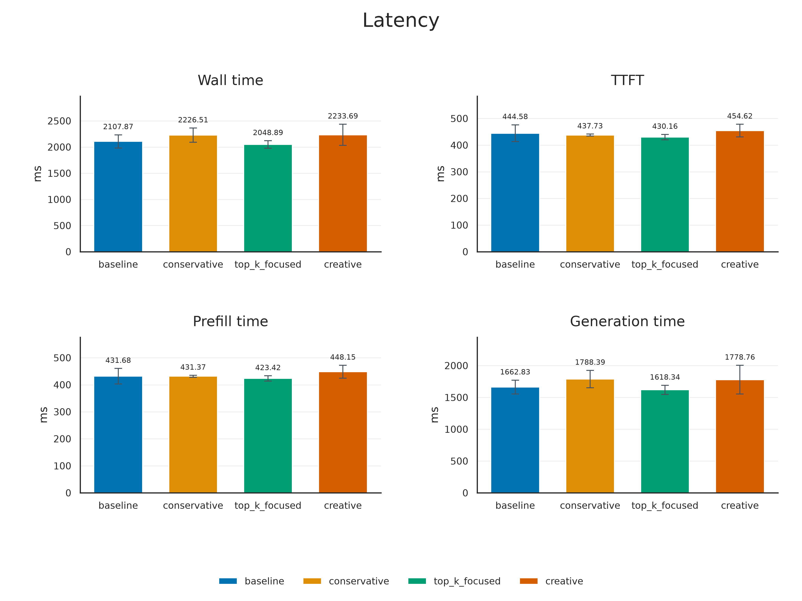

###### Per Token Latency

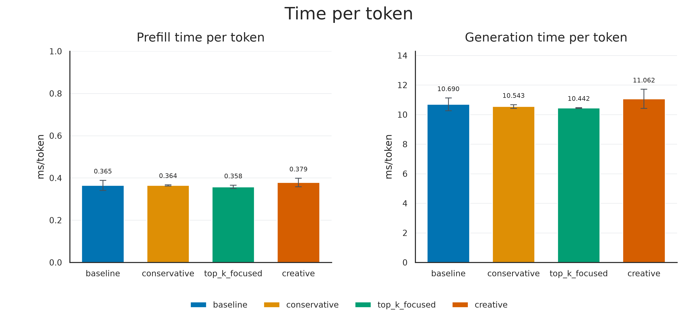

###### Throughput

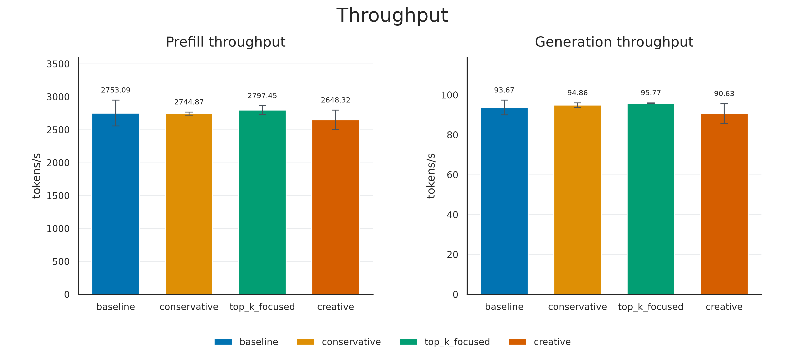

###### Token Counts

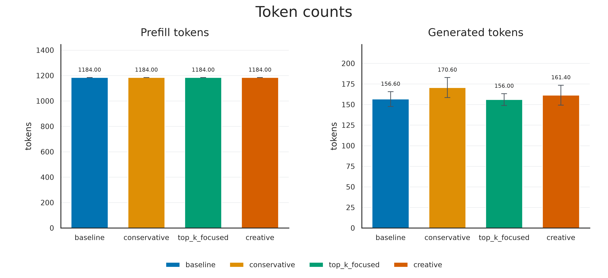

###### Token Usage

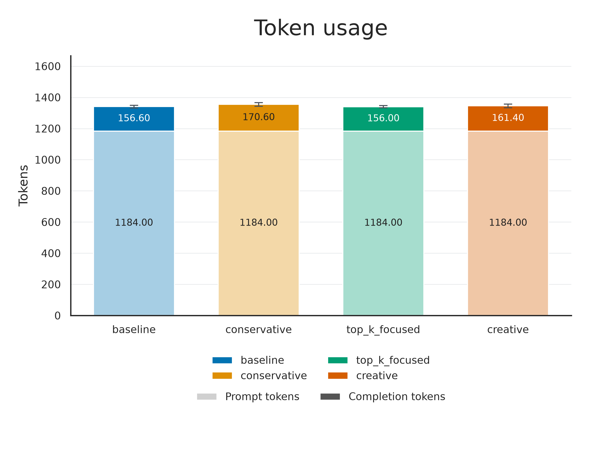

###### Timings Table

| Preset | Cached input tokens (tokens) | Wall time (ms) | TTFT (ms) | Prefill tokens (tokens) | Prefill time (ms) | Prefill time per token (ms/token) | Prefill throughput (tokens/s) | Generated tokens (tokens) | Generation time (ms) | Generation time per token (ms/token) | Generation throughput (tokens/s) |
| --- | --- | --- | --- | --- | --- | --- | --- | --- | --- | --- | --- |
| baseline | 0.00 +- 0.00 | 2107.87 +- 124.92 | 444.58 +- 31.68 | 1184.00 +- 0.00 | 431.68 +- 28.53 | 0.365 +- 0.024 | 2753.09 +- 195.64 | 156.60 +- 9.02 | 1662.83 +- 108.37 | 10.690 +- 0.436 | 93.67 +- 3.71 |
| conservative | 0.00 +- 0.00 | 2226.51 +- 135.98 | 437.73 +- 3.64 | 1184.00 +- 0.00 | 431.37 +- 3.54 | 0.364 +- 0.003 | 2744.87 +- 22.47 | 170.60 +- 12.16 | 1788.39 +- 135.97 | 10.543 +- 0.129 | 94.86 +- 1.14 |
| top_k_focused | 0.00 +- 0.00 | **2048.89 +- 70.70** | **430.16 +- 9.81** | 1184.00 +- 0.00 | **423.42 +- 9.71** | **0.358 +- 0.008** | **2797.45 +- 65.26** | 156.00 +- 7.18 | **1618.34 +- 71.46** | **10.442 +- 0.027** | **95.77 +- 0.25** |
| creative | 0.00 +- 0.00 | 2233.69 +- 202.36 | 454.62 +- 23.79 | 1184.00 +- 0.00 | 448.15 +- 23.82 | 0.379 +- 0.020 | 2648.32 +- 148.90 | 161.40 +- 12.10 | 1778.76 +- 225.21 | 11.062 +- 0.648 | 90.63 +- 4.96 |

#### Вывод о влиянии настроек

По оценке **LLM as a judge**, настройки меняют прежде всего выбор деталей и формулировок, а не основную позицию ответа. В генерации любой пресет сохраняет отрицательное мнение об эпизоде, но полнота исходных тезисов и естественность языка меняются. conservative чаще удерживает дополнительные требования, хотя даже среди его ответов есть пропуски; top_k_focused сохраняет часть языковых ошибок и в одном из приведённых примеров искажает положительное замечание об озвучке и музыке. creative допускает более свободные формулировки, однако это не обеспечивает полного покрытия задания.

В суммаризации картина сходная: у всех пресетов повторяется каркас «общая оценка — бой — Шаула — финал», а различия касаются включения отдельных фактов и точности фраз. conservative сохраняет важную границу между шестой и седьмой арками, но ошибается в местоимениях; top_k_focused даёт удачный компактный первый пример и неудачный синтаксис во втором. Дословное совпадение первых ответов baseline и creative показывает, что повышение случайности не обязано менять каждый результат.

Классификация остаётся близкой по средней точности: **80,00%** у baseline и creative против **77,78%** у conservative и top_k_focused. Нулевой std у двух последних конфигураций характеризует одинаковое число правильных ответов во всех пяти повторах; сам по себе он не доказывает совпадение всех предсказаний. Устойчивые ошибки на одних и тех же отзывах показывают, что снижение случайности не устраняет содержательные затруднения модели.

Таким образом, для этих примеров более ограниченное семплирование может помочь удерживать структуру и требования, но не гарантирует грамотность или фактическую точность. Изменяются несколько настроек одновременно, а рассмотрено пять повторов на условие, поэтому наблюдения относятся к данным промптам и пресетам, без вывода об отдельном причинном эффекте temperature, top_p или top_k.

---


### Phi-4-mini

#### 1. Генерация

Ответы по пресетам: [baseline](../results/report_materials/preset_comparison/phi-4-mini/p1_generation/responses_baseline.md); [conservative](../results/report_materials/preset_comparison/phi-4-mini/p1_generation/responses_conservative.md); [top_k_focused](../results/report_materials/preset_comparison/phi-4-mini/p1_generation/responses_top_k_focused.md); [creative](../results/report_materials/preset_comparison/phi-4-mini/p1_generation/responses_creative.md).

Для оценки текста далее используется подход LLM as a judge: содержательное суждение по сохранённым ответам, а не новая объективная метрика эксперимента. Проверяются русский язык, разговорный стиль, ограничение 80–120 слов, отсутствие новых сведений и смысловая передача 12 тезисов из задания.

В таблицах `Covered` означает число тезисов, для которых есть хотя бы основной смысловой фрагмент: полное плюс частичное покрытие. `Fully covered` учитывает тезис целиком, `Partially covered` перечисляет пункты с утратой существенных деталей или искажениями, `Absent` — пункты без соответствующей мысли. У составного пункта 2 проверяются не только плохое качество и провал ключевой сцены, но также визуал, мимика, эмоции, рекапы на половину эпизода и отсутствие акцентов. Для пункта 8 различаются общая «оболочка» антагониста и конкретные потери его ветки, мотива «Хотим стать счастливыми» и предыстории. Общая формулировка не доказывает сохранение каждой из этих деталей. Поэтому `Covered = 12/12` здесь не означает, что все требования переданы полностью.

Длина измеряется по словам, найденным регулярным выражением `[^\W_]+(?:[-’'][^\W_]+)*`: учитываются слова и числа, дефисные формы считаются одним словом, Markdown и эмодзи не добавляют слов. В объём предложенного поста входят его приветствия, прощания, подписи и хештеги. Отдельно вынесена явная служебная вводная перед постом в `creative / Response 1`. Такой способ подсчёта применяется последовательно ко всем пяти ответам каждого пресета.

##### baseline

###### Пример — Response 1

> Здравствуйте, ребята! Давайте поговорим о 16-м эпизоде 4-го сезона "Re:zero" - вы не ожидали, что я скажу, но этот эпизод просто разочаровывает. В целом, он неудачная адаптация, и это только начало бед.
>
> Качество эпизода - ни к чему хорошего, никаких интересных визуальных ходов, ни богатой мимики персонажей, ни настоящих эмоций. Сцены с чтением книг мертвых, которые мы видели в прошлых сезонах, и это половина эпизода. Важно, что на ключевых сценах нет нормальных акцентов. Главное, что ты сказал, - `Ты потрясающий парень, Нацуки Субару.` - провалена, полностью блеклая копия из книжного первоисточника, что просто в крови.
>
> Конфликт персонажей также сильно смазан, не передавая чувства или мотивацию. Внутренний конфликт героев - это пустая трата времени.
>
> А когда дело доходит до фан-версии адаптации, она была в разы лучше, с полноценными эмоциями и качественной режиссурой. Режиссура в этом эпизоде просто отсутствует. Качество ниже плинтуса, и вырезанный контент, который мог бы придать эпизоду остроты и эмоций, был полностью пропущен.
>
> Хотя предыдущий эпизод был менее ожидаемым и важным, по качеству он на 3 головы выше, чем этот. Основная сюжетная ветка антагониста была просто вырезана, оставив только оболочку персонажа, не затрагивая основную тему злодея "Хотим стать счастливыми".
>
> Актрисы озвучки показали себя хорошо, и музыка, безусловно, была хорошей, но всё это не смягчает плохого адаптирования. Это худший эпизод сезона с точки зрения адаптации. Пару баллов накину на актёрскую игру.
>
> Советую всем прочитать оригинал, чтобы почувствовать полную картину, которую они пропустили в адаптации.
>
> Надеюсь, что следующий эпизод будет лучше, но надеюсь, что создатели не откажутся от оригинального материала.
>
> Спасибо за внимание, до новых эпизодов!
>
> #Re:zero #Adepto #Adaptation #Anime #Review

###### Анализ содержания

Ответ сохраняет общий отрицательный посыл и почти последовательно проходит по исходным пунктам. Однако из короткого поста получается длинный текст: **257 слов**. Это более чем вдвое превышает верхнюю границу 120 слов. Приветствие, разъясняющие вставки, прощание и хештеги увеличивают объём, но и основная часть слишком длинна. Модель в основном разворачивает список требований, вместо того чтобы объединить близкие претензии.

Русский язык заметно неровный. «Качество эпизода — ни к чему хорошего» нарушает устойчивое сочетание; «что просто в крови» не связано по смыслу с провалом сцены. Конструкция «Главное, что ты сказал» переводит цитату из сцены в обращение к пользователю. Это меняет коммуникативную ситуацию: автору нужен готовый пост, а не обсуждение того, что он перечислил в промпте.

Некоторые исходные мысли переданы приблизительно. Упоминание книг мёртвых, прошлых сезонов и половины эпизода присутствует, но фраза не объясняет ясно, что именно чтение книг превратилось в рекапы. Внутренний конфликт героя подменяется конфликтом персонажей и оценкой «пустая трата времени». Тема счастья антагониста названа, а потеря предыстории отдельно не раскрыта. Сравнение текущей режиссуры с предыдущим эпизодом также осталось только на уровне общей разницы качества. Заключение добавляет пожелание, чтобы создатели не отказались от оригинального материала: это новая мысль, которой в заданных тезисах нет. Уточнение «актрисы озвучки» тоже сужает исходное общее упоминание актёров без оснований в промпте.

###### Пример — Response 2

> Привет, ребята! Давно не писал, но решил поделиться своим мнением о 16 эпизоде 4-го сезона "Re:zero". Думайте о нем как о крайне разочаровывающем эпизоде, который, к сожалению, лишен почти всех положительных черт.
>
> Первое, что сразу бросается в глаза – это ужасная адаптация первоисточника. Впечатляете, как ни старались, но все равно ни интересных визуальных ходов, ни богатой мимики персонажей, ни вопиющих эмоций. Сцена чтения книг мертвых – это просто повторение прошлых сезонов. Ключевые сцены без нормальных акцентов – это просто кощунство!
>
> Главная сцена эпизода – `Ты потрясающий парень, Нацуки Субару.` – провалилась полностью. Блеклая копия оригинала, и это просто разочарование. Даже фан-версии, которые пытались улучшить это, оказались гораздо лучше и эмоциональнее.
>
> Режиссура явно отсутствует. Если сравнивать с предыдущим эпизодом, то это, по сути, ничего нового. Качество ниже плинтуса. Много вырезанного контента, который мог бы придать остроты и эмоциональности, но, к сожалению, это не произошло. Прошлый эпизод, хоть и был менее ожидаемым и важным, по качеству был на 3 головы выше.
>
> Главный антагонист – всего лишь оболочка, его сюжетная ветка была вырезана до такой степени, что остался только мимолётный образ. Отсутствует основная тема злодея "Хотим стать счастливыми" – ни предыстории, ни основных мотивов. Всё это просто убытки.
>
> Актёрская игра в озвучке и музыка могут похвастаться парой баллов – это единственная приятная часть для меня.
>
> Худший эпизод сезона с точки зрения адаптации. Нужен новый оригинальный материал, а не этот скопированный кусок.
>
> Советую всем прочитать оригинал. Надеюсь, что следующий эпизод будет лучше, даже немного лучше.
>
> Желаю вам хорошего дня, ребята!

Во втором ответе общий ход мысли проще и несколько лучше связан. Переход от главной сцены к фан-версиям понятен, а описание потерь антагониста подробнее. Но **239 слов** по-прежнему не соответствуют формату. Внутренний конфликт героя совсем не упомянут, доля эпизода, занятая рекапами, не сохранена. Есть речевые сбои «Впечатляете, как ни старались» и «Всё это просто убытки». Фраза «Нужен новый оригинальный материал» добавляет неподдержанную рекомендацию и плохо согласуется с претензией к адаптации уже существующего первоисточника. Поэтому относительно первого примера это улучшение связности, а не полноценное исправление следования инструкции.

###### Покрытие по тезисам

| Response | Covered | Fully covered | Partially covered | Absent | Words | Notes |
| --- | --- | --- | --- | --- | --- | --- |
| 1 | 12/12 | 7/12 | 2, 3, 4, 5, 8 | — | 257 | Рекапы описаны неясно; внутренний конфликт заменён общим конфликтом; фан-версия не привязана явно к главной сцене; сравнение режиссуры с прошлым эпизодом не раскрыто; нет предыстории антагониста. |
| 2 | 11/12 | 9/12 | 2, 5 | 3 | 239 | Нет половины эпизода с рекапами; сравнение режиссуры сформулировано как «ничего нового»; внутренний конфликт отсутствует. |
| 3 | 12/12 | 12/12 | — | — | 222 | Все мысли сохранены, преимущественно за счёт воспроизведения исходных формулировок; требование к объёму нарушено. |
| 4 | 12/12 | 8/12 | 1, 2, 3, 5 | — | 199 | Вступление противоречиво; причина разочарования не выделена; нет эмоций и акцентов из пункта 2; конфликт назван без внутреннего характера; сравнение режиссуры не раскрыто. |
| 5 | 12/12 | 10/12 | 1, 2 | — | 199 | Плохая адаптация не выделена как основная причина; рекапы ошибочно относятся к эпизоду «кроме чтения книг мёртвых», а не к самим сценам чтения. |

###### Оценка LLM as a judge

Базовый пресет позволяет сохранить много исходных мыслей, особенно в Response 3, но модель не решает задачу краткого естественного поста. Длина нарушена во всех пяти ответах. В приведённых примерах заметны ошибки русского языка, буквальное следование перечню и добавления от себя. По этой выборке высокая широта охвата темы сочетается с низким качеством редакторского сжатия.

##### conservative

###### Пример — Response 1

> Привет, ребята! Давайте поговорим о 16 эпизоде 4-го сезона "Re:zero". Я так разочарован, что не могу сдержать. Вот мои мысли:
>
> Эпизод получился крайне разочаровывающим в целом. В основном, из-за плохой адаптации первоисточника. Но и других проблем предостаточно. Качество эпизода - никудышное. Ни интересных визуальных ходов, ни богатой мимики персонажей, ни вопиющих эмоций. Сцены с чтением книг мертвых - это просто рекапы прошлых сезонов на протяжении половины эпизода. Нормальных акцентов на ключевых сценах нет. Главная сцена эпизода - "Ты потрясающий парень, Нацуки Субару." - полностью провалена и является блеклой копией своего оригинала из книжного первоисточника.
>
> Внутренний конл_fkт героя очень сильно смазан. Даже фан-версии адаптации главной сцены и то были в разы более качественными и эмоциональными. Режиссура - отсутствует. По сравнению с предыдущим эпизодом, в этом ее, считай, что нет. Качество - ниже плинтуса. Много вырезанного контента, который мог бы придать той остроты и эмоциональности, которой в эпизоде сильно не хватало.
>
> Прошлый эпизод, хоть и был менее ожидаемым и важным, по качеству был на 3 головы выше. Всю сюжетную ветку главного антагониста просто-напросто вырезали, оставив не персонажа, а просто оболочку от него. Отсутствует основная тема злодея "Хотим стать счастливыми", какая-никакая предыстория и все остальное.
>
> Пару баллов могу накинуть за актурскую игру актеров озвучки и музыку. Это единственное, что в этом эпизоде уместно.
>
> Худший эпизод сезона с точки зрения адаптации. Советую всем прочитать оригинал.
>
> Надеюсь, что следующий эпизод будет лучше.
>
> Спасибо за внимание!

###### Анализ содержания

Первый ответ этого пресета заметно ближе к тексту задания. Все 12 тезисов сохранены, включая сложные пункты о рекапах и потерях сюжетной ветки антагониста. Сохраняется положительное исключение для озвучки и музыки, а финал содержит и рекомендацию прочитать оригинал, и надежду на следующий эпизод.

Однако вместо самостоятельного компактного поста получилась почти копия перечня с приветствием и соединением пунктов в абзацы. Объём — **226 слов**, поэтому ограничение 80–120 слов не выполнено. Оборот «Я так разочарован, что не могу сдержать» не закончен: не указано, что именно автор не может сдержать. Модель переносит ошибки из запроса, а слово «конл_fkт» дополнительно повреждает смешением кириллицы и латиницы. Разговорная эмоциональность присутствует, но достигается главным образом за счёт заданных формулировок. Добавление «Это единственное, что в этом эпизоде уместно» усиливает отрицательную оценку, хотя в промпте были только несколько положительных баллов за озвучку и музыку.

###### Пример — Response 2

> Привет, ребята! Давно не писал, но вот я, чтобы поделиться своим мнением о 16 эпизоде 4-го сезона "Re:zero".
>
> Ну, честно говоря, этот эпизод был крайне разочаровывающим. В основном, из-за плохой адаптации первоисточника, но и других проблем предостаточно. Качество эпизода - никудышное. Ни интересных визуальных ходов, ни богатой мимики персонажей, ни вопиющих эмоций. Сцены с чтением книг мертвых - это просто рекапы прошлых сезонов на протяжении половины эпизода. Нормальных акцентов на ключевых сценах нет. Главная сцена эпизода - "Ты потрясающий парень, Нацуки Субару." - полностью провалена и является блеклой копией своего оригинала из книжного первоисточника.
>
> Внутренний конлфикт героя очень сильно смазан. Даже фан-версии адаптации главной сцены и то были в разы более качественными и эмоциональными. Режиссура - отсутствует. По сравнению с предыдущим эпизодом, в этом ее, считай, что нет. Качество - ниже плинтуса.
>
> Много вырезанного контента, который мог бы придать той остроты и эмоциональности, которой в эпизоде сильно не хватало. Прошлый эпизод, хоть и был менее ожидаемым и важным, по качеству был на 3 головы выше.
>
> Всю сюжетную ветку главного антагониста просто-напросто вырезали, оставив не персонажа, а просто оболочку от него. Отсутствует основная тема злодея "Хотим стать счастливыми", какая-никакая предыстория и все остальное.
>
> Пару баллов могу накинуть за актурскую игру актеров озвучки и музыку. Но это не компенсирует все остальные проблемы.
>
> Худший эпизод сезона с точки зрения адаптации. Советую всем прочитать оригинал.
>
> Надеюсь, что следующий эпизод будет лучше.
>
> Спасибо за внимание, ребята!

Во втором ответе также **226 слов** и полное смысловое покрытие тезисов. Почти вся основная часть совпадает с первым примером; различаются вступление, разбиение на абзацы и короткая оценочная связка после озвучки и музыки. Искажённого слова «конл_fkт» здесь нет, но модель сохраняет исходные опечатки и добавляет неподтверждённую биографическую вводную «Давно не писал». Это более аккуратный вариант того же длинного текста, а не выполнение требования о кратком посте.

###### Покрытие по тезисам

| Response | Covered | Fully covered | Partially covered | Absent | Words | Notes |
| --- | --- | --- | --- | --- | --- | --- |
| 1 | 12/12 | 12/12 | — | — | 226 | Основные мысли и детали сохранены; есть языковые повреждения и превышение объёма. |
| 2 | 12/12 | 12/12 | — | — | 226 | Почти дословное воспроизведение требований; превышение объёма. |
| 3 | 12/12 | 12/12 | — | — | 231 | Все тезисы сохранены, но добавлена длинная вводная и не выполнен лимит слов. |
| 4 | 12/12 | 11/12 | 1 | — | 223 | Разочарование выражено, но плохая адаптация не выделена как его основная причина; остальные тезисы сохранены. |
| 5 | 12/12 | 12/12 | — | — | 218 | Все тезисы сохранены; значительная часть формулировок повторяет промпт, лимит нарушен. |

###### Оценка LLM as a judge

Из рассмотренных пресетов этот выглядит наиболее надёжным по сохранению исходных мыслей. При этом повторяемость достигается прежде всего буквальным воспроизведением тезисов, а не удачным написанием поста. Ошибки языка и лишние вводные остаются; все пять ответов почти вдвое длиннее разрешённого максимума. Поэтому лучшее следование содержательной части задания не превращается в хорошее следование заданию целиком.

##### top_k_focused

###### Пример — Response 1

> Привет, ребята! Давайте поговорим о 16 эпизоде 4-го сезона "Re:zero". Ужасный, не так ли? Я так разочарован.
>
> Во-первых, эпизод получил крайне плохую адаптацию первоисточника. И не только это, но и множество других проблем. Качество эпизода - ничтожно низкое. В нем нет интересных визуальных ходов, богатой мимики персонажей, ни каких-либо эмоций, которые могли бы сделать его интересным. Сцены с чтением книг мертвых - это просто повторение прошлых сезонов, и это занимает половину эпизода. Обычные акцентов на ключевых сценах нет. Даже главная сцена эпизода "Ты потрясающий парень, Нацуки Субару" полностью провалилась и стала блеклой копией своего оригинала.
>
> Интрига героев, кажется, сильно смазанная. Даже фан-версии адаптации главной сцены оказались в разы более качественными и эмоциональными. Режиссура просто отсутствует. Качество эпизода ниже даже плинтуса. Много вырезанного контента, который мог бы придать остроту и эмоциональность, которых в эпизоде так и не хватило.
>
> Простой эпизод, хотя и был менее ожидаемым и важным, по качеству был на 3 головы выше. Весь сюжетную ветку главного антагониста просто вырезали, оставив не персонажа, а просто оболочку от него. Отсутствует основная тема злодея "Хотим стать счастливыми", предыстория и все остальное.
>
> Но, пожалуй, актёрская игра актеров озвучки и музыка заслуживают пару баллов. Это единственное, что не так плохо.
>
> Худший эпизод сезона с точки зрения адаптации. Советую всем прочитать оригинал. Надеюсь, что следующий эпизод будет лучше.
>
> Спасибо за внимание, ребята! 🏃‍♂️💨

###### Анализ содержания

Ответ содержит **216 слов**. Общий тон эмоциональный, но качество фраз хуже, чем можно ожидать от готового поста: «Обычные акцентов», «Весь сюжетную ветку», «качество ниже даже плинтуса». Здесь модель не просто копирует исходные ошибки, но создаёт новые нарушения согласования.

Наиболее существенная смысловая замена — «Интрига героев, кажется, сильно смазанная». Интрига не равнозначна внутреннему конфликту главного героя, поэтому пункт 3 не засчитан даже как частичное покрытие. Фраза «Простой эпизод» вместо прошлого делает сравнение в пункте 7 неопределённым: сохранены меньшая ожидаемость, важность и преимущество в качестве, но неясно, о каком эпизоде говорится. Из-за этого и сравнение режиссуры с предыдущим эпизодом остаётся неполным.

В остальном главная сцена, рекапы, фан-версии и потери антагониста описаны достаточно подробно. Положительная оценка озвучки и музыки сохранена. Проблема этого примера в том, что объём всё равно превышен, а сжатия не произошло: модель повторяет почти все требования, одновременно повреждая часть их смысла.

###### Пример — Response 2

> Привет, ребята! Давно не писал, но хочу поделиться своим мнением о 16 эпизоде 4-го сезона "Re:zero". Я не могу не сказать, что этот эпизод, в целом, разочаровывает. В основном, из-за плохой адаптации первоисточника, но даже в этом есть и другие проблемы.
>
> Качество эпизода - просто никудышное. Ничего интересного визуально, ни богатой мимики персонажей, ни вопиющих эмоций. Сцены с чтением книг мертвых - это просто повторение прошлых сезонов на протяжении половины эпизода. Ключевые сцены лишены акцентов, особенно главная сцена: "Ты потрясающий парень, Нацуки Субару." Это полностью провалена и является блеклой копией оригинала.
>
> Внутренний конфликт героя смазан. Даже фан-версии адаптации главной сцены и они были в разы более качественными и эмоциональными.
>
> Режиссура отсутствует. По сравнению с предыдущим эпизодом, в этом она, как будто, вообще нет. Качество ниже плинтуса. Много вырезанного контента, который мог бы придать той остроты и эмоциональности, которых так не хватает.
>
> Прошлый эпизод, хоть и был менее ожидаемым и важным, по качеству был на 3 головы выше. Весь сюжетную ветку главного антагониста просто вырезали, оставив не персонажа, а просто оболочку от него. Отсутствует основная тема злодея "Хотим стать счастливыми", какая-никакая предыстория и все остальное.
>
> Пару баллов могу накинуть за актурскую игру актеров озвучки и музыку. Но это не компенсирует остальную часть.
>
> Худший эпизод сезона с точки зрения адаптации. Советую всем прочитать оригинал, если еще этого не сделали.
>
> Надеюсь, что следующий эпизод будет лучше. Спасибо за прочтение.

Во втором ответе **225 слов**. Он исправляет основные смысловые потери первого: появляется именно внутренний конфликт героя, а сравнение явно относится к прошлому эпизоду. Полнота содержания выше, но язык всё ещё проблемный: «Это полностью провалена», «в этом она, как будто, вообще нет», «Весь сюжетную ветку». Вводная «Давно не писал» вновь добавляет неуказанную предысторию автора. Этот ответ лучше первого по смыслу, но оба требуют существенного сокращения и редакторской правки.

###### Покрытие по тезисам

| Response | Covered | Fully covered | Partially covered | Absent | Words | Notes |
| --- | --- | --- | --- | --- | --- | --- |
| 1 | 11/12 | 9/12 | 5, 7 | 3 | 216 | Внутренний конфликт заменён интригой; «Простой эпизод» делает сравнение с предыдущим неопределённым, в том числе для режиссуры. |
| 2 | 12/12 | 12/12 | — | — | 225 | Мысли сохранены, но имеются грамматические ошибки и превышение лимита. |
| 3 | 11/12 | 9/12 | 1, 5 | 10 | 209 | Не выделена плохая адаптация как главная причина; сравнение режиссуры остаётся общим; «не хватает, чтобы считался лучшим» не означает «худший эпизод сезона». |
| 4 | 12/12 | 12/12 | — | — | 222 | Почти полный перенос списка в абзацы без нужного сокращения. |
| 5 | 11/12 | 11/12 | — | 10 | 242 | Все остальные мысли присутствуют, но утверждения о худшем эпизоде сезона нет. |

###### Оценка LLM as a judge

Пресет даёт неоднородные результаты: рядом с полным охватом в Response 2 и 4 встречаются потеря внутреннего конфликта или исчезновение оценки «худший эпизод сезона». Языковые ошибки и превышение объёма устойчивы. На этой выборке ограничение top_k не обеспечило ни естественного поста, ни более надёжного выполнения всех требований.

##### creative

###### Пример — Response 1

> Ладно, вот мой пост о 16 эпизоде `Re:zero`:
>
> Привет уважаемые читатели!
>
> Сегодня я хочу поделиться моим мнением о 16 эпизоде 4-го сезона `Re:zero`. Мой опыт просмотра этого эпизода был крайне разочаровывающим. Качество эпизода просто ничудего.
>
> Во-первых, этот эпизод сильно страдал плохой адаптацией первоисточника. Качество - ужасное: ни интересных визуальных ходов, ни богатой мимики персонажей, ни вопиющих эмоций. Сцены с чтением книг мертвых - просто рекапы прошлых сезонов, и половина эпизода в этом потере. Отсутствует любой акцент на ключевых сценах, включая главную сцена: "Ты потрясающий парень, Нацуки Субару". Весь сюжет и актёрская игра, только шутка.
>
> Внутренний конфликт героя смазан до неузнаваемости. Внутренний конфликт героев был бы на 3 головы выше, чем этот. И даже фан-версии адаптации главной сцены, а то и более качественные и эмоциональные.
>
> Режиссура, похоже, вообще отсутствует. Качество этого эпизода ниже уровня предыдущего, и, безусловно, хуже предыдущего эпизода.
>
> Много вырезанного контента, который мог бы придать нужную остроту и эмоциональность, но просто нет. Прошлый эпизод был менее ожидаемым и важным, но по качеству он на 3 головы выше этого. 
>
> Всю сюжетную ветку главного антагониста просто вырезали, оставив не персонажа, а только оболочку, не имеющую ни основной темы, ни предыстории, ни всякого смысла. 
>
> Актёры, хоть и прекрасно справились со своими ролями, но контент оказался не на уровне, которого я жду.
>
> С точки зрения адаптации, этот эпизод является самым худшим сезоном. Уверен, что всем прочитать оригинал будет стоить этого.
>
> Надеюсь, следующем эпизодам удастся улучшиться.
>
> Примите, если-то, мои слова.
>
> С уважением,
> [Ваше имя]

###### Анализ содержания

Перед постом есть явная служебная строка: **9 слов**. Сам предложенный пост содержит **231 слово**, весь ответ — **240 слов**. Даже без служебной вводной ограничение нарушено почти вдвое.

Язык существенно повреждён: «ничудего», «половина эпизода в этом потере», «главную сцена», «следующем эпизодам», «Примите, если-то, мои слова». Это не отдельная опечатка, а повторяющаяся проблема согласования и связности. Общая отрицательная эмоция считывается, но текст трудно использовать без переписывания.

Смысл также менее надёжен. Фраза «Внутренний конфликт героев был бы на 3 головы выше» переносит сравнение качества предыдущего эпизода на конфликт персонажей и создаёт новую непонятную оценку. Описание главной сцены утрачивает явное сравнение с книжным оригиналом. Антагонист назван лишённым темы и предыстории, но конкретный мотив счастья не сохранён. Положительная оценка актёров противоречит предшествующей фразе «Весь сюжет и актёрская игра, только шутка», а музыка вообще не упомянута. «Самый худший сезоном» искажает масштаб оценки: вместо худшего эпизода сезона получается неясное утверждение о сезоне.

###### Пример — Response 2

> Ну, наконец-то пришло время высказаться о 16-ом эпизоде 4-го сезона `Re:zero`. Хочу сказать, что этот эпизод мне крайне разочаровал. Пожалуйста, прочтите мои мысли, они могут быть эмоциональными.
>
> Во-первых, эпизод получил крайне отрицательное впечатление. Похоже, качество эпизода - это прямо ничего. Качества визуальных ходов нет, богатая мимика персонажей - мертвый пейзаж, и эмоции на этом эпизоде просто не вырываются. Я даже вспомню, как эпизод был похож на то, что я видел в прошлом сезоне.
>
> Главная сцена с `Ты потрясающий парень, Нацуки Субару` была полностью провалена, стала блеклой копией своего оригинального эпизода. Даже фан-версии этого эпизода значительно превосходят оригинальную версию по качеству и эмоциональности.
>
> Интриги героя - это тоже пустяк. Режиссеры просто не смогли сохранить сюжетную глубину, даже предыдущий, более ожидаемый и важный эпизод был на 3 головы выше по качеству.
>
> Злоумышленника - главного антагониста - просто не оставили. Впечатливает, как от него просто убрали все, оставив лишь оболочку, лишив его основного мотива «Хотим стать счастливыми».
>
> Однако, мне хотелось бы упомянуть, что актеры озвучки показали отличную работу, и музыка не плохая. Эти два аспекта оставили приятные следы, несмотря на все прочие недостатки.
>
> С точки зрения адаптации, это худший эпизод сезона. Считаю, что стоит прочесть оригинал, чтобы понять, какой была потеряна. Надеюсь, следующий эпизод покажет себя лучше, но, как правило, всегда есть надежда.
>
> Жаль, что эпизод 4-го сезона оказался таким разочаровывающим. Надеюсь, следующем эпизодам повезет больше.

Во втором ответе **219 слов**. Он несколько легче читается и сохраняет положительную оценку озвучки и музыки, но содержательно менее полный. Вместо внутреннего конфликта появляются «интриги героя», исчезает общий тезис о вырезанном материале, который мог усилить эмоции. Предыдущий эпизод назван **более** ожидаемым и важным, хотя в запросе сказано обратное. Главная сцена сравнивается с «оригинальным эпизодом», а не с книжным первоисточником. Поэтому меньшая языковая хаотичность относительно первого примера не компенсирует эти смысловые потери.

###### Покрытие по тезисам

| Response | Covered | Fully covered | Partially covered | Absent | Words | Notes |
| --- | --- | --- | --- | --- | --- | --- |
| 1 | 12/12 | 8/12 | 2, 8, 9, 10 | — | 231 + 9 вводных | Нет явной блеклой копии книжной сцены; мотив счастья не раскрыт; актёрская игра оценена противоречиво, музыки нет; итоговая оценка сезона искажена. |
| 2 | 10/12 | 4/12 | 1, 2, 4, 5, 7, 8 | 3, 6 | 219 | Нет основной причины плохой адаптации, деталей рекапов и предыстории; сравнение фан-версий и режиссуры расплывчато; ожидаемость прошлого эпизода перевёрнута; конфликт и роль вырезанного контента отсутствуют. |
| 3 | 12/12 | 10/12 | 1, 2 | — | 239 | «Изначальный план» не означает плохую адаптацию как основную причину; нет акцентов и конкретики визуала из пункта 2; добавлен призыв не смотреть эпизод. |
| 4 | 12/12 | 7/12 | 2, 5, 7, 8, 9 | — | 211 | Нет рекапов и акцентов; «последний эпизод» делает сравнение неопределённым; не раскрыт мотив счастья; положительная оценка озвучки ослаблена. |
| 5 | 12/12 | 8/12 | 1, 2, 5, 10 | — | 218 | Не выделена основная причина; нет рекапов и акцентов; добавлены проблемы иных эпизодов; оценка «худший в сезоне» расширена до «худший когда-либо». |

###### Оценка LLM as a judge

В этих ответах выше разнообразие формулировок, но одновременно больше смысловых отклонений и языковых сбоев. Особенно неудачен Response 2: он меняет сравнительную характеристику прошлого эпизода и теряет отдельные мысли. Response 3 и 5 добавляют утверждения или рекомендации сверх запроса. Ни один из пяти ответов не соблюдает лимит слов. В данном задании дополнительная вариативность этого пресета не улучшила пригодность текста для публикации.

##### Производительность модели

###### Latency

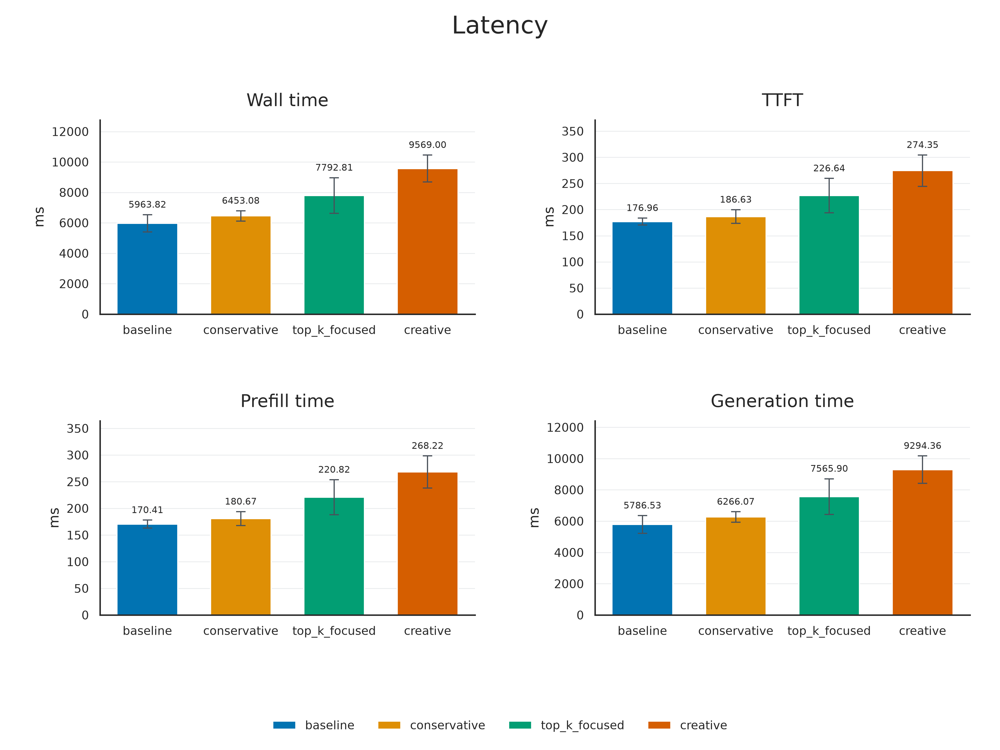

###### Per Token Latency

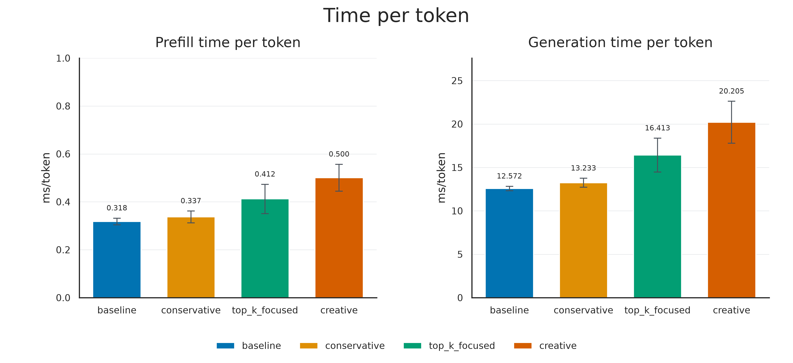

###### Throughput

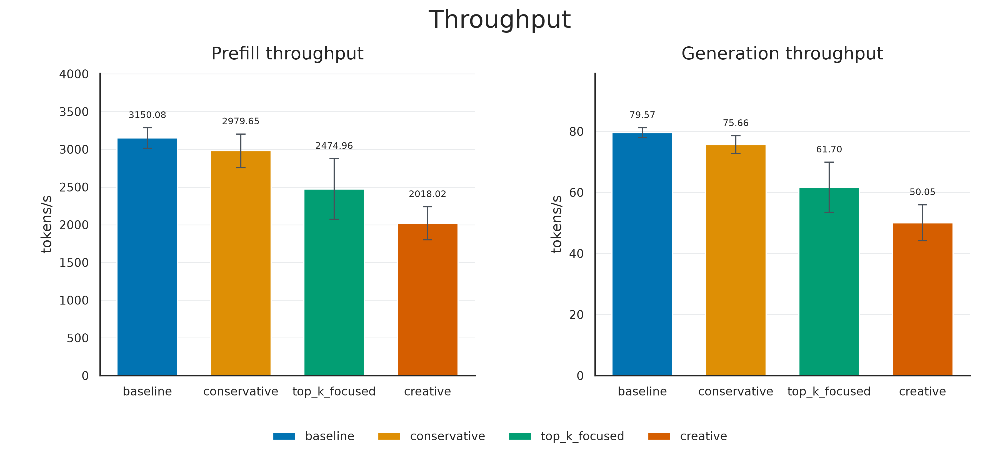

###### Token Counts


###### Token Usage

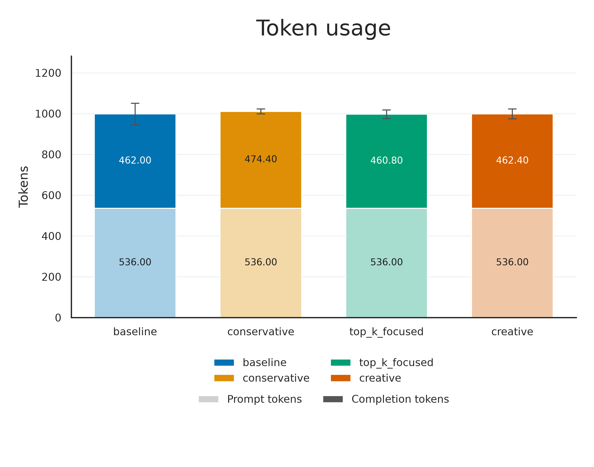

###### Timings Table

| Preset | Cached input tokens (tokens) | Wall time (ms) | TTFT (ms) | Prefill tokens (tokens) | Prefill time (ms) | Prefill time per token (ms/token) | Prefill throughput (tokens/s) | Generated tokens (tokens) | Generation time (ms) | Generation time per token (ms/token) | Generation throughput (tokens/s) |
| --- | --- | --- | --- | --- | --- | --- | --- | --- | --- | --- | --- |
| baseline | 0.00 +- 0.00 | **5963.82 +- 570.21** | **176.96 +- 6.72** | 536.00 +- 0.00 | **170.41 +- 7.51** | **0.318 +- 0.014** | **3150.08 +- 135.13** | 462.00 +- 52.91 | **5786.53 +- 568.38** | **12.572 +- 0.258** | **79.57 +- 1.61** |
| conservative | 0.00 +- 0.00 | 6453.08 +- 337.99 | 186.63 +- 13.08 | 536.00 +- 0.00 | 180.67 +- 13.17 | 0.337 +- 0.025 | 2979.65 +- 222.31 | 474.40 +- 12.03 | 6266.07 +- 333.14 | 13.233 +- 0.519 | 75.66 +- 2.88 |
| top_k_focused | 0.00 +- 0.00 | 7792.81 +- 1171.73 | 226.64 +- 32.95 | 536.00 +- 0.00 | 220.82 +- 32.84 | 0.412 +- 0.061 | 2474.96 +- 401.85 | 460.80 +- 21.15 | 7565.90 +- 1142.67 | 16.413 +- 1.958 | 61.70 +- 8.19 |
| creative | 0.00 +- 0.00 | 9569.00 +- 888.15 | 274.35 +- 29.99 | 536.00 +- 0.00 | 268.22 +- 30.17 | 0.500 +- 0.056 | 2018.02 +- 218.63 | 462.40 +- 24.59 | 9294.36 +- 876.59 | 20.205 +- 2.412 | 50.05 +- 5.86 |

---

#### 2. Классификация

Ответы по пресетам: [baseline](../results/report_materials/preset_comparison/phi-4-mini/p2_classification/responses_baseline.md); [conservative](../results/report_materials/preset_comparison/phi-4-mini/p2_classification/responses_conservative.md); [top_k_focused](../results/report_materials/preset_comparison/phi-4-mini/p2_classification/responses_top_k_focused.md); [creative](../results/report_materials/preset_comparison/phi-4-mini/p2_classification/responses_creative.md).

Короткое резюме: лучшие средние результаты получены с `conservative` и `top_k_focused` — **83,33 ± 5,56 %**, или **15,00 ± 1,00** правильных классификаций из 18. Для `baseline` сохранённые показатели составляют **82,22 ± 6,09 %** и **14,80 ± 1,10**, для `creative` — **81,11 ± 4,97 %** и **14,60 ± 0,89**. Здесь приведены готовые `accuracy` и `n_correct` из таблиц анализа, без повторного вычисления относительно эталона. Разница между средними небольшая относительно разброса пяти повторов, поэтому уверенного превосходства одного пресета из этих значений не следует.

Наиболее устойчивые ошибки относятся к двум отзывам:

**8** — «Фильм не произвел должного впечатления… актеры были на высоте, но чего-то в этом фильме не хватает». Эталон — **Bad**, во всех пяти ответах каждого пресета предсказано **Neutral**. Положительные частные детали соседствуют с общим неудовлетворительным впечатлением; модель во всей выборке выбирает более нейтральную оценку, чем задано эталоном.

**18** — «…это — действительно хороший фильм… одна из лучших в кинематографе». Эталон — **Neutral**, во всех пяти ответах каждого пресета предсказано **Good**. Ответы модели согласованы друг с другом, но эта согласованность не означает правильности относительно выбранной разметки.

Отдельный характерный сбой — снижение явно положительных отзывов **13** и **14** до **Neutral**. В отзыве 13 говорится о фильме, навсегда оставшемся в сердце, в отзыве 14 — о сильном впечатлении от идеи ценности жизни. При `baseline` и `creative` каждый из этих пунктов ошибочен в двух повторах; при `conservative` и `top_k_focused` пункт 13 — в трёх, пункт 14 — в двух. Следовательно, самые близкие к лучшим по среднему пресеты не устраняют эти ошибки.

У `baseline` дополнительно по одному разу ошибочно классифицированы отзывы **7** и **10**: вместо **Neutral** выбрано **Good**. У `creative` ошибка по пункту 7 встречается дважды, причём ответы расходятся между **Good** и **Bad**, а ошибка по пункту 10 — один раз. Сохранённые confusion matrices показывают, что основная неоднозначность сосредоточена на границах **Good / Neutral** и **Bad / Neutral**, без смешения **Good** с **Bad**. Единственное дополнительное направление у `creative` — **Neutral → Bad**.

По совпадению полных последовательностей классов `conservative` и `top_k_focused` дают одинаковый набор ответов для каждого соответствующего повтора. В этих двух пресетах, как и в `baseline`, Response 1 совпадает с Response 3, а Response 2 — с Response 5. У `creative` совпадает только пара Response 1 и Response 3. Это описание наблюдаемых повторов: уменьшение разнообразия не устранило систематические ошибки 8 и 18.

##### Производительность модели

###### Accuracy

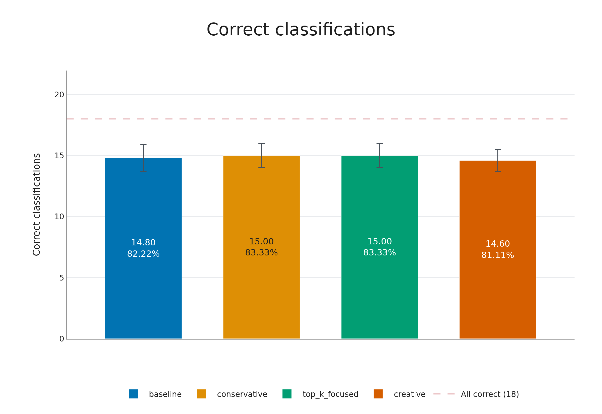

###### Latency

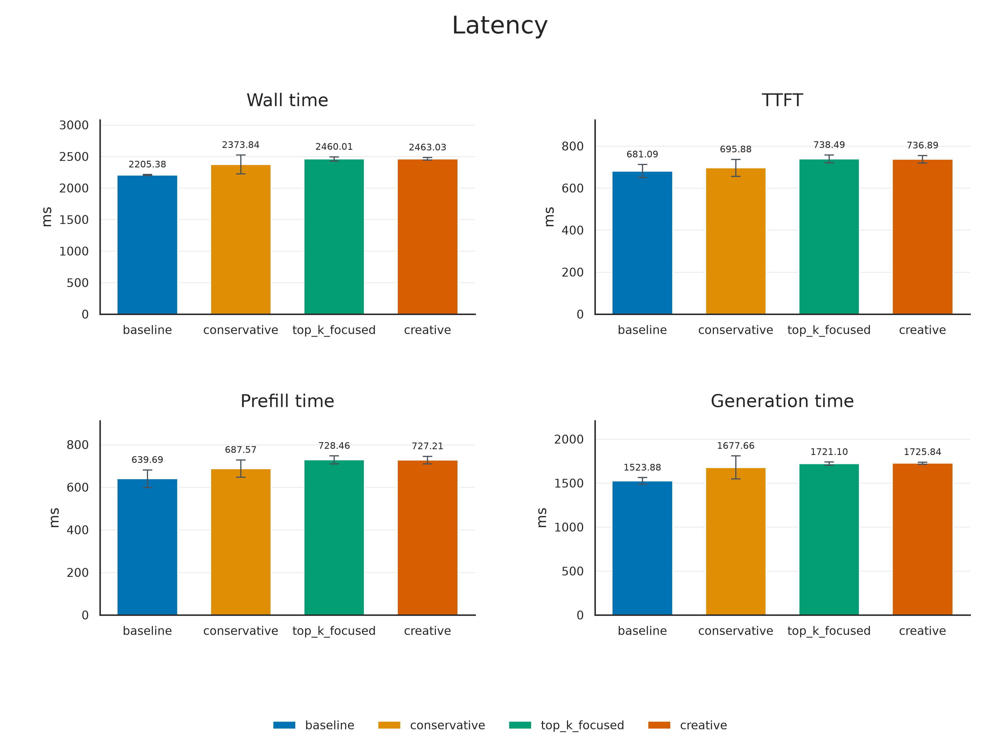

###### Per Token Latency

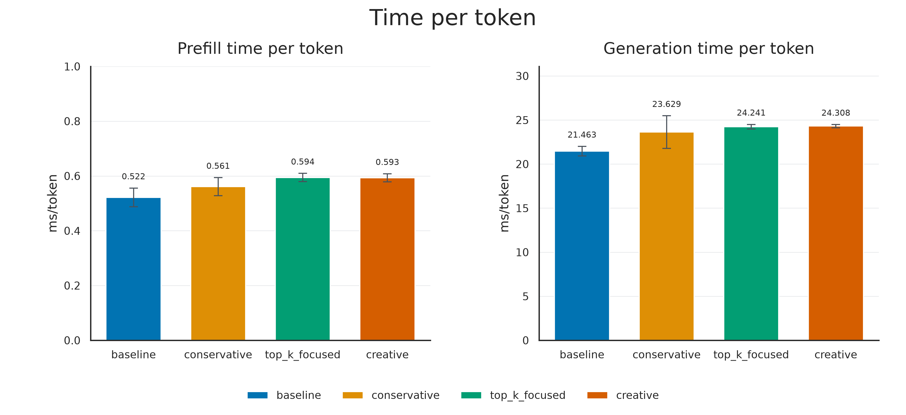

###### Throughput

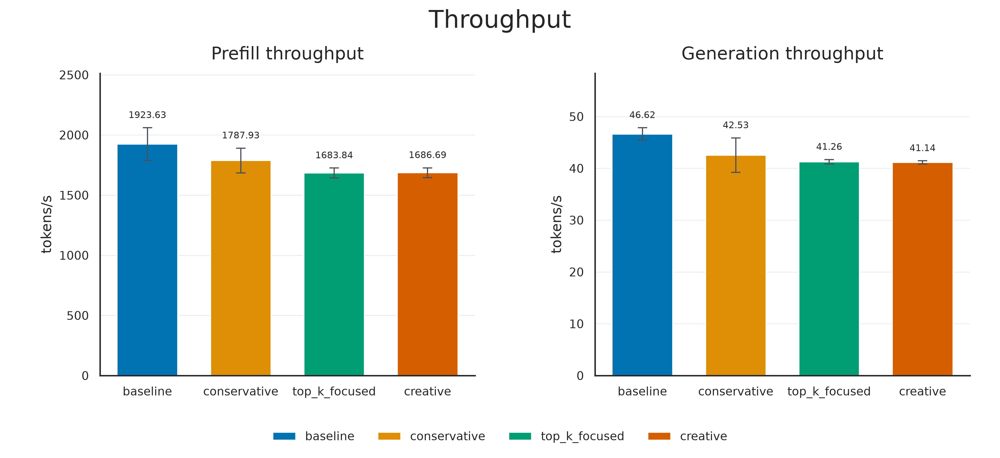

###### Token Counts

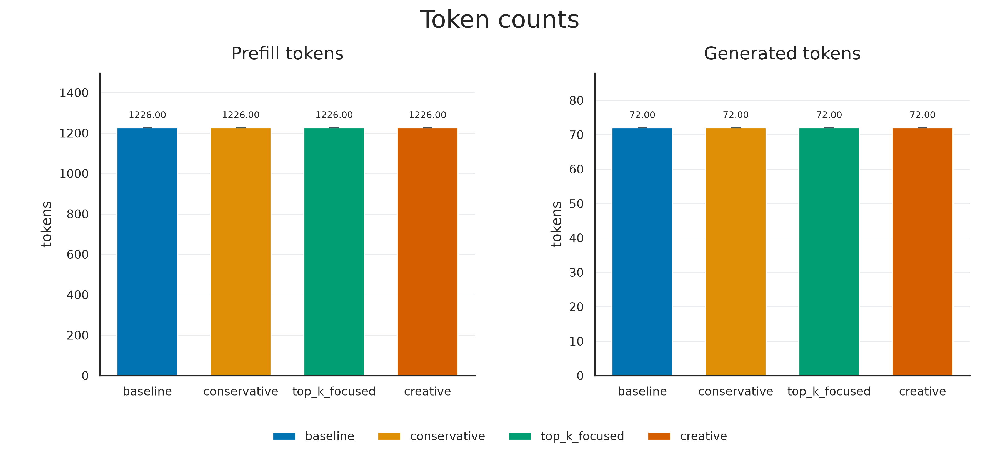

###### Token Usage


##### Частота ошибок по инстансам

###### baseline

| Measure | 1 | 2 | 3 | 4 | 5 | 6 | 7 | 8 | 9 | 10 | 11 | 12 | 13 | 14 | 15 | 16 | 17 | 18 |
| --- | --- | --- | --- | --- | --- | --- | --- | --- | --- | --- | --- | --- | --- | --- | --- | --- | --- | --- |
| Expected class | Good | Good | Bad | Good | Bad | Bad | Neutral | Bad | Neutral | Neutral | Good | Neutral | Good | Good | Neutral | Bad | Bad | Neutral |
| Incorrect predictions | 0 | 0 | 0 | 0 | 0 | 0 | 1 | 5 | 0 | 1 | 0 | 0 | 2 | 2 | 0 | 0 | 0 | 5 |
| Total predictions | 5 | 5 | 5 | 5 | 5 | 5 | 5 | 5 | 5 | 5 | 5 | 5 | 5 | 5 | 5 | 5 | 5 | 5 |

| Actual / Predicted | Good | Bad | Neutral |
| --- | --- | --- | --- |
| Good | 26 | 0 | 4 |
| Bad | 0 | 25 | 5 |
| Neutral | 7 | 0 | 23 |

###### conservative

| Measure | 1 | 2 | 3 | 4 | 5 | 6 | 7 | 8 | 9 | 10 | 11 | 12 | 13 | 14 | 15 | 16 | 17 | 18 |
| --- | --- | --- | --- | --- | --- | --- | --- | --- | --- | --- | --- | --- | --- | --- | --- | --- | --- | --- |
| Expected class | Good | Good | Bad | Good | Bad | Bad | Neutral | Bad | Neutral | Neutral | Good | Neutral | Good | Good | Neutral | Bad | Bad | Neutral |
| Incorrect predictions | 0 | 0 | 0 | 0 | 0 | 0 | 0 | 5 | 0 | 0 | 0 | 0 | 3 | 2 | 0 | 0 | 0 | 5 |
| Total predictions | 5 | 5 | 5 | 5 | 5 | 5 | 5 | 5 | 5 | 5 | 5 | 5 | 5 | 5 | 5 | 5 | 5 | 5 |

| Actual / Predicted | Good | Bad | Neutral |
| --- | --- | --- | --- |
| Good | 25 | 0 | 5 |
| Bad | 0 | 25 | 5 |
| Neutral | 5 | 0 | 25 |

###### top_k_focused

| Measure | 1 | 2 | 3 | 4 | 5 | 6 | 7 | 8 | 9 | 10 | 11 | 12 | 13 | 14 | 15 | 16 | 17 | 18 |
| --- | --- | --- | --- | --- | --- | --- | --- | --- | --- | --- | --- | --- | --- | --- | --- | --- | --- | --- |
| Expected class | Good | Good | Bad | Good | Bad | Bad | Neutral | Bad | Neutral | Neutral | Good | Neutral | Good | Good | Neutral | Bad | Bad | Neutral |
| Incorrect predictions | 0 | 0 | 0 | 0 | 0 | 0 | 0 | 5 | 0 | 0 | 0 | 0 | 3 | 2 | 0 | 0 | 0 | 5 |
| Total predictions | 5 | 5 | 5 | 5 | 5 | 5 | 5 | 5 | 5 | 5 | 5 | 5 | 5 | 5 | 5 | 5 | 5 | 5 |

| Actual / Predicted | Good | Bad | Neutral |
| --- | --- | --- | --- |
| Good | 25 | 0 | 5 |
| Bad | 0 | 25 | 5 |
| Neutral | 5 | 0 | 25 |

###### creative

| Measure | 1 | 2 | 3 | 4 | 5 | 6 | 7 | 8 | 9 | 10 | 11 | 12 | 13 | 14 | 15 | 16 | 17 | 18 |
| --- | --- | --- | --- | --- | --- | --- | --- | --- | --- | --- | --- | --- | --- | --- | --- | --- | --- | --- |
| Expected class | Good | Good | Bad | Good | Bad | Bad | Neutral | Bad | Neutral | Neutral | Good | Neutral | Good | Good | Neutral | Bad | Bad | Neutral |
| Incorrect predictions | 0 | 0 | 0 | 0 | 0 | 0 | 2 | 5 | 0 | 1 | 0 | 0 | 2 | 2 | 0 | 0 | 0 | 5 |
| Total predictions | 5 | 5 | 5 | 5 | 5 | 5 | 5 | 5 | 5 | 5 | 5 | 5 | 5 | 5 | 5 | 5 | 5 | 5 |

| Actual / Predicted | Good | Bad | Neutral |
| --- | --- | --- | --- |
| Good | 26 | 0 | 4 |
| Bad | 0 | 25 | 5 |
| Neutral | 7 | 1 | 22 |

---

#### 3. Суммаризация

Ответы по пресетам: [baseline](../results/report_materials/preset_comparison/phi-4-mini/p3_summary/responses_baseline.md); [conservative](../results/report_materials/preset_comparison/phi-4-mini/p3_summary/responses_conservative.md); [top_k_focused](../results/report_materials/preset_comparison/phi-4-mini/p3_summary/responses_top_k_focused.md); [creative](../results/report_materials/preset_comparison/phi-4-mini/p3_summary/responses_creative.md).

Оценка LLM as a judge здесь относится к точности и полезности резюме исходного поста. Проверяется передача восторга автора, основных событий и итоговой оценки без добавления новых сведений, а также формат 4–5 предложений. Покрытие 12 тезисов из задания на генерацию к этой задаче не применяется. В разборе формата заголовок не считается предложением, а самостоятельные завершённые точкой фразы о длительности и оценке учитываются. В выбранных примерах явной служебной вводной перед резюме нет; выделенные названия эпизода выполняют роль заголовка или подписи.

##### baseline

###### Пример — Response 1

> В финальной серии 4 сезона "Re:Zero — 4 сезон, 19 серия" зрители получат захватывающую битву, эмоциональную сцену с Шаулой и Субару, а также завершение шестой арки, где Рем просыпается. Адаптация доходит до самого конца, воплощая великолепие, о чём говорила критика Алекс ДеЛардж. Программа длится около 41 минуты, включая опенинг и эндинг. Оценка — 9,5/10.

###### Анализ содержания

Резюме состоит из **четырёх предложений**, то есть формально соблюдает требование. Оно сохраняет основные опорные факты: эмоциональную сцену Шаулы и Субару, пробуждение Рем, завершение шестой арки, длительность около 41 минуты и оценку 9,5/10. При этом битва описана слишком общо: исчезают имена Эмилии и Волканики, хотя в исходнике именно этот бой выделен как любимая часть. Потеря подробностей сама по себе допустима для краткого резюме, но здесь их заменяет менее полезная фраза о «воплощении великолепия».

Основная проблема точности связана с Алексом ДеЛарджем. В исходнике автор использует цитату для описания собственного восторга; это не отзыв критика о серии. Фраза «о чём говорила критика Алекс ДеЛардж» создаёт другую роль и источник оценки, причём с грамматической ошибкой. Называние серии «программой» стилистически неуместно. Перечисление опенинга и эндинга подано увереннее исходника, где опенинг подтверждён, а подробности эндинга сознательно не раскрываются.

Резюме достаточно узнаваемо как сокращение исходного поста, но требует устранить ошибочную атрибуцию и выправить язык. Утверждение, что седьмая арка не адаптирована, отсутствует: это важная граница адаптации, которую можно было бы сохранить вместо неудачной фразы о критике.

###### Пример — Response 2

> **Re:Zero — 4 сезон, 19 серия (ФИНАЛ):** Финальная серия захватывает с битвами, эмоциональными моментами и завершается важной сценой, где Субару просыпается и Рем становится его героем. Сцена шести арки впечатляет своими деталями, оставляя тайну для будущих сезонов. ★★★★★

Во втором примере только **два предложения**: формат не выполнен. Более серьёзная ошибка — «Рем становится его героем». В исходнике Субару говорит Рем, что **он её герой**, а не наоборот. Обещание тайны для будущих сезонов в посте явно не сформулировано. Исчезают длительность и исходная оценка 9,5/10; пять звёзд не являются точной передачей этой оценки. По сравнению с первым примером ответ короче, но значительно хуже сохраняет факты.

###### Оценка LLM as a judge

Первый пример можно использовать как основу после редактирования, второй — только после существенного исправления. Сам формат четырёх предложений в Response 1 не защищает от ложной атрибуции. Базовые настройки в этих примерах дают различную длину и надёжность; качество нельзя описать как устойчивое выполнение задачи.

##### conservative

###### Пример — Response 4

> **Re:Zero — 4 сезон, 19 серия (ФИНАЛ)**
>
> Последний эпизод сезона 4, серия 19, завершающий шестую арку, вызывает восторг благодаря динамичным боям, особенно Эмилии против Волканики, и эмоциональной сцене с Шаулой и Субару. Впечатляет трансформация Скорпиона и финальная сцена, где Рем просыпается, воплощая завершение шестой арки. Сюжет адаптирован до самого конца, оставляя зрителей в восторге. Длительность — около 41 минуты. Оценка: 9,5/10.

###### Анализ содержания

В этом примере **пять завершённых фраз**, включая отдельные фразы о длительности и оценке. В отличие от большинства сверхкоротких ответов модель охватывает несколько частей исходного поста: бой Эмилии с Волканикой, сцену Шаулы и Субару, превращение скорпиона и пробуждение Рем. Правильно переданы завершение шестой арки, 41 минута и 9,5/10.

Текст достаточно связен, хотя повторение «завершающий шестую арку» и «воплощая завершение шестой арки» расходует место. «Трансформация Скорпиона» обобщает конкретный эмоциональный момент появления маленького багрового скорпиона из разрушающегося панциря. Для резюме такое сокращение допустимо, но оно делает важную авторскую реакцию менее понятной. Формулировка о зрителях, оставленных в восторге, распространяет мнение одного автора на аудиторию в целом; исходный пост не содержит данных о реакции всех зрителей.

Не сохранены отсутствие адаптации седьмой арки и слова Субару о том, что он герой Рем. Это потери детализации, а не фактическая инверсия. Среди выбранных примеров ответ выглядит относительно удачным: основные события различимы, заданная длина соблюдена, итоговая оценка точно перенесена.

###### Пример — Response 3

> **Re:Zero — 4 сезон, 19 серия (ФИНАЛ)**
>
> Последний эпизод сезона 4, серия 19, завершается захватывающей финальной сценой. Эмилия против Волканики демонстрирует динамичную битву, любимая Эмилией сцена с «Абсолютным Нолем». Битва в пустыне и сцена с Шаулой также выделяются. Финальная сцена, где Субару просыпается на таинственной поляне, завершается завершением шестой арки, с Ремом, который говорит Субару, что он её герой. Эпизод длится около 41 минуты, включая открывающий и заключительный титры. Оценка: 9,5/10.

Другой ответ содержит **шесть завершённых фраз**, если, как и выше, включать отдельную фразу оценки; без неё остаётся пять повествовательных предложений. Подробностей больше, но надёжность ниже. «Любимая Эмилией сцена» ошибочно приписывает оценку персонажу: в оригинале любимый момент выбирает автор поста. Затем Рем приписаны слова о том, что Субару её герой, хотя произносит их Субару. Конструкция «завершается завершением» дополнительно ухудшает стиль. По сравнению с Response 4 увеличение детализации здесь сопровождается искажением отношений между участниками событий.

###### Оценка LLM as a judge

Response 4 показывает, что при этом пресете возможна содержательная и достаточно аккуратная суммаризация. Response 3 показывает обратную сторону: модель может сохранять названия событий, но менять носителя мнения и автора реплики. Кроме того, другие ответы этого пресета очень кратки: Response 1 и 2 состоят из двух завершённых фраз. Поэтому сниженная температура в этой выборке не обеспечила надёжного соблюдения формата и фактов во всех повторах.

##### top_k_focused

###### Пример — Response 4

> **Re: Zero, 4 сезон, 19 серия (ФИНАЛ)** — это финальная серия, которая оставила зрителей в восторге, особенно битвы Эмилии против Волканики и сцена с Шаулой. Момент, когда Волканика отреагировал на «Ведьму Зависти», и использование «Абсолютного Ноля» Эмилией были особенно впечатляющими. Сцена с Шаулой, особенно поцелуй в щёку Субару, была воспринята как мощное и трогательное. Финальная сцена, где Субару просыпается и говорит Рему, что он её герой, была оценена как воплощённое великолепие, получив оценку 9,5/10. Серия длится около 41 минуты, включая открывающий и завершающий титры.

###### Анализ содержания

Ответ содержит **пять предложений** и передаёт больше содержательных деталей, чем baseline / Response 1. Сохранены бой Эмилии и Волканики, реакция на слова «Ведьма Зависти», применение «Абсолютного Ноля», поцелуй Шаулы в щёку Субару, финальные слова Субару и длительность серии. Оценка 9,5/10 присутствует.

Важный плюс относительно неудачных примеров выше — слова о герое правильно приписаны Субару. Однако пробуждение Рем явно не названо, как и завершение шестой арки, поэтому граница адаптации теряется. Фраза «получив оценку 9,5/10» грамматически связывает оценку с финальной сценой, тогда как в исходнике это итоговая оценка серии. Упоминание восторга зрителей вновь расширяет личную реакцию автора до реакции аудитории.

Есть ошибки языка: «говорит Рему» меняет форму имени, «была воспринята как мощное и трогательное» нарушает согласование. «Открывающий и завершающий титры» заменяют исходное более конкретное упоминание опенинга и намеренно нераскрытого эндинга. Общий восторженный тон и последовательность ключевых моментов узнаваемы, но текст нуждается в выправлении формулировок и возвращении важных финальных фактов.

###### Пример — Response 5

> **Re:Zero — 4 сезон, 19 серия (ФИНАЛ)**
>
> Последний эпизод сезона 4, серия 19, завершается мощным финалом с эмоциональной сценой, где Субару просыпается на таинственной поляне, окружённой джунглями, что соответствует завершению шестой арки. Эпизод, длительностью около 41 минуты, включает в себя ключевые моменты, такие как битва в пустыне, сцена с Шаулой и завершение истории Роя. Адаптация доходит до самого конца шестой арки, что вызывает восторг у зрителей. Оценка: 9,5/10.

Во втором примере **четыре завершённых фразы**, то есть формат соблюдён. Он менее подробен и не содержит языкового сбоя с «Рему», но добавляет «завершение истории Роя». Исходник только сообщает об обсуждении Роя, заточённого в Шамаке; завершения его истории в нём нет. Пробуждение Рем снова отсутствует, хотя именно оно составляет кульминацию финального абзаца. Получается более гладкий, но менее надёжный пересказ: связность не компенсирует добавление сюжетного вывода от себя.

###### Оценка LLM as a judge

Выбранные ответы этого пресета лучше сверхкоротких вариантов по форме и числу упомянутых событий. Однако оба теряют часть финального смысла, а Response 5 добавляет неподтверждённый сюжетный факт. Кроме того, Response 1 представляет собой одну перечислительную фразу, Response 2 — две: стабильности формата 4–5 предложений во всей пятёрке нет. Ограниченный выбор токенов не устранил ошибки содержательной суммаризации.

##### creative

###### Пример — Response 2

> **Re:Zero — 4 сезон, 19 серия (ФИНАЛ):** В этом финальном эпизоде зрители получают захватывающий опыт, включая мощные сцены с Эмилией против Волканики, эпизодическую встречу с «Ведьмой Зависти» и момент, когда Субару встает из панацеи. Переход в Зелёную комнату нарушен появлением Ведьмы Зависти, что приводит к её поражению. Финальная сцена, где Субару просыпается на таинственной поляне, завершается грандиозной адаптацией шестой арки, завершенной словами Рема о том, что Субару её герой. Длительность серии составляет 41 минуту. **Оценка: 9,5/10**.

###### Анализ содержания

Формально здесь **пять предложений**. Сохранены имена персонажей, Зелёная комната, Ведьма Зависти, завершение шестой арки, длительность и итоговая оценка. Но наличие этих опорных слов не означает корректного пересказа.

«Субару встает из панацеи» не соответствует никакому событию исходного текста и не имеет понятного смысла в данном контексте. Появление Луи, нарушающее табу, пропущено; вместо этого сказано, что «переход в Зелёную комнату нарушен появлением Ведьмы Зависти». Тем самым меняется причинная последовательность. Удар Волканики, сметающий Ведьму и тени, превращается в общее «поражение», а роль самого Волканики в этой сцене не объясняется. Затем слова о герое вновь приписываются Рем, хотя в оригинале их произносит Субару.

Эмоциональная сцена Шаулы и сам факт пробуждения Рем не раскрыты, хотя для краткого резюме они полезнее непонятной «панацеи». Поэтому соблюдение числа предложений сопровождается серьёзной потерей фактической точности. Этот ответ не годится как верное краткое резюме без переработки.

###### Пример — Response 1

> Эпизод 19 4 сезона Re:zero привлёл зрителей яркими битвами и эмоциональными моментами, особенно поцелуй Шаулы в щёку Субару и финальная сцена, где Рем просыпается, что получили высокие оценки от фанатов, оцениваемые в 9,5/10. Серия впечатляющая, но её продолжительность — около 41 минуты, с открывающим и заключительным эндингом.

Во втором примере всего **два предложения**, поэтому формат нарушен. Сохраняются поцелуй Шаулы, пробуждение Рем, 41 минута и 9,5/10, но последняя оценка ошибочно представлена как высокие оценки фанатов, хотя это оценка автора одного поста. Есть языковые сбои «привлёл» и «что получили… оцениваемые». Относительно Response 2 здесь меньше сюжетных выдумок и верно названо пробуждение Рем, но резюме слишком общее и не передаёт границу шестой и седьмой арок.

###### Оценка LLM as a judge

На этих примерах creative даёт наименее безопасное для смысла исходника расширение вариативности: появляются несуществующее событие, смена говорящего и обобщения о реакции аудитории. Один выбранный ответ выполняет формальный лимит предложений, другой — нет; оба требуют фактической и языковой правки. В данной выборке настройка не улучшает полезность резюме.

##### Производительность модели

###### Latency

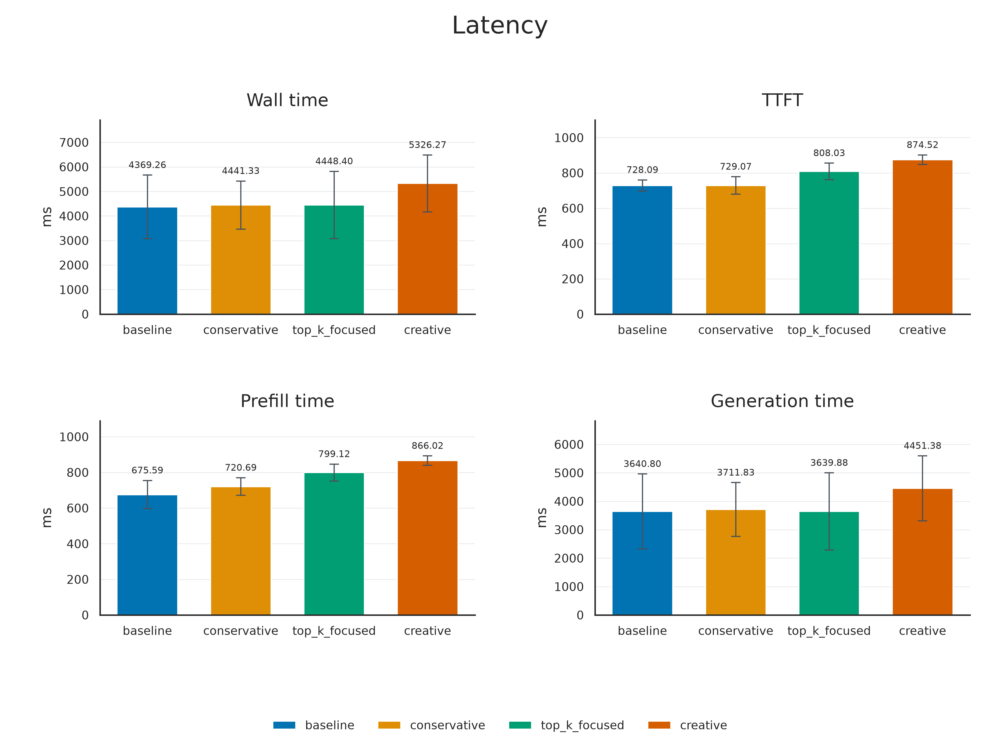

###### Per Token Latency

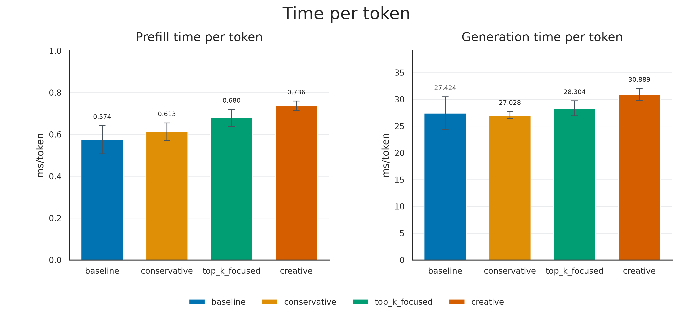

###### Throughput

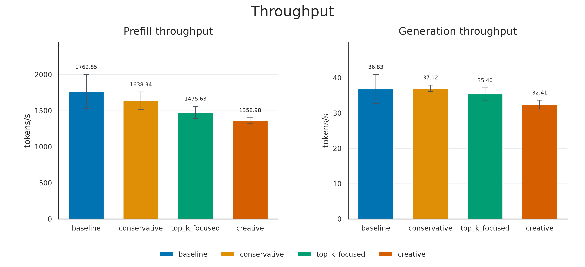

###### Token Counts

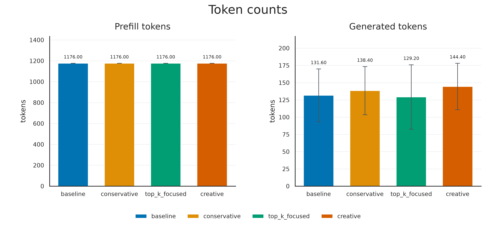

###### Token Usage

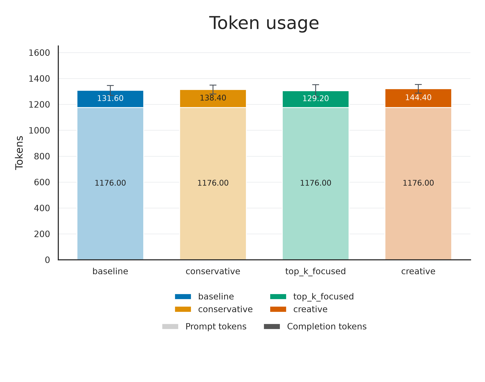

###### Timings Table

| Preset | Cached input tokens (tokens) | Wall time (ms) | TTFT (ms) | Prefill tokens (tokens) | Prefill time (ms) | Prefill time per token (ms/token) | Prefill throughput (tokens/s) | Generated tokens (tokens) | Generation time (ms) | Generation time per token (ms/token) | Generation throughput (tokens/s) |
| --- | --- | --- | --- | --- | --- | --- | --- | --- | --- | --- | --- |
| baseline | 0.00 +- 0.00 | **4369.26 +- 1295.98** | **728.09 +- 31.79** | 1176.00 +- 0.00 | **675.59 +- 79.07** | **0.574 +- 0.067** | **1762.85 +- 237.32** | 131.60 +- 38.21 | 3640.80 +- 1317.78 | 27.424 +- 3.036 | 36.83 +- 4.11 |
| conservative | 0.00 +- 0.00 | 4441.33 +- 983.69 | 729.07 +- 49.31 | 1176.00 +- 0.00 | 720.69 +- 49.42 | 0.613 +- 0.042 | 1638.34 +- 119.70 | 138.40 +- 34.86 | 3711.83 +- 943.24 | **27.028 +- 0.673** | **37.02 +- 0.92** |
| top_k_focused | 0.00 +- 0.00 | 4448.40 +- 1369.55 | 808.03 +- 47.30 | 1176.00 +- 0.00 | 799.12 +- 47.29 | 0.680 +- 0.040 | 1475.63 +- 84.94 | 129.20 +- 46.74 | **3639.88 +- 1357.87** | 28.304 +- 1.411 | 35.40 +- 1.75 |
| creative | 0.00 +- 0.00 | 5326.27 +- 1157.52 | 874.52 +- 27.01 | 1176.00 +- 0.00 | 866.02 +- 26.70 | 0.736 +- 0.023 | 1358.98 +- 42.27 | 144.40 +- 33.60 | 4451.38 +- 1144.16 | 30.889 +- 1.137 | 32.41 +- 1.25 |

#### Вывод о влиянии настроек

В задаче генерации `conservative` наиболее последовательно сохраняет исходные мысли, но преимущественно за счёт почти буквального переноса списка тезисов. Это не исправляет главную проблему: все 20 ответов Phi-4-mini длиннее разрешённых 120 слов. `top_k_focused` даёт отдельные полные ответы рядом с потерями смысла, а `creative` чаще создаёт грамматические и смысловые искажения. Более разнообразные формулировки здесь не означают лучшего готового поста.

В суммаризации встречаются относительно удачные примеры у `conservative` и `top_k_focused`, но рядом с ними сохраняются сверхкороткие ответы, ложная атрибуция мнений и реплик, пропуски важных финальных фактов. `creative` в приведённых примерах добавляет наиболее заметные ошибки сюжета. Общего пресета, который надёжно соблюдал бы формат и сохранял факты в обоих текстовых заданиях, по пяти повторам не найдено.

Для классификации `conservative` и `top_k_focused` дают одинаковые последовательности классов по соответствующим повторам и одинаковые лучшие средние показатели — 83,33 %. Разница с 82,22 % у `baseline` и 81,11 % у `creative` невелика; систематические ошибки на отзывах 8 и 18 остаются при любых настройках. Стабильность отдельных ответов и правильность относительно эталона следует оценивать отдельно.

У Phi-4-mini `baseline` использует фактические настройки сервера **temperature = 0.8, top_k = 40, top_p = 0.95**. `conservative` меняет temperature и top_p на 0.2 и 0.8, `top_k_focused` — temperature и top_k на 0.5 и 20, `creative` — temperature и top_p на 1.1 и 0.98; остальные параметры наследуются от сервера. Поэтому эти наблюдения относятся к пресетам целиком. Они не позволяют приписать разницу одному параметру или установить причинность; пять повторов описывают ограниченную выборку ответов на три конкретных задания.

### Qwen3.5-4B

#### 1. Генерация

Ответы модели по конфигурациям настроек:

- [baseline](../results/report_materials/preset_comparison/qwen3.5-4b/p1_generation/responses_baseline.md);
- [conservative](../results/report_materials/preset_comparison/qwen3.5-4b/p1_generation/responses_conservative.md);
- [top_k_focused](../results/report_materials/preset_comparison/qwen3.5-4b/p1_generation/responses_top_k_focused.md);
- [creative](../results/report_materials/preset_comparison/qwen3.5-4b/p1_generation/responses_creative.md);

Для каждого пресета подробно рассматривается `Response 1`, затем коротко — `Response 2`. Проверка всех пяти ответов выполнена в роли **LLM as a judge**. Это семантическая оценка следования конкретному промпту, а не независимая объективная метрика.

В таблицах **Fully covered** означает, что смысл тезиса сохранён, включая значимые части составного требования; **Partially covered** — основная мысль узнаваема, но потеряны важные детали или внесено искажение; **Absent** — нет соответствующей мысли либо она заменена противоположной. **Covered** включает полное и частичное покрытие, поэтому его следует читать вместе с остальными столбцами. В частности, упоминание плохого качества само по себе не покрывает все перечисленные проблемы тезиса 2; «прошлый эпизод лучше» передаёт только часть тезиса 7; «вырезали злодея» не подразумевает автоматически его тему счастья и предысторию.

Длина считается по выражению `[^\W_]+(?:[’'-][^\W_]+)*` в Unicode: буквенные и числовые последовательности, слова с дефисом или апострофом считаются одним словом; эмодзи и знаки Markdown не считаются. Полный текст ответа совпадает с текстом поста: служебных вступлений в этих двадцати ответах нет.

##### baseline

**Response 1**

> Сейчас устал от 16-го эпизода, он просто разочаровывает. Режиссуры почти нет, визуалы сухие, а ключевая сцена с Нацуки превратилась в блеклую копию оригинала. Конфликт героя смазан, а главную ветку антагониста просто вырезали, оставив пустую оболочку. Даже фан-версии были лучше! Прошлый эпизод был на голову выше. Но пару баллов за музыку и актеров. Советую всем прочитать мангу, чтобы увидеть настоящую глубину. Надеюсь, следующий эпизод наконец-то оправдает ожидания. Это худшее шоу сезона.

###### Субъективный анализ содержания

Начало «Сейчас устал от 16-го эпизода» звучит неестественно: для впечатления от недавно просмотренной серии уместнее «устал после просмотра» или «эпизод меня разочаровал». Дальше модель переходит к достаточно понятному разговорному перечислению претензий. «Визуалы сухие», «конфликт смазан», «пустая оболочка» передают общий эмоциональный тон задания, а музыка и актёры остаются небольшим положительным исключением.

Проблема текста заключается в смысловых подменах. «Советую всем прочитать мангу» сужает «прочитать оригинал» до конкретного вида произведения, которого в тезисах нет; источник явно описан как книжный первоисточник. Без внешних сведений о франшизе эта рекомендация уже не подтверждается входными данными. Концовка «Это худшее шоу сезона» меняет оценку одного эпизода с точки зрения адаптации на оценку всего шоу. Это существеннее неудачного выбора синонима.

Фраза про фан-версии стоит после внутреннего конфликта и антагониста. Она сохраняет общий комплимент фанатским работам, но не поясняет, что речь именно об адаптации главной сцены, её качестве и эмоциональности. Аналогично, прошлый эпизод назван лучшим, однако его меньшая ожидаемость и важность не упомянуты. У антагониста осталась «оболочка», но исчезли тема счастья и предыстория.

###### Следование инструкциям

Ответ содержит **70 слов**, что ниже требуемого диапазона 80–120. Он в основном написан по-русски и сохраняет разговорный тон, но не использует имеющийся запас длины для деталей. Нет отдельной мысли о ценном вырезанном контенте, способном усилить эмоциональность; отсутствуют чтение книг мёртвых, длительность рекапов и отсутствие акцентов на ключевых сценах. Следовательно, краткость здесь достигается за счёт потери содержания, а не только удачного сжатия.

###### Другой пример генерации

**Response 2**

> 16-й эпизод 4-го сезона Re:Zero — это полный провал. Качество просто ниже плинтуса: ни визуальных эффектов, ни эмоций. Главная сцена с похвалой Субару стала блеклой копией книги, а внутренний конфликт героя смазан до неузнаваемости.
>
> Режиссуры как никакой, актеры озвучки спасают ситуацию пару баллов. А ведь всю сюжетную ветку антагониста и его главную тему вырезали, оставив лишь оболочку. Вырезанный контент мог бы добавить нужной остроты. По сравнению с предыдущим эпизодом, который хоть и менее важен, но качественнее, это абсолютный кошмар.
>
> Это худшая адаптация сезона. Советую всем прочитать оригинал, там же нет. Надеюсь, следующий эпизод наконец-то будет лучше.

Во втором примере **96 слов**: ограничение соблюдено, появляется мысль о вырезанном контенте, который мог добавить остроты, и правильная оценка адаптации сезона. По полноте он лучше первого.

Однако язык хуже: «Режиссуры как никакой», «актеры озвучки спасают ситуацию пару баллов» и особенно «Советую всем прочитать оригинал, там же нет» выглядят как неотредактированные обрывки. Музыка не упомянута, сравнение с фан-версиями пропущено. В тезисе об антагонисте названа «главная тема», но не раскрыто, что это стремление к счастью. Более высокая полнота не компенсирует эти нарушения связности.

###### Оценка LLM as a judge

Первый ответ — слабое выполнение задания: он короткий, содержит неподтверждённую конкретизацию источника и неправильно меняет объект итоговой оценки. Второй лучше по содержанию и объёму, но требует языковой редакции. Среди пяти ответов нет стабильно аккуратного решения: `Response 5` также имеет 70 слов, `Response 3` повторяет рекомендацию манги, а `Response 4` пишет, что даже фан-версии «выглядят здесь жалко», хотя исходный тезис, наоборот, хвалит их. Пресет даёт узнаваемый эмоциональный отзыв, но точность переноса смысла ненадёжна.

###### Покрытие по тезисам

| Response | Words | Covered (incl. partial) | Fully covered | Partially covered | Absent | Notes |
| --- | --- | --- | --- | --- | --- | --- |
| 1 | 70 | 10/12 | 3, 9, 12 | 1, 2, 4, 5, 7, 8, 11 | 6, 10 | 70 слов; «манга» не задана; худшим названо шоу, а не эпизод по адаптации. |
| 2 | 96 | 11/12 | 1, 3, 6, 10, 11, 12 | 2, 5, 7, 8, 9 | 4 | Нет музыки; главная тема злодея не раскрыта; обрывок «там же нет». |
| 3 | 93 | 11/12 | 1, 3, 9, 10, 12 | 2, 4, 5, 7, 8, 11 | 6 | Тема счастья названа, предыстории нет; манга вместо неопределённого оригинала. |
| 4 | 95 | 10/12 | 1, 3, 9, 11, 12 | 2, 5, 7, 8, 10 | 4, 6 | Комплимент фан-версиям искажён до «выглядят здесь жалко». |
| 5 | 70 | 11/12 | 1, 3, 9, 10, 11, 12 | 2, 4, 5, 7, 8 | 6 | 70 слов; главные сцены смешаны с рекапами; ветка злодея названа без её содержания. |

##### conservative

**Response 1**

> 16-й эпизод 4-го сезона `Re:zero` — это полный провал. Адаптация превратилась в рекап, а ключевая сцена с фразой «Ты потрясающий парень» стала блеклой копией оригинала. Внутренний конфликт смазан, режиссуры нет, а сюжетную ветку главного антагониста просто вырезали, оставив пустую оболочку. Даже фан-версии были эмоциональнее. Качество ниже плинтуса, хотя за музыку и актеров можно дать пару баллов. Прошлый эпизод был на 3 головы выше. Советую всем прочитать мангу, чтобы увидеть настоящую глубину. Надеюсь, следующий выпуск исправит эту катастрофу.

###### Субъективный анализ содержания

Ответ построен компактно и связно: сначала общий провал, затем главная сцена, внутренний конфликт, режиссура и антагонист, после чего следуют позитивное исключение и надежда на улучшение. Выражения «полный провал», «качество ниже плинтуса» и «пустая оболочка» подходят свободному негативному посту. Грубых грамматических ошибок в выбранном примере почти нет.

При этом «Адаптация превратилась в рекап» обобщает локальную претензию к сценам чтения книг мёртвых на всю адаптацию. Это не равнозначно сообщению, что именно эти сцены заняли половину эпизода рекапами прошлых сезонов. Ключевая реплика сокращена, но основная мысль о блеклой копии сохранена. Сравнение с фан-версиями передаёт эмоциональное превосходство, хотя связь с конкретной сценой названа только косвенно.

Как и в первом `baseline`, возникает рекомендация «прочитать мангу, чтобы увидеть настоящую глубину». Вид первоисточника не задан, а «настоящая глубина» — оценочное усиление, не отдельный подтверждённый факт. Кроме того, нет мысли о худшем эпизоде сезона именно по адаптации. Ветка антагониста сжата до пустой оболочки: ни главная тема, ни предыстория не сохранились.

###### Следование инструкциям

В ответе **77 слов**, то есть нижняя граница 80 не достигнута. Русский язык и эмоциональный разговорный формат соблюдены. Однако низкая вариативность пресета сама по себе не гарантирует полноты: отдельное упоминание важного вырезанного контента отсутствует, а составные тезисы о качестве, режиссуре, предыдущем эпизоде и антагонисте сокращены.

###### Другой пример генерации

**Response 2**

> 16-й эпизод 4-го сезона Re:Zero — это полный провал и разочарование. Качество никудышное: нет визуальных эффектов, мимики или эмоций. Сцены с книгами мертвых превратились в скучные рекапы, а кульминация провалена как блеклая копия оригинала. Внутренний конфликт смазан, режиссуры нет, а вырезанный сюжет злодея лишил его сути. Даже фан-версии были лучше. Прошлый эпизод был на 3 головы выше. Пара баллов за музыку и озвучку, но это худшая адаптация сезона. Советую прочитать мангу. Надеюсь, следующий эпизод наконец-то будет лучше.

Второй ответ также содержит **77 слов** и не проходит ограничение длины. Он более явно перечисляет визуальные эффекты, мимику, эмоции и книги мёртвых, а также называет эпизод худшей адаптацией сезона. Поэтому по содержанию он немного удачнее первого.

Речь в целом понятна, хотя «кульминация провалена как блеклая копия оригинала» соединяет две оценки не очень естественным образом. Рекомендация манги повторяется. Самостоятельная претензия к ценному вырезанному контенту всё ещё не появляется: описание вырезанного сюжета злодея относится к другому тезису и не заменяет её.

###### Оценка LLM as a judge

Выбранные примеры читаются спокойнее и связнее, чем часть `baseline`, но оба слишком короткие и неполные. Все пять ответов повторяют близкую последовательность претензий, музыки и надежды на следующий эпизод. Вместе с тем устойчивость шаблона не означает устойчивость качества: `Response 3` ставит рекап на место живого антагониста, `Response 4` пропускает сравнение с предыдущим эпизодом, а `Response 5` содержит вставку `原作` в «Адаптация原作 ужасна», нарушая требование русского языка. По этой серии `conservative` не устраняет смысловые ошибки, хотя в двух выбранных ответах снижает шероховатость формулировок.

###### Покрытие по тезисам

| Response | Words | Covered (incl. partial) | Fully covered | Partially covered | Absent | Notes |
| --- | --- | --- | --- | --- | --- | --- |
| 1 | 77 | 10/12 | 1, 3, 9, 12 | 2, 4, 5, 7, 8, 11 | 6, 10 | 77 слов; рекап отнесён ко всей адаптации; рекомендация манги. |
| 2 | 77 | 11/12 | 1, 3, 9, 10, 12 | 2, 4, 5, 7, 8, 11 | 6 | 77 слов; основные проблемы качества названы, но детали тезиса 2 сокращены; рекомендация манги. |
| 3 | 103 | 11/12 | 1, 3, 9, 10, 11, 12 | 2, 4, 5, 7, 8 | 6 | Рекап поставлен на место живого антагониста; «хотим» заменено «хочу». |
| 4 | 89 | 11/12 | 1, 3, 9, 11, 12 | 2, 4, 5, 6, 8, 10 | 7 | Общее «много контента убрали» не передаёт его эмоциональную роль. |
| 5 | 82 | 12/12 | 1, 3, 9, 10, 12 | 2, 4, 5, 6, 7, 8, 11 | — | Вставка 原作; «мог бы спасти ситуацию» только обобщает ценность вырезанного; рекомендация манги. |

##### top_k_focused

**Response 1**

> Этот 16-й эпизод 4-го сезона `Re:zero` — полная катастрофа и разочарование. Адаптация原作 провалилась на все 100%, а качество просто ниже плинтуса. Сцены с книгами мертвых превратились в скучные рекапы, а ключевая сцена провалена до блеклости — это бледная копия оригинала. Внутренний конфликт героя смазан, режиссуры нет вообще, а вырезанный сюжет антагониста лишил эпизод смысла. Даже фан-версии были лучше. Прошлый эпизод был качественнее в три раза! Единственный плюс — игра актеров и музыка, но это не спасает. Это худшая адаптация сезона. Жаль, но надеюсь, следующий будет лучше. Просто прочитайте оригинал, там всё по-настоящему.

###### Субъективный анализ содержания

Пост сохраняет эмоциональность и узнаваемую структуру жалобы на адаптацию. Есть рекапы книг мёртвых, блеклая ключевая сцена, внутренний конфликт, отсутствие режиссуры, положительная оценка актёров и музыки и надежда на следующий эпизод. Итог «худшая адаптация сезона» соответствует требованию лучше, чем «худшее шоу» из первого `baseline`.

Главный языковой дефект находится уже во втором предложении: «Адаптация原作 провалилась» смешивает русский текст с иероглифами. Для готового русского поста это заметное нарушение. «Ключевая сцена провалена до блеклости» звучит механически; следующая часть про бледную копию фактически повторяет тот же смысл.

Есть и смысловые неточности. «Вырезанный сюжет антагониста лишил эпизод смысла» усиливает исходную претензию: в промпте обеднён сам персонаж, а не объявлен бессмысленным весь эпизод. «Прошлый эпизод был качественнее в три раза» превращает образное «на три головы» в псевдоколичественное сравнение. Фан-версии лучше, но не уточнено, что именно главная сцена в них была качественнее и эмоциональнее. Отдельная роль вырезанного контента в создании остроты пропущена.

###### Следование инструкциям

Ответ содержит **90 слов**, поэтому по длине подходит. Разговорная эмоциональная манера сохранена, но полностью русским текст назвать нельзя из-за `原作`. Объём не объясняет всех пропусков: до верхней границы остаётся запас, а предыстория и тема счастья антагониста, отдельные детали качества и меньшая важность прошлого эпизода не восстановлены.

###### Другой пример генерации

**Response 2**

> 16-й эпизод 4-го сезона Re:Zero — это полный провал и разочарование. Качество никудышное: нет визуальных эффектов, мимики или эмоций. Сцены с книгами мертвых превратились в скучные рекапы, а кульминация продалась как блеклая копия оригинала. Внутренний конфликт смазан, а главная сюжетная ветка антагониста просто вырезана, оставив лишь пустую оболочку без его ключевой темы. Режиссуры вообще нет, качество ниже плинтуса, хотя актеры и музыка спасли пару баллов. Прошлый эпизод был на 3 головы лучше. Худшая адаптация сезона? Да, конечно. Советую всем прочитать мангу, чтобы не мучиться. Надеюсь, следующий эпизод наконец-то будет лучше.

Во втором ответе также **90 слов**. Иероглифов нет, а список проблем качества подробнее. Однако «кульминация продалась как блеклая копия оригинала» — явный сбой выбора глагола, не передающий естественно исходное «провалена». «Актеры и музыка спасли пару баллов» тоже требует редакции.

Сравнение с фан-версиями отсутствует, вместо оригинала снова рекомендована манга. Названа потеря ключевой темы антагониста, но сама тема и предыстория не раскрыты. По сравнению с первым примером этот ответ исправляет смешение языков, но не даёт общего улучшения точности или естественности.

###### Оценка LLM as a judge

Оба примера соответствуют длине, но первый содержит смешение языков, а второй — неестественный глагол и неподтверждённую конкретизацию источника. Все пять ответов укладываются в 80–120 слов, что является положительным результатом именно для ограничения объёма. Однако `Response 4` особенно проблемен: «фан-версии в книгах» добавляет не заданную локализацию, а «Много лишнего вырезано, чтобы спасти от падения ниже плинтуса» переворачивает претензию к удалению полезного контента. Сужение `top_k` не обеспечило надёжного сохранения смысла в этой выборке.

###### Покрытие по тезисам

| Response | Words | Covered (incl. partial) | Fully covered | Partially covered | Absent | Notes |
| --- | --- | --- | --- | --- | --- | --- |
| 1 | 90 | 11/12 | 1, 3, 9, 10, 11, 12 | 2, 4, 5, 7, 8 | 6 | Вставка 原作; «в три раза» вместо образного сравнения; антагонист описан без темы и предыстории. |
| 2 | 90 | 10/12 | 1, 3, 9, 10, 12 | 2, 5, 7, 8, 11 | 4, 6 | «Кульминация продалась»; главная тема названа без содержания; рекомендация манги. |
| 3 | 95 | 11/12 | 1, 3, 9, 10, 12 | 2, 4, 5, 7, 8, 11 | 6 | «Кульминация пропала совсем» усиливает исходную претензию; «голосовых» — неестественная номинация; манга. |
| 4 | 80 | 10/12 | 1, 3, 11, 12 | 2, 4, 5, 7, 8, 10 | 6, 9 | «Фан-версии в книгах»; удаление названо полезным; положительных слов о музыке и озвучке нет. |
| 5 | 89 | 12/12 | 1, 3, 9, 10, 12 | 2, 4, 5, 6, 7, 8, 11 | — | Вырезанный контент лишь упомянут, его эмоциональная роль не раскрыта; рекомендация манги. |

##### creative

**Response 1**

> Только что посмотрел 16-й эпизод 4-го сезона «Re:Zero». Это был настоящий разочарование! Качество адаптировано от нулевого: нет эмоций, никудышная мимика и, самое обидное, сцена с главной репликой «Ты потрясающий парень» стала блеклой копией из книги вместо кульминации.
>
> Внутренний конфликт Субару смазан, а сюжетная ветка главного злодея просто вырезана, оставив лишь оболочку. Вместо режиссерского искусства — серая рутина, ниже плинтуса. Даже фан-версии были лучше. Контент вырезан, а прошлый эпизод был на три головы качественнее. Советую всем прочитать оригинал и надеюсь, следующий сезон наконец исправит эту неудачу.

###### Субъективный анализ содержания

Ответ пытается сделать пост более личным: начинается с «Только что посмотрел», затем переходит к оценке качества и перечислению претензий. Это подходит формату отзыва, но уже «Это был настоящий разочарование!» содержит ошибку согласования. Следующая фраза — «Качество адаптировано от нулевого» — не имеет ясного русского смысла. Эти сбои значительно ухудшают впечатление, хотя дальше текст становится более понятным.

Ключевая сцена, смазанный конфликт и пустая оболочка злодея узнаваемы. «Серая рутина» — допустимая оценочная формулировка, но она не восполняет конкретику исходных претензий. Не названы чтение книг мёртвых и рекапы, положительное исключение для озвучки и музыки и итоговая оценка худшего эпизода по адаптации. Фраза «контент вырезан» сообщает только общий факт, без того, что этот контент мог бы придать остроту и эмоциональность.

В финале надежда на **следующий эпизод** заменяется надеждой на **следующий сезон**. Это изменение масштаба времени, а не стилистическая переформулировка. Поэтому соответствующий тезис нельзя считать сохранённым.

###### Следование инструкциям

В ответе **85 слов**, диапазон соблюдён. Основной текст русский, но грамматические и лексические ошибки мешают естественности. Не все требования содержания выполнены, и замена эпизода сезоном добавляет смысл, которого в исходном списке нет.

###### Другой пример генерации

**Response 2**

> Этот 16-й эпизод 4 сезона `Re:zero` стал для меня полным разочарованием. Визуальная бедность, отсутствующая режиссура и блеклая мимика превратили ключевую сцену про «Ты потрясающий» в жалкий клише без искр эмоций.
>
> Сюжетная ветка главного злодея превратилась в пустую оболочку: убрали всю суть его фразы «Хотим стать счастливыми» и глубину персонажа. Вместо этого мы получаем затянутые рекапы книг мертвых и смазанный внутренний конфликт Субару.
>
> Огромные куски драматичной истории просто вырезали, что сделало весь эпизод худшим с точки зрения адаптации за весь сезон. Даже фан-версии этой сцены получились эмоциональнее. На будущее надеюсь, что следующий эпизод будет лучше, пока не поздно!

Второй пример содержит **98 слов**. Он подробнее раскрывает тему злодея «Хотим стать счастливыми», связывает вырезанную драматичную историю с ухудшением адаптации и правильно относит фан-версии к конкретной сцене. Надежда на следующий эпизод также восстановлена.

Однако «в жалкий клише» — ошибка согласования, а «ключевая сцена про “Ты потрясающий”» звучит неестественно и обедняет реплику. Отсутствуют позитивная оценка озвучки и музыки, сравнение с прошлым эпизодом и совет прочитать оригинал. По сравнению с первым примером смысловая точность отдельных деталей повысилась, но полнота всего задания остаётся низкой.

###### Оценка LLM as a judge

Первый ответ не подходит для публикации без правки из-за языковых ошибок и изменения «эпизод → сезон». Во втором удачно переданы некоторые сложные связи, но пропущены три самостоятельные мысли. Более свободные настройки в этой серии увеличивают разброс конкретных ошибок, а не гарантируют лучшего текста: `Response 4` содержит бессмысленное «кульминация провела в полет», `Response 5` имеет всего 64 слова и добавляет не заданное воспоминание «весь сезон я смотрела с надеждой». `Creative` дал отдельные удачные детали, но хуже подходит для строгого выполнения набора ограничений по наблюдаемым пяти ответам.

###### Покрытие по тезисам

| Response | Words | Covered (incl. partial) | Fully covered | Partially covered | Absent | Notes |
| --- | --- | --- | --- | --- | --- | --- |
| 1 | 85 | 9/12 | 1, 3, 11 | 2, 4, 5, 6, 7, 8 | 9, 10, 12 | Надежда на следующий сезон вместо эпизода; рекапы и полезная роль вырезанного не раскрыты. |
| 2 | 98 | 9/12 | 1, 3, 4, 6, 10, 12 | 2, 5, 8 | 7, 9, 11 | У фан-версий явно названа главная сцена; тема счастья сохранена, предыстория злодея нет. |
| 3 | 81 | 11/12 | 1, 3, 9, 10, 12 | 2, 4, 5, 7, 8, 11 | 6 | Названа «главная тема» без содержания; рекомендация манги. |
| 4 | 81 | 11/12 | 1, 3, 9, 11, 12 | 2, 4, 5, 6, 8, 10 | 7 | «Кульминация провела в полет»; ценность контента описана лишь общим словом. |
| 5 | 64 | 10/12 | 1, 3, 9, 11, 12 | 2, 5, 6, 8, 10 | 4, 7 | 64 слова; нет ясного описания вырезанной ветки; добавлена личная история просмотра всего сезона. |

При этой проверке ни один ответ полностью не передаёт составной тезис 2: конкретный объём рекапов и весь набор проблем ключевых сцен не сохраняются. Во всех ответах, затрагивающих тезисы 5 и 7, теряется хотя бы одна сравнительная деталь; ни один вариант не сохраняет предысторию антагониста из тезиса 8. Поэтому присутствие основной мысли в столбце Covered не следует приравнивать к выполнению всех деталей инструкции.

##### Производительность модели

###### Latency

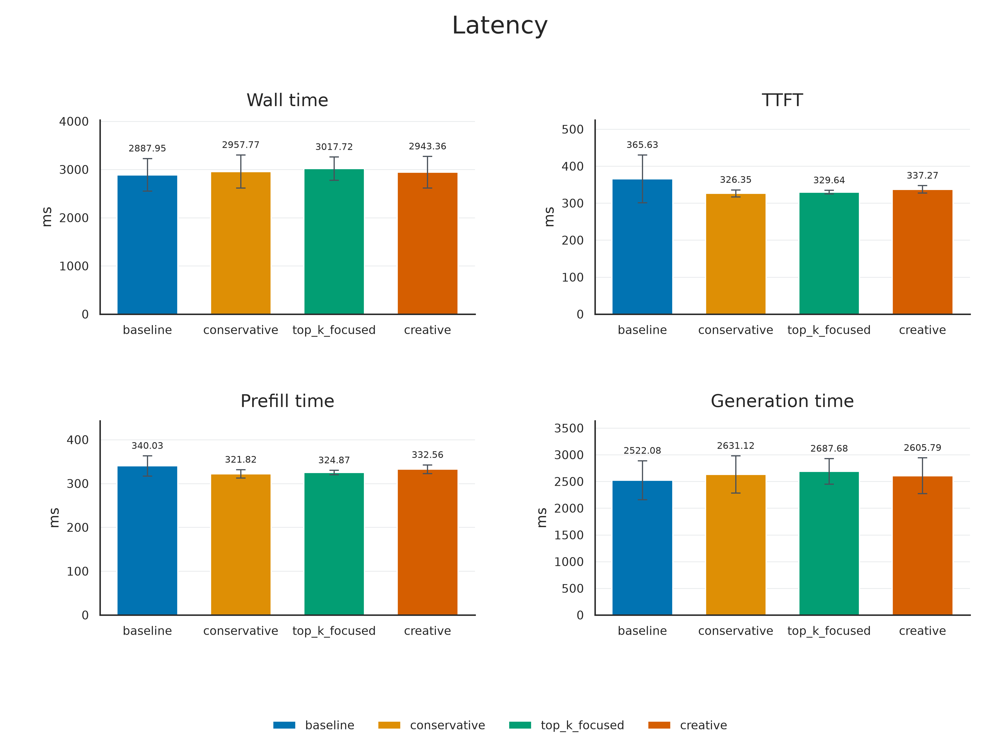

###### Per Token Latency

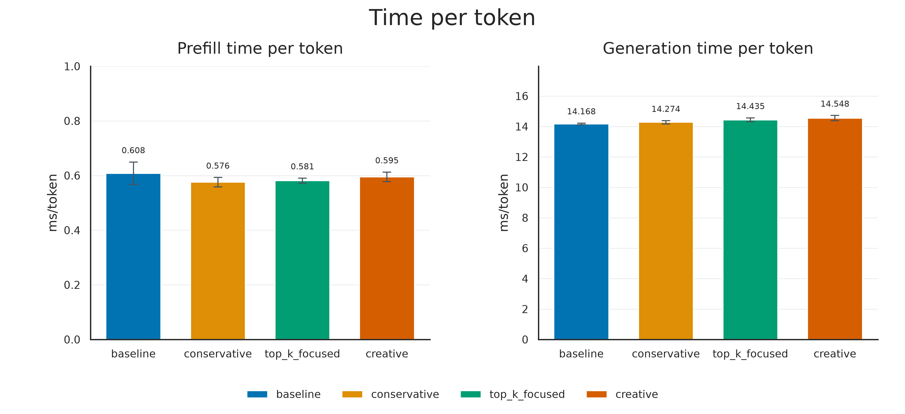

###### Throughput

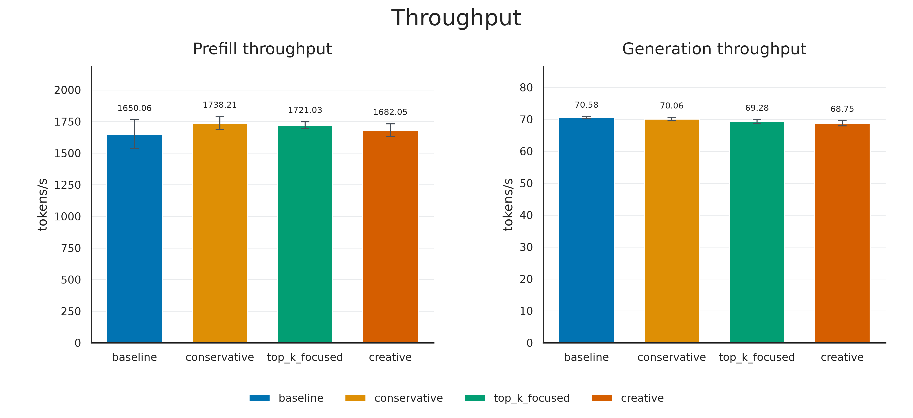

###### Token Counts

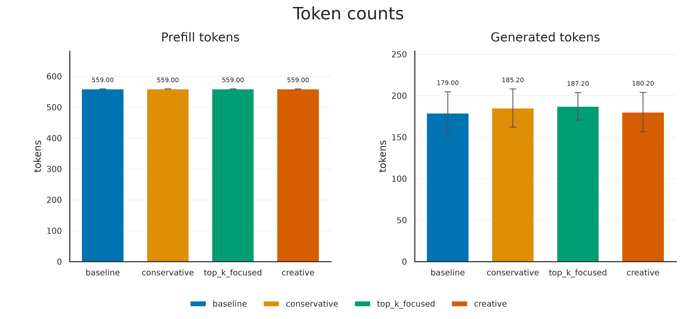

###### Token Usage

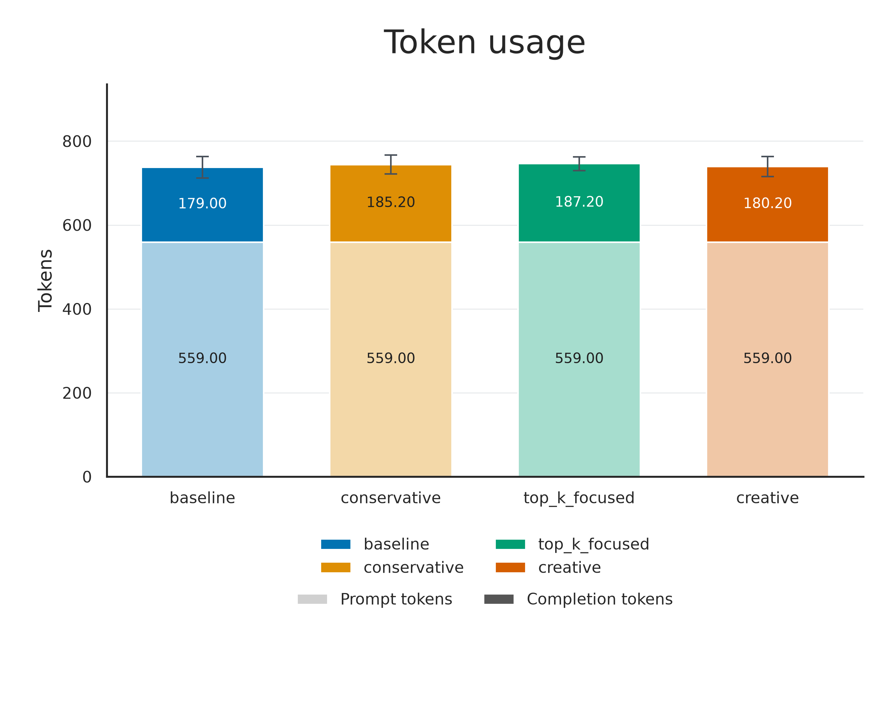

###### Timings Table

| Preset | Cached input tokens (tokens) | Wall time (ms) | TTFT (ms) | Prefill tokens (tokens) | Prefill time (ms) | Prefill time per token (ms/token) | Prefill throughput (tokens/s) | Generated tokens (tokens) | Generation time (ms) | Generation time per token (ms/token) | Generation throughput (tokens/s) |
| --- | --- | --- | --- | --- | --- | --- | --- | --- | --- | --- | --- |
| baseline | 0.00 +- 0.00 | **2887.95 +- 338.93** | 365.63 +- 64.46 | 559.00 +- 0.00 | 340.03 +- 22.99 | 0.608 +- 0.041 | 1650.06 +- 113.01 | 179.00 +- 25.66 | **2522.08 +- 364.40** | **14.168 +- 0.051** | **70.58 +- 0.25** |
| conservative | 0.00 +- 0.00 | 2957.77 +- 342.74 | **326.35 +- 9.42** | 559.00 +- 0.00 | **321.82 +- 9.62** | **0.576 +- 0.017** | **1738.21 +- 50.57** | 185.20 +- 22.88 | 2631.12 +- 347.63 | 14.274 +- 0.106 | 70.06 +- 0.52 |
| top_k_focused | 0.00 +- 0.00 | 3017.72 +- 240.73 | 329.64 +- 4.82 | 559.00 +- 0.00 | 324.87 +- 5.09 | 0.581 +- 0.009 | 1721.03 +- 26.77 | 187.20 +- 16.53 | 2687.68 +- 238.67 | 14.435 +- 0.127 | 69.28 +- 0.61 |
| creative | 0.00 +- 0.00 | 2943.36 +- 326.67 | 337.27 +- 9.89 | 559.00 +- 0.00 | 332.56 +- 9.73 | 0.595 +- 0.017 | 1682.05 +- 50.05 | 180.20 +- 23.81 | 2605.79 +- 335.24 | 14.548 +- 0.171 | 68.75 +- 0.81 |

---

#### 2. Классификация

Ответы модели по конфигурациям настроек:

- [baseline](../results/report_materials/preset_comparison/qwen3.5-4b/p2_classification/responses_baseline.md);
- [conservative](../results/report_materials/preset_comparison/qwen3.5-4b/p2_classification/responses_conservative.md);
- [top_k_focused](../results/report_materials/preset_comparison/qwen3.5-4b/p2_classification/responses_top_k_focused.md);
- [creative](../results/report_materials/preset_comparison/qwen3.5-4b/p2_classification/responses_creative.md);

##### Производительность модели

Сводка использует уже рассчитанные accuracy и n_correct. Средняя точность составляет **80,00 ± 3,04%** для baseline и conservative, **81,11 ± 3,04%** для top_k_focused и **78,89 ± 4,65%** для creative. Это соответственно **14,40 ± 0,55**, **14,40 ± 0,55**, **14,60 ± 0,55** и **14,20 ± 0,84** правильных классификаций из 18. Небольшое преимущество top_k_focused в этой серии составляет 0,2 правильного ответа относительно baseline; по пяти повторам его нельзя считать доказательством устойчивого превосходства настройки.

Ошибки сосредоточены прежде всего на смешанных оценках:

- **Отзыв 8:** ожидается **Bad**, модель выбирает **Neutral** во всех пяти повторах каждого пресета. Критика общего впечатления соседствует с похвалой актёров и языка; итоговая метка модели сглаживает негативную оценку.
- **Отзыв 12:** ожидается **Neutral**, модель выбирает **Good** в 5/5 повторов baseline, conservative и top_k_focused и в 4/5 повторов creative. Формулировки «не плохой фильм» и «ничего больше плохого» оказываются связаны с положительной категорией, хотя в эталоне отзыв нейтральный.
- **Отзыв 18:** ожидается **Neutral**, модель выбирает **Good** в 5/5 повторов всех пресетов. Слова «действительно хороший фильм» и высокая оценка отдельной сцены выражают положительное отношение, однако оценка качества в эксперименте определяется именно сохранённой эталонной меткой.
- **Отзыв 7:** ожидается **Neutral**, выбор **Good** возникает в 2/5 повторов baseline, 1/5 top_k_focused и 2/5 creative; при conservative ошибок на этом отзыве нет.
- **Отзыв 10:** ожидается **Neutral**; выбор **Bad** наблюдается в 1/5 повторов baseline, 3/5 conservative и 1/5 top_k_focused. В creative есть одна ошибка с выбором **Good**, то есть меняется даже направление отклонения.
- Только у **creative** появляется по одной ошибке на отзывах **2** и **5**: явно положительный и явно отрицательный отзывы получают **Neutral**.

Таким образом, изменение пресета не устраняет постоянные ошибки 8 и 18 и почти не устраняет ошибку 12. Матрицы показывают, что у baseline, conservative и top_k_focused все 30 предсказаний для положительных отзывов верны, а 25 из 30 для отрицательных верны; основной разброс относится к нейтральным отзывам. У creative появляются дополнительные отклонения также в положительном и отрицательном классах. Числовая стабильность качества ухудшается: std точности увеличивается с 3,04 до 4,65 процентного пункта.

###### Accuracy

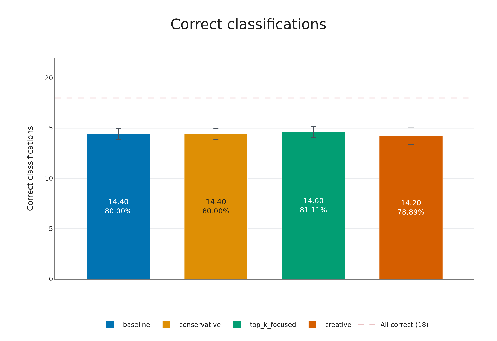

###### Latency

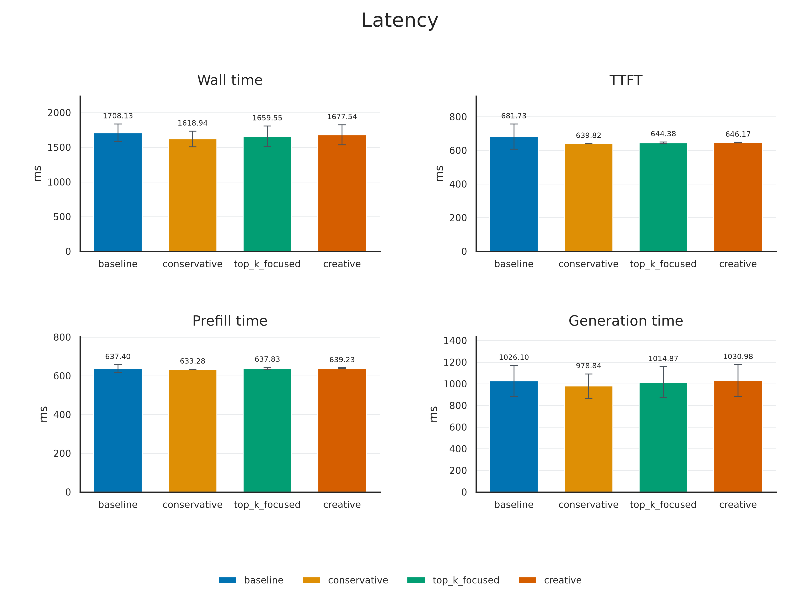

###### Per Token Latency

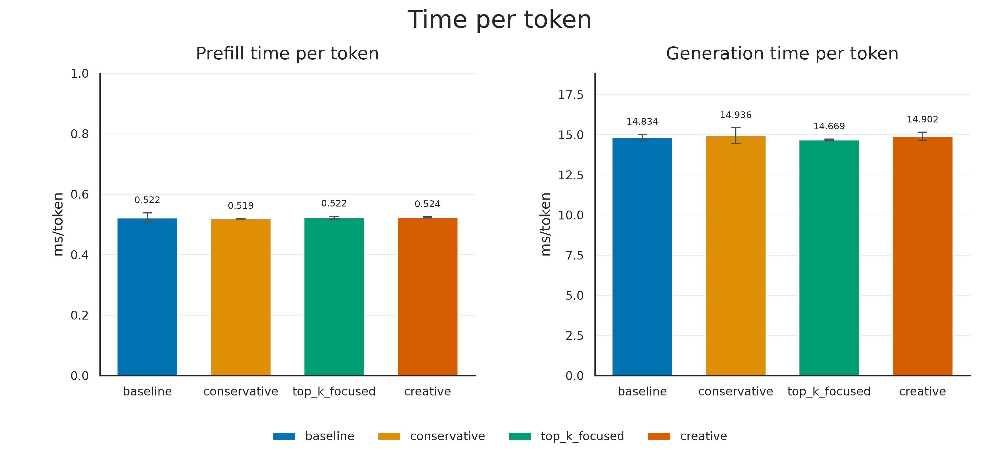

###### Throughput

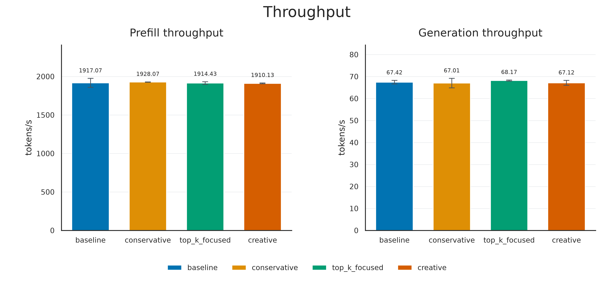

###### Token Counts

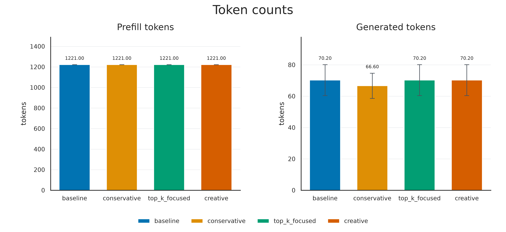

###### Token Usage


##### Частота ошибок по инстансам

###### baseline

| Measure | 1 | 2 | 3 | 4 | 5 | 6 | 7 | 8 | 9 | 10 | 11 | 12 | 13 | 14 | 15 | 16 | 17 | 18 |
| --- | --- | --- | --- | --- | --- | --- | --- | --- | --- | --- | --- | --- | --- | --- | --- | --- | --- | --- |
| Expected class | Good | Good | Bad | Good | Bad | Bad | Neutral | Bad | Neutral | Neutral | Good | Neutral | Good | Good | Neutral | Bad | Bad | Neutral |
| Incorrect predictions | 0 | 0 | 0 | 0 | 0 | 0 | 2 | 5 | 0 | 1 | 0 | 5 | 0 | 0 | 0 | 0 | 0 | 5 |
| Total predictions | 5 | 5 | 5 | 5 | 5 | 5 | 5 | 5 | 5 | 5 | 5 | 5 | 5 | 5 | 5 | 5 | 5 | 5 |

| Actual / Predicted | Good | Bad | Neutral |
| --- | --- | --- | --- |
| Good | 30 | 0 | 0 |
| Bad | 0 | 25 | 5 |
| Neutral | 12 | 1 | 17 |

###### conservative

| Measure | 1 | 2 | 3 | 4 | 5 | 6 | 7 | 8 | 9 | 10 | 11 | 12 | 13 | 14 | 15 | 16 | 17 | 18 |
| --- | --- | --- | --- | --- | --- | --- | --- | --- | --- | --- | --- | --- | --- | --- | --- | --- | --- | --- |
| Expected class | Good | Good | Bad | Good | Bad | Bad | Neutral | Bad | Neutral | Neutral | Good | Neutral | Good | Good | Neutral | Bad | Bad | Neutral |
| Incorrect predictions | 0 | 0 | 0 | 0 | 0 | 0 | 0 | 5 | 0 | 3 | 0 | 5 | 0 | 0 | 0 | 0 | 0 | 5 |
| Total predictions | 5 | 5 | 5 | 5 | 5 | 5 | 5 | 5 | 5 | 5 | 5 | 5 | 5 | 5 | 5 | 5 | 5 | 5 |

| Actual / Predicted | Good | Bad | Neutral |
| --- | --- | --- | --- |
| Good | 30 | 0 | 0 |
| Bad | 0 | 25 | 5 |
| Neutral | 10 | 3 | 17 |

###### top_k_focused

| Measure | 1 | 2 | 3 | 4 | 5 | 6 | 7 | 8 | 9 | 10 | 11 | 12 | 13 | 14 | 15 | 16 | 17 | 18 |
| --- | --- | --- | --- | --- | --- | --- | --- | --- | --- | --- | --- | --- | --- | --- | --- | --- | --- | --- |
| Expected class | Good | Good | Bad | Good | Bad | Bad | Neutral | Bad | Neutral | Neutral | Good | Neutral | Good | Good | Neutral | Bad | Bad | Neutral |
| Incorrect predictions | 0 | 0 | 0 | 0 | 0 | 0 | 1 | 5 | 0 | 1 | 0 | 5 | 0 | 0 | 0 | 0 | 0 | 5 |
| Total predictions | 5 | 5 | 5 | 5 | 5 | 5 | 5 | 5 | 5 | 5 | 5 | 5 | 5 | 5 | 5 | 5 | 5 | 5 |

| Actual / Predicted | Good | Bad | Neutral |
| --- | --- | --- | --- |
| Good | 30 | 0 | 0 |
| Bad | 0 | 25 | 5 |
| Neutral | 11 | 1 | 18 |

###### creative

| Measure | 1 | 2 | 3 | 4 | 5 | 6 | 7 | 8 | 9 | 10 | 11 | 12 | 13 | 14 | 15 | 16 | 17 | 18 |
| --- | --- | --- | --- | --- | --- | --- | --- | --- | --- | --- | --- | --- | --- | --- | --- | --- | --- | --- |
| Expected class | Good | Good | Bad | Good | Bad | Bad | Neutral | Bad | Neutral | Neutral | Good | Neutral | Good | Good | Neutral | Bad | Bad | Neutral |
| Incorrect predictions | 0 | 1 | 0 | 0 | 1 | 0 | 2 | 5 | 0 | 1 | 0 | 4 | 0 | 0 | 0 | 0 | 0 | 5 |
| Total predictions | 5 | 5 | 5 | 5 | 5 | 5 | 5 | 5 | 5 | 5 | 5 | 5 | 5 | 5 | 5 | 5 | 5 | 5 |

| Actual / Predicted | Good | Bad | Neutral |
| --- | --- | --- | --- |
| Good | 29 | 0 | 1 |
| Bad | 0 | 24 | 6 |
| Neutral | 12 | 0 | 18 |

---

#### 3. Суммаризация

Ответы модели по конфигурациям настроек:

- [baseline](../results/report_materials/preset_comparison/qwen3.5-4b/p3_summary/responses_baseline.md);
- [conservative](../results/report_materials/preset_comparison/qwen3.5-4b/p3_summary/responses_conservative.md);
- [top_k_focused](../results/report_materials/preset_comparison/qwen3.5-4b/p3_summary/responses_top_k_focused.md);
- [creative](../results/report_materials/preset_comparison/qwen3.5-4b/p3_summary/responses_creative.md);

В каждом пресете подробно рассматривается Response 1, затем коротко — Response 2. Оценка LLM as a judge касается точности относительно исходного поста, сохранения ключевых мыслей, связности и ограничения 4–5 предложений; подсчёт покрытия тезисов здесь не применяется.

##### baseline

**Response 1**

> В финальной серии четвертого сезона аниме «Re:Zero» режиссер Синохара создал захватывающие боевые сцены, включая эпичную битву Эмилии против Волканики и трогательное завершение истории Шаулы. Автор поста высоко оценил адаптацию шестой арки, отметив, что финал с пробуждением Рема стал воплощением эмоционального великолепия, превосходящим оригинальную новеллу. Несмотря на отсутствие адаптации седьмой арки, серия длиной более 40 минут укрепила репутацию проекта как одного из лучших в жанре. Общее впечатление от выпуска, сочетающего динамичный экшен и глубокие драматические моменты, составило 9,5 из 10 баллов.

###### Анализ содержания и следования инструкциям

Резюме состоит из **четырёх предложений**, без служебного вступления. Оно выделяет бой Эмилии с Волканикой, историю Шаулы, завершение шестой арки и пробуждение Рем, а также сохраняет отсутствие адаптации седьмой арки, длительность более 40 минут и оценку 9,5/10. Общий восторг автора передан, а объём действительно существенно сокращён относительно исходного поста.

Однако несколько связей восстановлены неверно. В источнике автор отдельно говорит, что некоторые сцены Шаулы в аниме действуют сильнее, чем в новелле. В ответе оборот «превосходящим оригинальную новеллу» относится уже к финалу с пробуждением Рем. Это перенос оценки между разными эпизодами исходного текста. Фраза «укрепила репутацию проекта как одного из лучших в жанре» вообще не имеет основания в посте: автор оценивает серию, а не описывает общественную репутацию проекта.

Синохара в исходном тексте упомянут в связи с раскадровкой. Ответ называет его режиссёром и приписывает ему создание боевых сцен. Даже если такая роль могла бы подтверждаться внешними сведениями, в рамках запрета добавлять отсутствующую информацию подобное уточнение не следует считать проверенным. Формулировка «общее впечатление ... составило 9,5» немного механическая, но значение оценки сохранено.

Результат выглядит гладким резюме и проходит формальное ограничение, однако гладкость маскирует неподтверждённые утверждения и перенос оценки между сценами.

###### Другой пример суммаризации

**Response 2**

> Автор оценивает финал 19-й серии 4-го сезона Re:Zero как «чистое великолепие», особенно отмечая захватывающую битву между Эмилией и Волканикой. Рецензент особо похвалил эмоциональную сцену расставания Шаулы, где её нежный поцелуй в щёку и появление маленького скорпиона произвели на зрителя гораздо большее впечатление, чем оригинальные новеллы. Несмотря на то, что серия не затрагивает сюжет седьмой арки, адаптация шестой арки и финальная сцена с пробуждением Рема признаны вершиной режиссерского мастерства Синохары. Всего серию длилось почти 41 минуту, что позволило максимально раскрыть динамику и глубину эмоций. В итоговой оценке этот эпизод получил высокий балл 9,5 из 10.

Второй ответ содержит **пять предложений**, без вводного текста. Он подробнее и точнее передаёт историю Шаулы: поцелуй в щёку, маленького скорпиона и более сильный эмоциональный эффект аниме. Пробуждение Рем, граница шестой и седьмой арок, почти 41 минута и 9,5/10 также сохранены.

По сравнению с первым примером он лучше по фактической опоре. Но «Всего серию длилось почти 41 минуту» содержит явную грамматическую ошибку, а объяснение, что именно эта длительность «позволила максимально раскрыть динамику и глубину эмоций», добавляет причинную связь, которую автор не устанавливал. Такое предложение следовало бы сократить до факта продолжительности.

###### Оценка LLM as a judge

Первый ответ недостаточно надёжен для точного резюме из-за репутационного утверждения и переноса сравнения с новеллой на другую сцену. Второй удачнее по сохранению ключевых фактов, но нуждается в языковой редакции и удалении придуманного объяснения роли длительности. Формат 4–5 предложений соблюдён во всех пяти ответах baseline, однако это не гарантирует фактическую точность: например, `Response 3` и `Response 5` путают 19-ю серию с 19-м сезоном. Синтаксическая компактность выполнена лучше, чем требование не добавлять и не искажать сведения.

##### conservative

**Response 1**

> Автор оценивает финальную серию 4 сезона «Re:Zero» как абсолютный пик с динамичной битвой Эмилии против Волканики и эмоциональной сценой прощания с Шаулой. Особое восхищение вызывает момент появления маленького скорпиона и финальная сцена пробуждения Рема, которую автор называет воплощением великолепия. Несмотря на то, что адаптация охватывает шестую арку до последней строчки, в серию не включили события седьмой арки. В целом, автор ставит этой серии оценку 9,5 из 10, отмечая безупречную раскадровку и режиссуру.

###### Анализ содержания и следования инструкциям

В ответе **четыре предложения**, служебного вступления нет. Суммаризация имеет ясную структуру: общий восторг и две основные линии эпизода, затем маленький скорпион и пробуждение Рем, граница адаптации арок и итоговая оценка.

Все названные события опираются на исходный текст. «Сцена прощания с Шаулой» — допустимое сжатие описанного завершения её истории, а «воплощение великолепия» сохраняет сильную положительную оценку финала. Верно передано, что шестая арка адаптирована до последней строки, а седьмая не включена. Оценка 9,5/10, раскадровка и режиссура также не заменяются придуманными фактами.

Резюме не сообщает номер серии и её продолжительность, не передаёт подробно улучшение восприятия Шаулы по сравнению с новеллой и не перечисляет все эффектные моменты боя. Для ограничения в четыре предложения это допустимые потери детализации: основные сюжетные линии, отношение автора и важная граница адаптации остаются понятны. В отличие от первого baseline здесь нет ни неподтверждённой репутации проекта, ни переноса оценки с одной сцены на другую.

Язык достаточно естественный, хотя плотное первое предложение объединяет несколько объектов похвалы. В целом это аккуратный короткий пересказ, который сохраняет предмет авторского восторга.

###### Другой пример суммаризации

**Response 2**

> Автор оценивает финальную серию четвертого сезона «Re:Zero» как абсолютный пик с динамичной битвой между Эмилией и Волканикой, а также эмоциональной адаптацией истории Шаулы, включая её поцелуй в щёку и появление маленького скорпиона. Несмотря на то, что автор признает, что седьмая арка в этой серии не адаптирована, он считает финальную сцену пробуждения Рема воплощением совершенства и великолепной режиссурой. Хотя некоторые моменты в новеллах казались слащавыми, в аниме они получили невероятную глубину благодаря раскадровке Синохары и саундтреку. В целом, автор ставит этой серии высокую оценку в 9,5 из 10, отмечая её как бесконечно восторженную часть сезона.

Второй пример также состоит из **четырёх предложений**. Он добавляет поцелуй Шаулы и сравнение с ранее слащавыми моментами новеллы, сохраняя изменение восприятия в аниме благодаря раскадровке и музыке. Здесь нет явного нового сюжетного события.

По сравнению с первым примером больше внимания уделено эмоциональной адаптации Шаулы, но исчезает явное указание на завершение шестой арки. Конструкция «Несмотря на то, что ... седьмая арка ... не адаптирована» создаёт не очень уместный контраст: автор не называл эту границу недостатком. Последняя фраза «бесконечно восторженную часть сезона» звучит неправильно, поскольку восторг испытывает автор, а не часть сезона. Содержательно пример хороший, языково первый лучше.

###### Оценка LLM as a judge

Из двух выбранных ответов первый наиболее аккуратен: он не пытается заполнять пропуски дополнительными событиями или внешними оценками и сохраняет общий смысл исходного поста. Второй также полезен, но нуждается в правке неестественной концовки. Это локальный результат, а не гарантия пресета: `Response 3` заменяет пробуждение Рем «восхождением» и добавляет долгий перерыв в выпуске, хотя речь шла о задержке публикации поста; `Response 5` превращает слова Субару о том, что он её герой и скучал, в признание в любви. Все пять ответов формально содержат четыре предложения, но фактическая надёжность различается.

##### top_k_focused

**Response 1**

> Автор оценивает финальную серию 4 сезона «Re:Zero» как абсолютный пик с динамичной битвой Эмилии против Волканики и эмоциональной сценой прощания с Шаулой. Особое впечатление произвела адаптация конца шестой арки, где Рем наконец проснулся, что автор считает воплощением совершенства режиссуры. Несмотря на отсутствие адаптации седьмой арки, автор отмечает, что продолжительность серии составила около 41 минуты, а концовка осталась скрытой от читателей. В целом пост подводит итог как высокому качеству аниме-сезона, ставшему для многих культовым событием.

###### Анализ содержания и следования инструкциям

Резюме содержит **четыре предложения**, без вводного текста. Начало верно выделяет бой Эмилии с Волканикой и эмоциональную историю Шаулы. Также сохраняются завершение шестой арки, пробуждение Рем, отсутствие адаптации седьмой арки и около 41 минуты.

Дальше появляются два неподтверждённых обобщения. «Концовка осталась скрытой от читателей» не соответствует исходнику: автор прямо раскрывает пробуждение Рем и последнюю реплику Субару, скрывая конкретные решения раскадровки и то, что покажут после. Отказ спойлерить отдельные детали нельзя заменять утверждением, что вся концовка скрыта. «Культовое событие» для многих тоже не следует из поста одного автора и расширяет его личную оценку до мнения аудитории.

В ответе пропущена заметная итоговая цифра 9,5/10, хотя последняя фраза могла бы передать её вместо выдуманного статуса. «Рем наконец проснулся» меняет согласование относительно женского персонажа исходника. В итоге компактное резюме содержит центральные события, но неудачно тратит последнее предложение на сведения вне источника.

###### Другой пример суммаризации

**Response 2**

> Автор оценивает финал 19-й серии 4-го сезона «Re:Zero» как «чистое великолепие», особенно отметив захватывающую битву между Эмилией и Волканикой, а также эмоциональную адаптацию истории Шаулы, где сцены с поцелуем и милым маленьким скорпионом оказали сильное воздействие. Несмотря на то, что автор признает слащавость некоторых моментов в новеллах, аниме-версия с великолепной раскадровкой Синохара превзошла ожидания, сохранив при этом табу на седьмую арку. Финальная сцена пробуждения Рема описывается как пик адаптации шестой арки, идеально передающая чувства Субару и его обещание быть героем для Рема. В общей сложности серия длилась около 41 минуты, и автор ставит ей высокую оценку в 9,5 из 10, называя её абсолютным пиком сезона.

Во втором ответе **четыре предложения**. Он сохраняет больше важных фактов: историю Шаулы с поцелуем и скорпионом, реакцию автора на аниме по сравнению с новеллой, пробуждение Рем, 41 минуту и 9,5/10. Поэтому в целом он информативнее первого.

Но оборот «сохранив при этом табу на седьмую арку» смешивает разные части исходника. Табу нарушается в сюжете из-за появления Луи; отсутствие экранизации седьмой арки — отдельное замечание автора о границах адаптации. Это не запрет на седьмую арку. «Обещание быть героем для Рема» также меняет речевой акт: Субару говорит, что он её герой, а не формулирует обещание на будущее. Основные факты присутствуют, но смысловые связи требуют проверки.

###### Оценка LLM as a judge

Первый пример слабее из-за неподтверждённого культового статуса, неправильного масштаба скрываемой концовки и потери оценки. Второй лучше по полноте, но ошибка с табу делает его ненадёжным без сверки с источником. Этот пресет не устраняет ни путаницу фактов, ни ошибки связей: `Response 3` содержит только три предложения и пишет о 19-м сезоне; `Response 4` меняет роли в финальной реплике, утверждая, что Субару называет Рем героем. Последний случай особенно показателен: нужные имена и тема присутствуют, но само событие передано неверно.

##### creative

**Response 1**

> Режиссеры White Fox создали захватывающий финал 19-й серии «Re:Zero», сочетая динамичную битву Эмилии против Волканики с глубокой эмоциональной сценой прощения между Субару и Шаулой. Несмотря на то, что автор не стал спойлерить финал с пробуждением Рема, он охарактеризовал его как воплощение «великолепия и великолепия», ставшее главным моментом эпизода. Визуальная составляющая, включая раскадровку Синохара и эмоциональный саундтрек, усилила даже сцену прощания с Шаулой, сделав её более трогательной, чем в новеллах. Хотя серия не адаптировала седьмую арку, её общая длина в 41 минуту позволила полностью раскрыть шестую линию сюжета. Обладая высокой оценкой 9,5 из 10, этот эпизод описывается как идеальный баланс экшена, драмы и визуального искусства.

###### Анализ содержания и следования инструкциям

Ответ состоит из **пяти предложений**, без служебного вступления. Он сообщает о бое Эмилии и Волканики, эмоциональной линии Шаулы, пробуждении Рем, раскадровке и музыке, неадаптированной седьмой арке, длительности 41 минута и оценке 9,5/10. На уровне перечня тем это насыщенное резюме.

Однако «сцена прощения между Субару и Шаулой» добавляет отсутствующее событие. Исходник описывает завершение её истории, поцелуй, слёзы и многовековое ожидание; прощение там не упоминается. Возможно, модель спутала «прощение» и «прощание», но в сохранённом ответе написано именно первое, и смысл изменён.

Фраза «автор не стал спойлерить финал с пробуждением Рема» также неточна: пробуждение раскрыто прямо, а скрыты постановочные решения и последующие детали. Цитата «великолепия и великолепия» теряет второе слово оригинального оборота «великолепие и великолепность». Наконец, утверждение, что 41 минута «позволила полностью раскрыть шестую линию сюжета», устанавливает не указанную автором причинную связь.

Текст старается обобщить достоинства серии как баланс экшена, драмы и визуального искусства. Такое оценочное сжатие допустимо как вывод из восторженного поста, но конкретные события и причины при этом должны оставаться точными. Здесь именно они оказались изменены.

###### Другой пример суммаризации

**Response 2**

> Автор оценивает финальный эпизод четвертого сезона Re:Zero как шедевр с высокой динамикой, особенно выделяя захватывающую битву Эмилии против Волканики и эмоциональное завершение истории Шаулы. Хотя в адаптации были опущены элементы седьмой арки, сцена пробуждения Рема, названная самим сценаристом воплощенным великолепием, стала главной эмоциональной кульминацией серии. Разработчики White Fox показали безупречную раскадровку и музыку, превратив даже ранее слащавые моменты в глубоко трогательные. Несмотря на отсутствие спойлеров о финальных решениях, автор дает этой серии высочайший рейтинг в 9,5 из 10 баллов.

Второй пример содержит **четыре предложения**. Бой, завершение истории Шаулы, усиление эмоционального эффекта через раскадровку и музыку, пробуждение Рем и 9,5/10 сохранены. Длительность и явное завершение шестой арки пропущены.

Главная новая ошибка — «названная самим сценаристом воплощенным великолепием»: эта оценка принадлежит автору поста, а не указанному сценаристу. «Были опущены элементы седьмой арки» менее точно, чем исходное прямое «ничего из седьмой арки не адаптировали», поскольку может создавать впечатление частичной адаптации. «Разработчики White Fox» — неудачная номинация студийной работы. По сравнению с первым примером исчезло выдуманное прощение, но появилось неверное авторство оценки.

###### Оценка LLM as a judge

Оба выбранных ответа проходят ограничение числа предложений и сохраняют общий положительный тон, но не выполняют требование фактической точности достаточно надёжно. Дополнения затрагивают не только стиль: меняются событие и источник оценки. В остальных ответах creative встречаются ещё более явные ошибки: `Response 3` придумывает «скорпиона-дочь», 19-й сезон и отсутствующую в посте цитату; `Response 5` меняет направление чувства, будто Рем скучала по Субару, тогда как в исходнике это говорит Субару о себе. Поэтому по этой серии creative требует наиболее внимательной проверки суммаризации. Формально все пять ответов имеют 4–5 предложений, но хороший формат не компенсирует искажение фактов.

##### Производительность модели

###### Latency

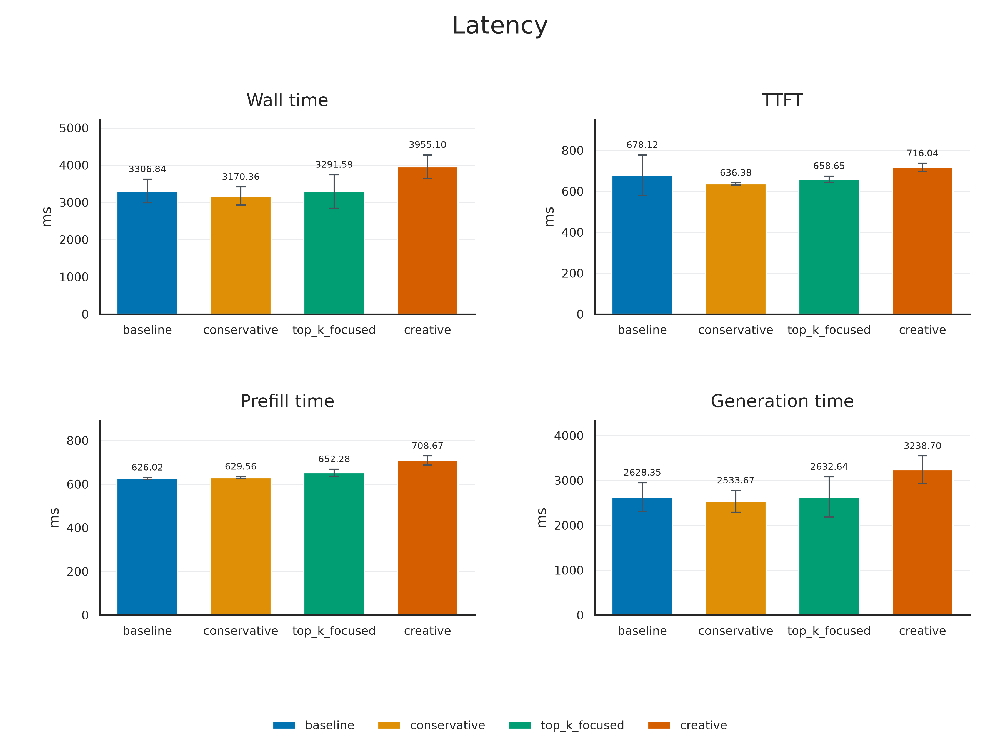

###### Per Token Latency

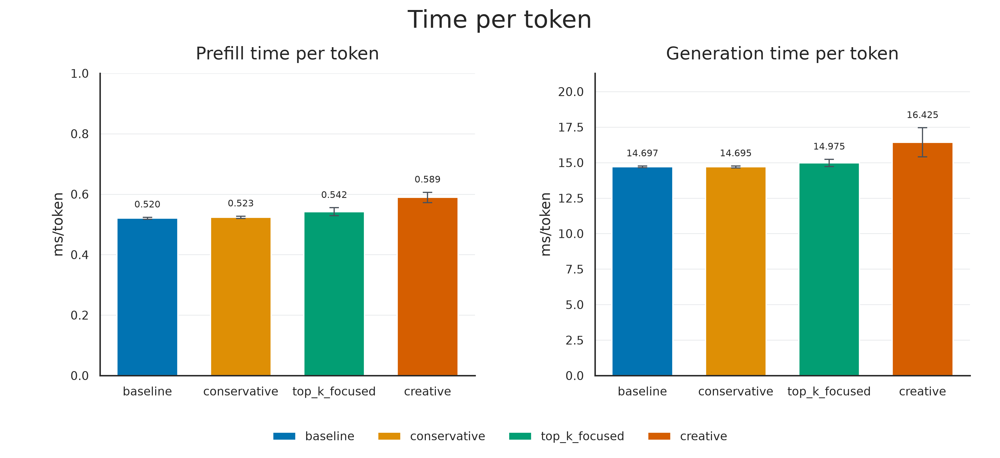

###### Throughput

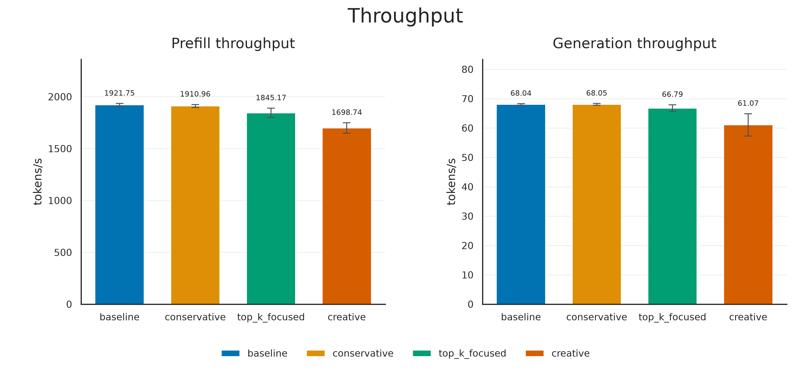

###### Token Counts

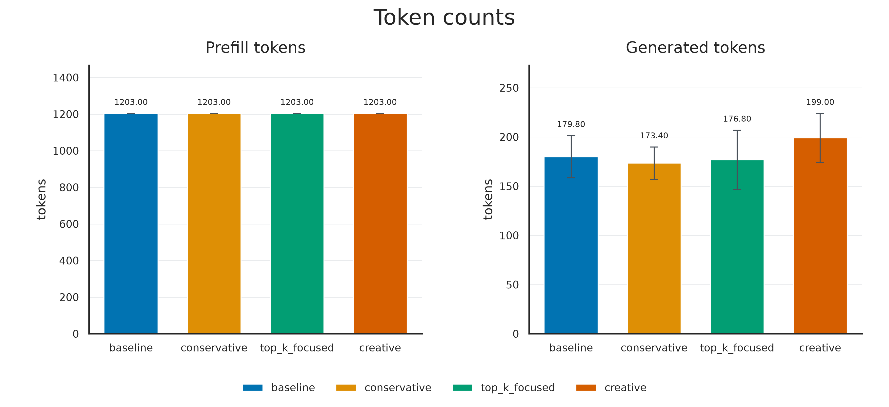

###### Token Usage

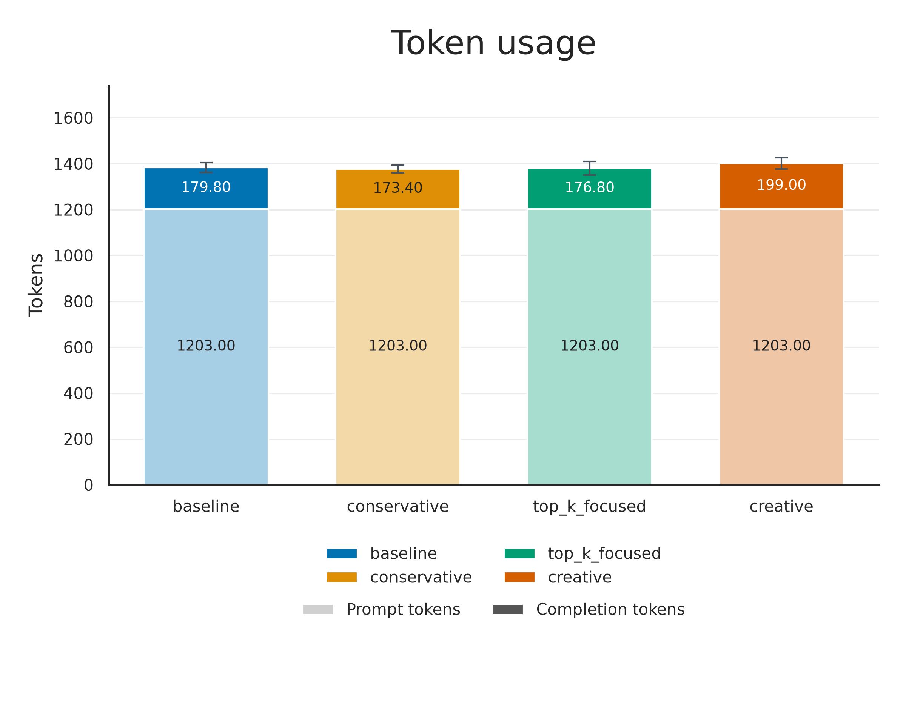

###### Timings Table

| Preset | Cached input tokens (tokens) | Wall time (ms) | TTFT (ms) | Prefill tokens (tokens) | Prefill time (ms) | Prefill time per token (ms/token) | Prefill throughput (tokens/s) | Generated tokens (tokens) | Generation time (ms) | Generation time per token (ms/token) | Generation throughput (tokens/s) |
| --- | --- | --- | --- | --- | --- | --- | --- | --- | --- | --- | --- |
| baseline | 0.00 +- 0.00 | 3306.84 +- 313.87 | 678.12 +- 99.38 | 1203.00 +- 0.00 | **626.02 +- 4.16** | **0.520 +- 0.003** | **1921.75 +- 12.78** | 179.80 +- 21.43 | 2628.35 +- 320.68 | 14.697 +- 0.057 | 68.04 +- 0.27 |
| conservative | 0.00 +- 0.00 | **3170.36 +- 242.86** | **636.38 +- 5.00** | 1203.00 +- 0.00 | 629.56 +- 4.83 | 0.523 +- 0.004 | 1910.96 +- 14.59 | 173.40 +- 16.33 | **2533.67 +- 242.21** | **14.695 +- 0.063** | **68.05 +- 0.29** |
| top_k_focused | 0.00 +- 0.00 | 3291.59 +- 449.83 | 658.65 +- 15.79 | 1203.00 +- 0.00 | 652.28 +- 15.80 | 0.542 +- 0.013 | 1845.17 +- 44.73 | 176.80 +- 30.02 | 2632.64 +- 446.97 | 14.975 +- 0.255 | 66.79 +- 1.13 |
| creative | 0.00 +- 0.00 | 3955.10 +- 317.68 | 716.04 +- 20.54 | 1203.00 +- 0.00 | 708.67 +- 20.77 | 0.589 +- 0.017 | 1698.74 +- 50.32 | 199.00 +- 24.79 | 3238.70 +- 306.90 | 16.425 +- 1.026 | 61.07 +- 3.81 |


#### Вывод о влиянии настроек

Для Qwen baseline фактически означает temperature≈0,8, top_k=40 и top_p≈0,95 из сохранённого metadata.json. Conservative меняет temperature на 0,2 и top_p на 0,8; top_k_focused — temperature на 0,5 и top_k на 20; creative — temperature на 1,1 и top_p на 0,98. Поэтому результаты нельзя приписывать только temperature: в каждом настроенном пресете совместно изменяются два параметра, остальные наследуются от сервера.

В генерации conservative сохраняет сравнительно связную структуру выбранных ответов, но два из пяти постов короче 80 слов и остаются смысловые потери. Top_k_focused выдерживает длину во всех пяти ответах, однако не защищает от смешения языков и переворота смысла вырезанного контента. У creative заметнее языковые сбои и подмены, включая следующий сезон вместо эпизода; один ответ имеет только 64 слова. Таким образом, увеличение свободы не дало устойчивого выигрыша в качестве выполнения этого промпта.

В суммаризации выбранные conservative Response 1 и Response 2 осторожнее в обращении с исходными событиями, чем выбранные creative. Но и у conservative есть другие ответы с новыми событиями. Baseline и top_k_focused сохраняют основные темы, при этом могут неверно переносить оценку между сценами, путать границу адаптации с сюжетным табу или менять роли персонажей. Для всех пресетов требуется содержательная проверка, даже когда число предложений соблюдено.

В классификации различия средних невелики: top_k_focused имеет 81,11%, baseline и conservative — 80,00%, creative — 78,89%. При creative возрастает std и появляются ошибки на двух ранее устойчивых отзывах. Эти результаты согласуются с большей вариативностью ответов, однако не доказывают причинную роль отдельного параметра. Выводы ограничены данными трёх конкретных промптов и пяти повторов каждой комбинации.

---

### Сравнение моделей

В этом разделе сопоставляются измеренные показатели производительности и, для классификации, заранее рассчитанные `accuracy` и `n_correct`. Все значения представлены как среднее ± выборочное стандартное отклонение (`ddof=1`) по пяти повторам. Графики показывают разброс этих повторов; он не является доверительным интервалом. Качество свободной генерации и суммаризации здесь не сравнивается.

В экспериментах использованы одинаковые тексты промптов, контекст 4096 токенов, квантизация Q4_K_M, отключённый reasoning и одна сборка llama.cpp `b11046-60081bb2b`. Для каждой конфигурации выполнены пять повторов с seed 42–46. При этом одинаковое имя пресета не означает полного совпадения sampling: в `conservative` задаются `temperature=0.2` и `top_p=0.8`, в `creative` — `temperature=1.1` и `top_p=0.98`, а `top_k` наследуется от настроек сервера. Для Gemma 4 он равен 64, для Phi-4-mini и Qwen3.5-4B — 40. В `baseline` также различается исходная температура: 1.0 для Gemma и 0.8 для двух других моделей. Следовательно, сравнение относится к фактически запущенным конфигурациям; оно не изолирует влияние архитектуры от всех настроек генерации. Пресет `top_k_focused` с общими `temperature=0.5` и `top_k=20` в данное сравнение не включён.

Число токенов зависит от токенизатора и шаблона чата модели. Поэтому одинаковый входной текст может иметь разную токенную длину, а токены в секунду нельзя напрямую приравнивать к словам или символам в секунду. `prompt_tokens_per_second` характеризует обработку уже токенизированного промпта моделью — prefill; отдельная скорость токенизации в эксперименте не измеряется.

#### 1. Генерация

##### conservative

###### Latency

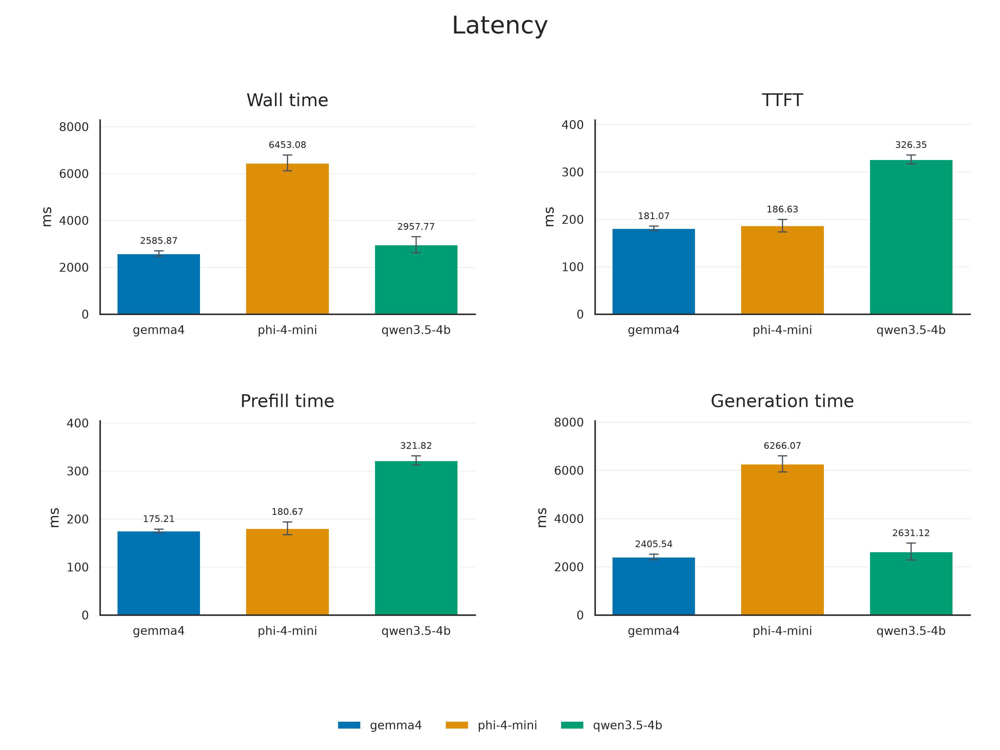

###### Per Token Latency

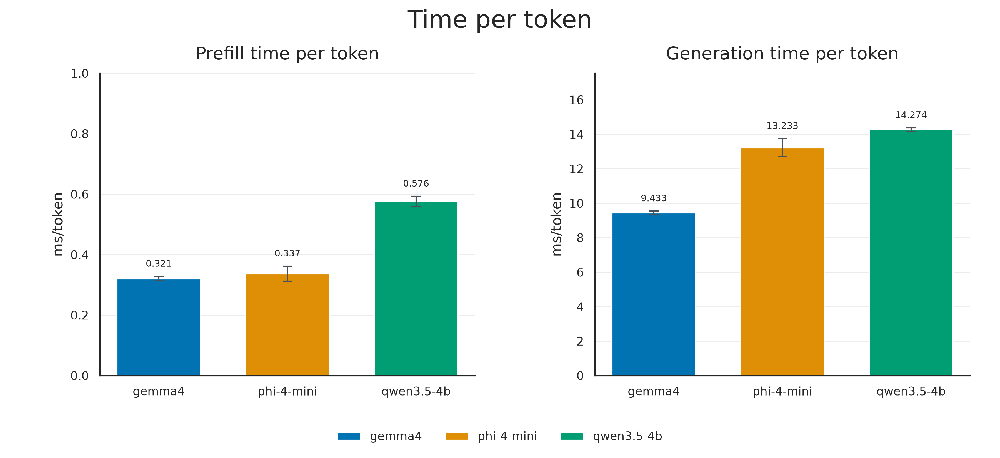

###### Throughput

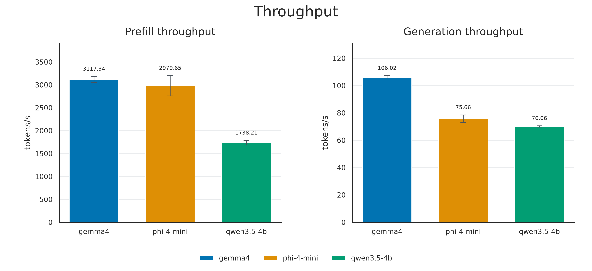

###### Token Counts

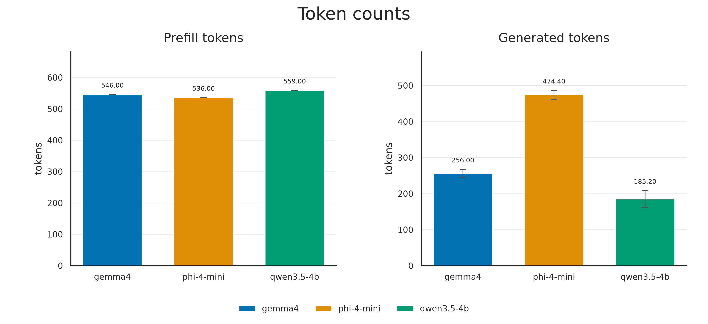

###### Token Usage

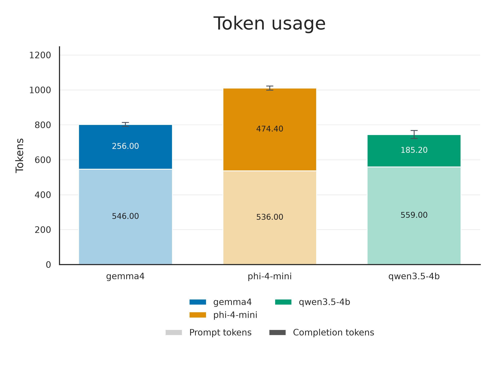

###### Timings Table

| Model | Cached input tokens (tokens) | Wall time (ms) | TTFT (ms) | Prefill tokens (tokens) | Prefill time (ms) | Prefill time per token (ms/token) | Prefill throughput (tokens/s) | Generated tokens (tokens) | Generation time (ms) | Generation time per token (ms/token) | Generation throughput (tokens/s) |
| --- | --- | --- | --- | --- | --- | --- | --- | --- | --- | --- | --- |
| gemma4 | 0.00 +- 0.00 | **2585.87 +- 112.80** | **181.07 +- 4.56** | 546.00 +- 0.00 | **175.21 +- 3.79** | **0.321 +- 0.007** | **3117.34 +- 67.22** | 256.00 +- 11.34 | **2405.54 +- 114.23** | **9.433 +- 0.113** | **106.02 +- 1.26** |
| phi-4-mini | 0.00 +- 0.00 | 6453.08 +- 337.99 | 186.63 +- 13.08 | 536.00 +- 0.00 | 180.67 +- 13.17 | 0.337 +- 0.025 | 2979.65 +- 222.31 | 474.40 +- 12.03 | 6266.07 +- 333.14 | 13.233 +- 0.519 | 75.66 +- 2.88 |
| qwen3.5-4b | 0.00 +- 0.00 | 2957.77 +- 342.74 | 326.35 +- 9.42 | 559.00 +- 0.00 | 321.82 +- 9.62 | 0.576 +- 0.017 | 1738.21 +- 50.57 | 185.20 +- 22.88 | 2631.12 +- 347.63 | 14.274 +- 0.106 | 70.06 +- 0.52 |

По полному времени запроса Gemma 4 получает минимальное среднее: **2585.87 ± 112.80 мс**. Qwen3.5-4B требуется **2957.77 ± 342.74 мс**, Phi-4-mini — **6453.08 ± 337.99 мс**. Таким образом, среднее время Qwen примерно в 1.14 раза, а Phi — в 2.50 раза выше времени Gemma. Для пользователя это соответствует ожиданию полного ответа около 2.59, 2.96 и 6.45 секунды соответственно.

Время до первого непустого фрагмента у Gemma и Phi близко: **181.07 ± 4.56 мс** и **186.63 ± 13.08 мс**. У Qwen оно составляет **326.35 ± 9.42 мс**. Такая же последовательность наблюдается у prefill: 175.21 ± 3.79, 180.67 ± 13.17 и 321.82 ± 9.62 мс. У Gemma и Phi вход содержит 546 и 536 токенов, у Qwen — 559; небольшая разница входного объёма сопровождается существенно большим временем prefill Qwen. Скорость обработки промпта составляет **3117.34 ± 67.22**, **2979.65 ± 222.31** и **1738.21 ± 50.57 токена/с** соответственно. Это показатели инференса входных токенов, а не измерения работы токенизатора.

На стадии decode Gemma имеет максимальную скорость — **106.02 ± 1.26 токена/с**, затем идут Phi с **75.66 ± 2.88** и Qwen с **70.06 ± 0.52 токена/с**. Время на выходной токен имеет обратный порядок: 9.433 ± 0.113, 13.233 ± 0.519 и 14.274 ± 0.106 мс/токен. Но полное время Phi оказывается значительно выше Qwen, хотя её токенная скорость больше. Существенное различие здесь — выходной объём: **474.40 ± 12.03 токена** у Phi, **256.00 ± 11.34** у Gemma и **185.20 ± 22.88** у Qwen. В пределах измеренных токенных объёмов ответ Phi примерно в 1.85 раза длиннее ответа Gemma и в 2.56 раза длиннее ответа Qwen. Поэтому для оценки задержки необходимы одновременно скорость decode и длина ответа.

Генерация занимает 2405.54 ± 114.23 мс у Gemma, 6266.07 ± 333.14 мс у Phi и 2631.12 ± 347.63 мс у Qwen и составляет основную часть полного времени. У Qwen заметен разброс выходной длины и времени завершения при сравнительно небольшом std скорости decode: 22.88 токена, 342.74 мс полного времени и 0.52 токена/с соответственно. Это согласуется с тем, что изменяется прежде всего количество генерируемых токенов. Gemma имеет меньший абсолютный разброс wall time — 112.80 мс. У Phi разброс wall time равен 337.99 мс при довольно устойчивой выходной длине — std 12.03 токена; кроме длины, между её повторами различается и скорость decode.

Входная длина внутри каждой модели постоянна, поэтому std `prompt_tokens` равен нулю. Суммарный расход составляет 802.00 ± 11.34 токена у Gemma, 1010.40 ± 12.03 у Phi и 744.20 ± 22.88 у Qwen. Кэшированные токены во всех случаях равны нулю.

##### creative

###### Latency

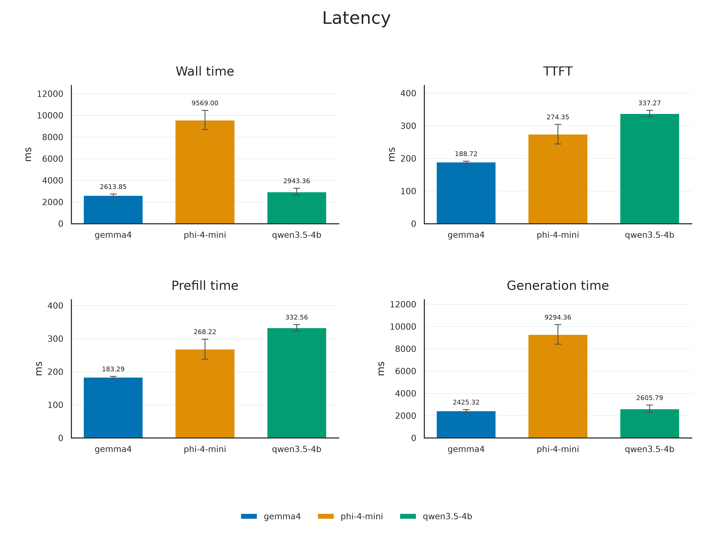

###### Per Token Latency

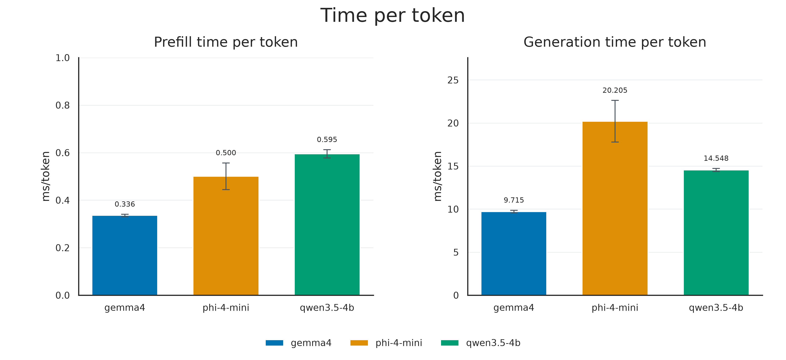

###### Throughput

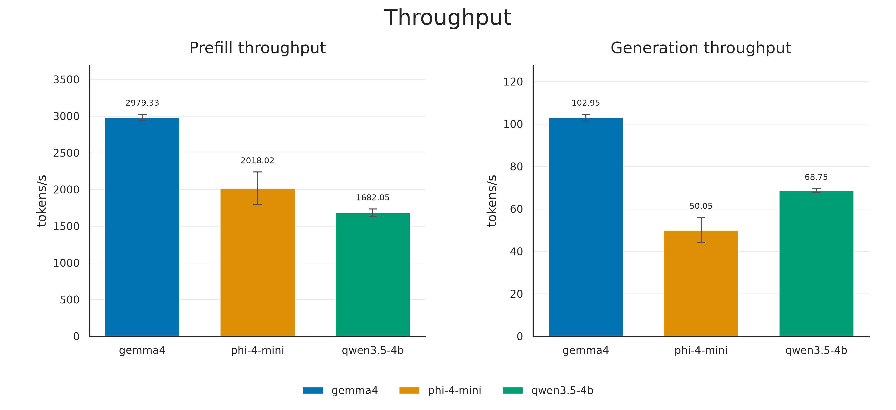

###### Token Counts

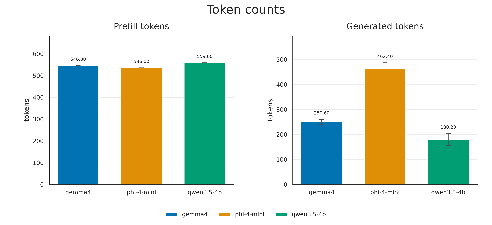

###### Token Usage

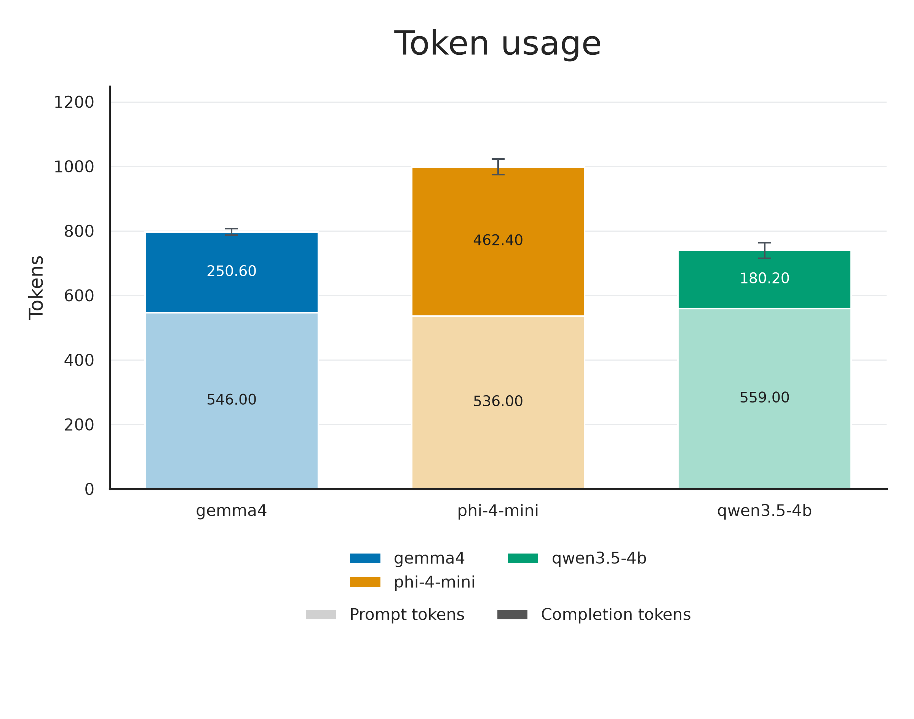

###### Timings Table

| Model | Cached input tokens (tokens) | Wall time (ms) | TTFT (ms) | Prefill tokens (tokens) | Prefill time (ms) | Prefill time per token (ms/token) | Prefill throughput (tokens/s) | Generated tokens (tokens) | Generation time (ms) | Generation time per token (ms/token) | Generation throughput (tokens/s) |
| --- | --- | --- | --- | --- | --- | --- | --- | --- | --- | --- | --- |
| gemma4 | 0.00 +- 0.00 | **2613.85 +- 118.59** | **188.72 +- 2.86** | 546.00 +- 0.00 | **183.29 +- 2.63** | **0.336 +- 0.005** | **2979.33 +- 43.32** | 250.60 +- 10.33 | **2425.32 +- 119.14** | **9.715 +- 0.148** | **102.95 +- 1.56** |
| phi-4-mini | 0.00 +- 0.00 | 9569.00 +- 888.15 | 274.35 +- 29.99 | 536.00 +- 0.00 | 268.22 +- 30.17 | 0.500 +- 0.056 | 2018.02 +- 218.63 | 462.40 +- 24.59 | 9294.36 +- 876.59 | 20.205 +- 2.412 | 50.05 +- 5.86 |
| qwen3.5-4b | 0.00 +- 0.00 | 2943.36 +- 326.67 | 337.27 +- 9.89 | 559.00 +- 0.00 | 332.56 +- 9.73 | 0.595 +- 0.017 | 1682.05 +- 50.05 | 180.20 +- 23.81 | 2605.79 +- 335.24 | 14.548 +- 0.171 | 68.75 +- 0.81 |

По среднему полному времени порядок моделей сохраняется: Gemma — **2613.85 ± 118.59 мс**, Qwen — **2943.36 ± 326.67 мс**, Phi — **9569.00 ± 888.15 мс**. Qwen требуется примерно в 1.13 раза больше времени, чем Gemma, Phi — в 3.66 раза. По сравнению с `conservative` среднее время Gemma увеличивается лишь на 1.1%, Qwen уменьшается на 0.5%, а Phi увеличивается на **48.3%**.

Рост времени Phi не объясняется увеличением выходного объёма: её средняя длина, наоборот, немного сокращается с 474.40 до **462.40 ± 24.59 токена**. При этом скорость decode падает с 75.66 до **50.05 ± 5.86 токена/с**, время на токен возрастает с 13.233 до **20.205 ± 2.412 мс**, а время генерации — с 6266.07 до **9294.36 ± 876.59 мс**. Одновременно увеличиваются TTFT (с 186.63 до **274.35 ± 29.99 мс**) и время prefill (с 180.67 до **268.22 ± 30.17 мс**); скорость prefill снижается с 2979.65 до **2018.02 ± 218.63 токена/с**. Это наблюдаемое изменение всей производительности конфигурации в данной серии. По пяти повторам и без отдельного контроля состояния системы нельзя утверждать, что такое замедление вызвано только повышением температуры.

У Gemma средняя длина сокращается с 256.00 до **250.60 ± 10.33 токена**, скорость decode — со 106.02 до **102.95 ± 1.56 токена/с**, а генерация занимает **2425.32 ± 119.14 мс**. TTFT составляет **188.72 ± 2.86 мс**, prefill — **183.29 ± 2.63 мс**, его скорость — **2979.33 ± 43.32 токена/с**. Разница wall time между пресетами мала по сравнению со std отдельных серий. В этих запусках переход к `creative` существенно не меняет время получения полного ответа Gemma.

У Qwen средняя длина также немного сокращается: со 185.20 до **180.20 ± 23.81 токена**. Скорость decode изменяется с 70.06 до **68.75 ± 0.81 токена/с**, а время генерации — с 2631.12 до **2605.79 ± 335.24 мс**. TTFT увеличивается до **337.27 ± 9.89 мс**, prefill занимает **332.56 ± 9.73 мс** при скорости **1682.05 ± 50.05 токена/с**. Более короткий выход сопровождается небольшим уменьшением wall time, несмотря на чуть более медленную обработку входа и выходных токенов.

Разброс полного времени Gemma и Qwen остаётся близким к `conservative`: 118.59 против 112.80 мс и 326.67 против 342.74 мс. У Phi std wall time возрастает с 337.99 до 888.15 мс, std длины — с 12.03 до 24.59 токена, std скорости decode — с 2.88 до 5.86 токена/с. Суммарное число токенов составляет 796.60 ± 10.33 у Gemma, 998.40 ± 24.59 у Phi и 739.20 ± 23.81 у Qwen; входные объёмы между пресетами не меняются, кэш остаётся нулевым.

**Вывод по генерации.** В обоих пресетах Gemma имеет минимальные средние TTFT и wall time и максимальную токенную скорость decode. Qwen завершает запросы лишь немного позже Gemma, генерируя меньший токенный объём. Phi выдаёт самый большой объём выходных токенов и требует больше всего времени; в серии `creative` её задержка и разброс дополнительно возрастают. Сравнение показывает, почему высокая скорость токенов сама по себе не гарантирует короткое ожидание полного ответа. Эти выводы относятся к конкретному промпту, сохранённым конфигурациям и пяти повторам.

#### 2. Классификация

Для классификации каждый повтор использует один и тот же набор из 18 отзывов. Поэтому пять повторов характеризуют вариативность решения этого набора при разных seed; они не образуют выборку из 90 независимых отзывов. `Accuracy` ниже указана в процентах, а её std — в процентных пунктах.

##### conservative

###### Accuracy

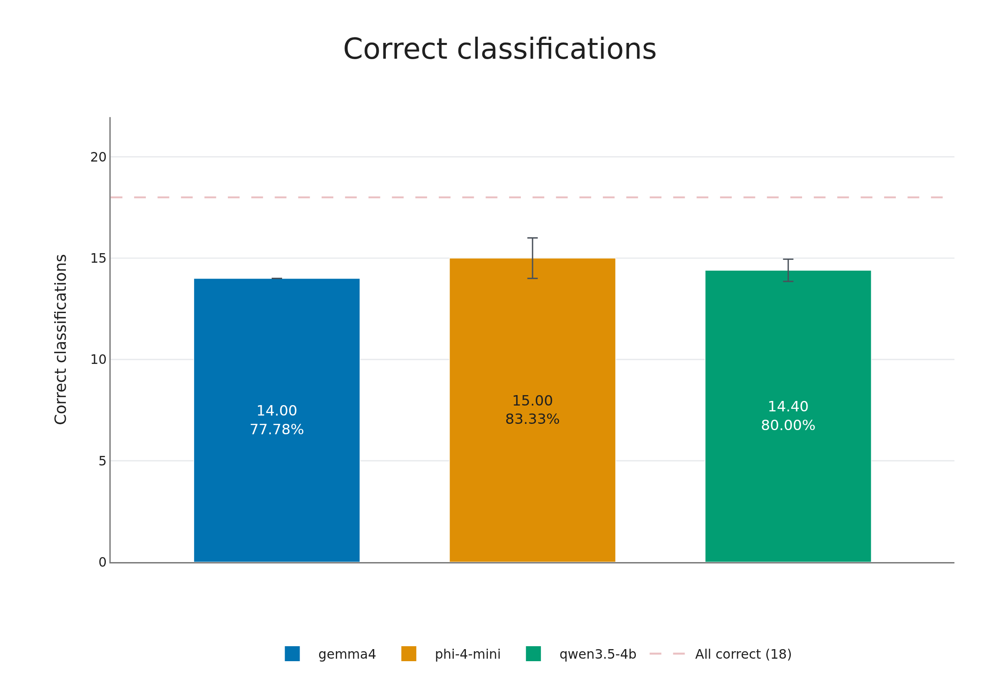

###### Latency

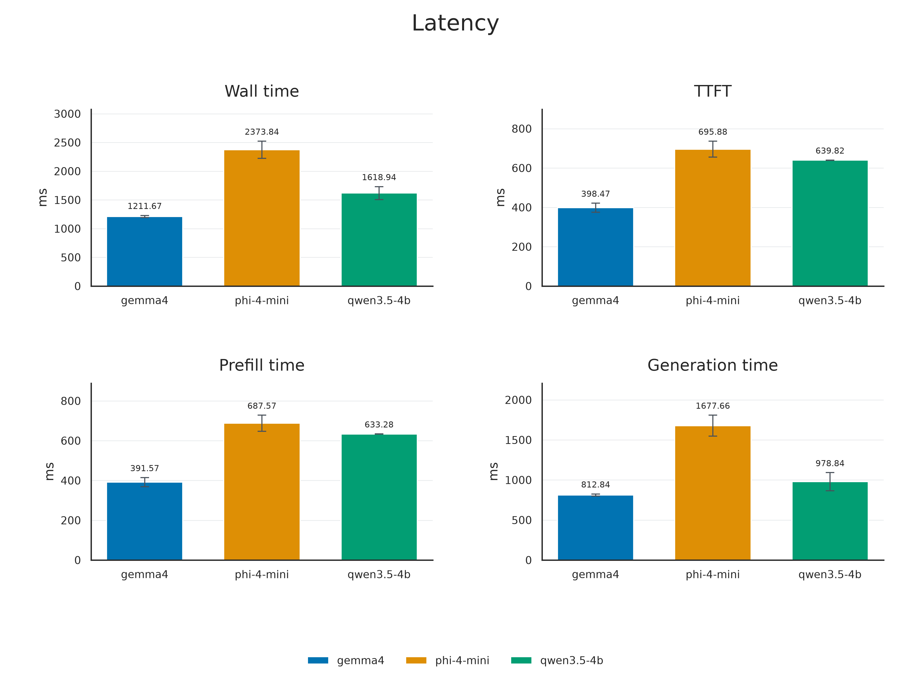

Наибольшее среднее число верных классификаций у Phi: **15.00 ± 1.00 из 18**, или **83.33 ± 5.56%**. Qwen получает **14.40 ± 0.55**, или **80.00 ± 3.04%**. Gemma во всех пяти повторах имеет **14.00 ± 0.00**, или **77.78 ± 0.00%**. Разница Phi относительно Gemma составляет в среднем одну верную классификацию, или 5.55 процентного пункта по округлённым значениям. У Phi при этом наибольший разброс данного показателя. Нулевой std Gemma означает одинаковое число верных ответов; сам по себе этот показатель не доказывает совпадение всех меток классификации.

По времени завершения запросов порядок обратный: **1211.67 ± 18.39 мс** у Gemma, **1618.94 ± 112.49 мс** у Qwen и **2373.84 ± 148.79 мс** у Phi. Qwen требует примерно в 1.34 раза, Phi — в 1.96 раза больше времени, чем Gemma. TTFT составляет соответственно **398.47 ± 22.83**, **639.82 ± 0.60** и **695.88 ± 40.49 мс**. Время prefill — 391.57 ± 22.86, 633.28 ± 0.68 и 687.57 ± 40.60 мс; время генерации — 812.84 ± 12.87, 978.84 ± 112.39 и 1677.66 ± 131.22 мс. У Phi больше средняя точность на этом наборе, но одновременно максимальны ожидание начала и завершения ответа.

##### creative

###### Accuracy

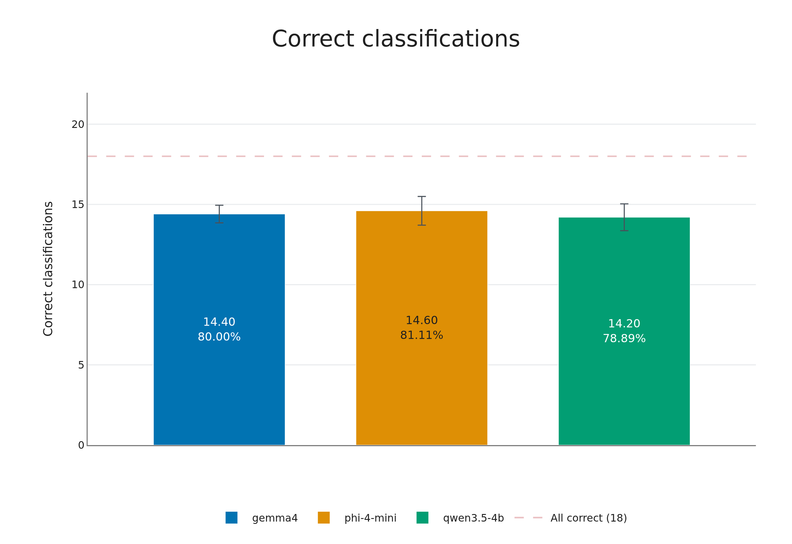

###### Latency

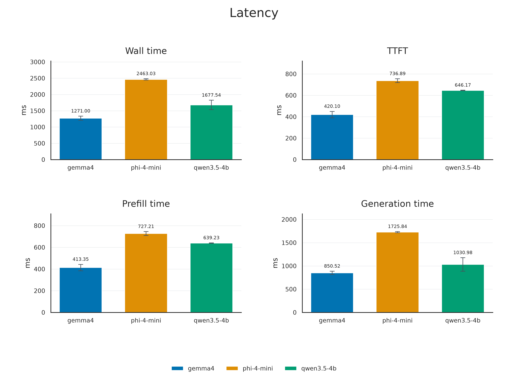

Phi сохраняет первое место по среднему результату: **14.60 ± 0.89** верной классификации и **81.11 ± 4.97%**. У Gemma — **14.40 ± 0.55** и **80.00 ± 3.04%**, у Qwen — **14.20 ± 0.84** и **78.89 ± 4.65%**. Относительно `conservative` среднее число верных ответов Gemma возрастает на 0.40, Phi уменьшается на 0.40, Qwen — на 0.20. Разница между лидирующей Phi и Gemma сокращается до 0.20 ответа, или 1.11 процентного пункта. Такие небольшие различия на одном наборе и при пяти повторах не позволяют установить статистически подтверждённое превосходство или общее влияние пресета на точность.

Среднее wall time составляет **1271.00 ± 64.19 мс** у Gemma, **1677.54 ± 145.08 мс** у Qwen и **2463.03 ± 20.51 мс** у Phi. Относительно `conservative` оно возрастает на 4.9%, 3.6% и 3.8% соответственно. Порядок моделей сохраняется: Qwen требует примерно в 1.32 раза, Phi — в 1.94 раза больше времени, чем Gemma. TTFT равен **420.10 ± 29.60**, **646.17 ± 1.55** и **736.89 ± 18.03 мс**. Prefill занимает 413.35 ± 29.53, 639.23 ± 1.87 и 727.21 ± 18.00 мс, генерация — 850.52 ± 35.64, 1030.98 ± 145.26 и 1725.84 ± 12.58 мс соответственно. При смене пресета std wall time Phi сокращается с 148.79 до 20.51 мс, хотя среднее время немного растёт; для Gemma и Qwen разброс wall time увеличивается.

**Вывод по классификации.** Phi имеет максимальную среднюю точность в обоих пресетах, Gemma — минимальную среднюю задержку. Qwen занимает промежуточное положение по времени. В `creative` разница средней точности между моделями меньше: 78.89–81.11% против 77.78–83.33% в `conservative`. Ни одна конфигурация в среднем не достигает всех 18 верных ответов. Результаты описывают работу на фиксированном наборе отзывов и вариативность повторов, а не качество классификации на произвольной независимой выборке.

#### 3. Суммаризация

##### conservative

###### Latency


###### Per Token Latency

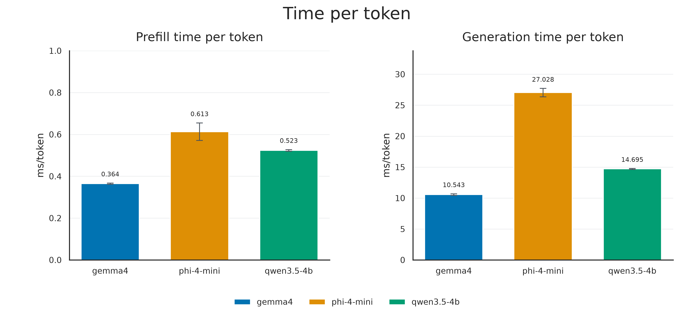

###### Throughput

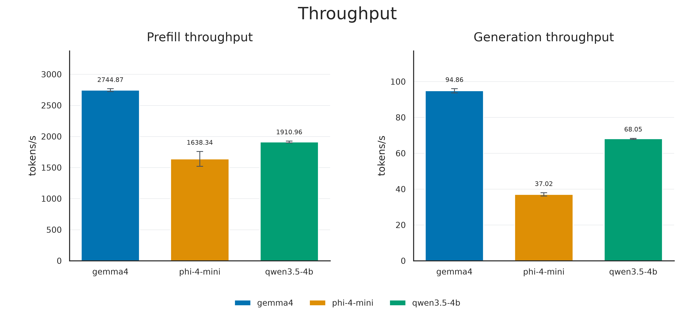

###### Token Counts

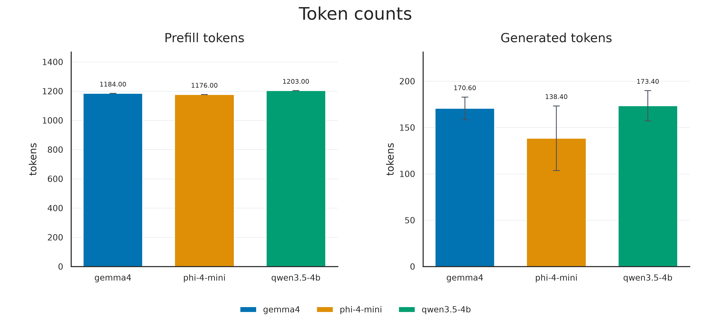

###### Token Usage

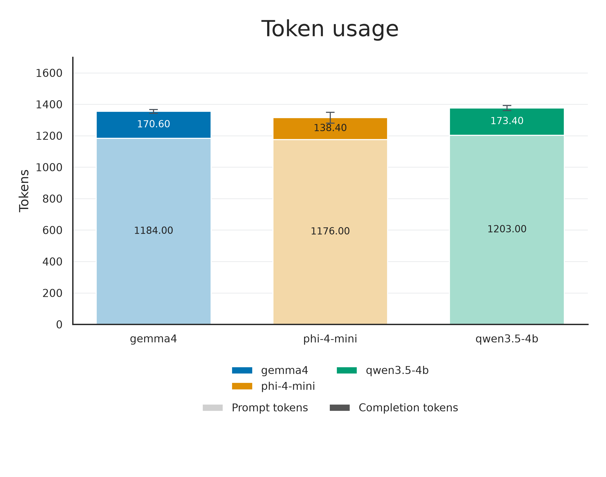

###### Timings Table

| Model | Cached input tokens (tokens) | Wall time (ms) | TTFT (ms) | Prefill tokens (tokens) | Prefill time (ms) | Prefill time per token (ms/token) | Prefill throughput (tokens/s) | Generated tokens (tokens) | Generation time (ms) | Generation time per token (ms/token) | Generation throughput (tokens/s) |
| --- | --- | --- | --- | --- | --- | --- | --- | --- | --- | --- | --- |
| gemma4 | 0.00 +- 0.00 | **2226.51 +- 135.98** | **437.73 +- 3.64** | 1184.00 +- 0.00 | **431.37 +- 3.54** | **0.364 +- 0.003** | **2744.87 +- 22.47** | 170.60 +- 12.16 | **1788.39 +- 135.97** | **10.543 +- 0.129** | **94.86 +- 1.14** |
| phi-4-mini | 0.00 +- 0.00 | 4441.33 +- 983.69 | 729.07 +- 49.31 | 1176.00 +- 0.00 | 720.69 +- 49.42 | 0.613 +- 0.042 | 1638.34 +- 119.70 | 138.40 +- 34.86 | 3711.83 +- 943.24 | 27.028 +- 0.673 | 37.02 +- 0.92 |
| qwen3.5-4b | 0.00 +- 0.00 | 3170.36 +- 242.86 | 636.38 +- 5.00 | 1203.00 +- 0.00 | 629.56 +- 4.83 | 0.523 +- 0.004 | 1910.96 +- 14.59 | 173.40 +- 16.33 | 2533.67 +- 242.21 | 14.695 +- 0.063 | 68.05 +- 0.29 |

Gemma завершает запрос в среднем за **2226.51 ± 135.98 мс**, Qwen — за **3170.36 ± 242.86 мс**, Phi — за **4441.33 ± 983.69 мс**. Qwen требуется примерно в 1.42 раза, Phi — в 2.00 раза больше времени, чем Gemma. TTFT равен **437.73 ± 3.64 мс** у Gemma, **636.38 ± 5.00 мс** у Qwen и **729.07 ± 49.31 мс** у Phi. Скорость prefill составляет **2744.87 ± 22.47**, **1910.96 ± 14.59** и **1638.34 ± 119.70 токена/с** соответственно.

Средние выходные объёмы Gemma и Qwen близки: **170.60 ± 12.16** и **173.40 ± 16.33 токена**. При этом Gemma имеет большую скорость decode — **94.86 ± 1.14 токена/с** против **68.05 ± 0.29** у Qwen. Phi генерирует меньший средний объём — **138.40 ± 34.86 токена**, но её скорость составляет только **37.02 ± 0.92 токена/с**. Время на выходной токен равно 10.543 ± 0.129 мс у Gemma, 14.695 ± 0.063 мс у Qwen и 27.028 ± 0.673 мс у Phi. Поэтому меньший токенный объём Phi в этой серии не компенсирует её более медленный decode: генерация занимает 3711.83 ± 943.24 мс против 1788.39 ± 135.97 мс у Gemma и 2533.67 ± 242.21 мс у Qwen.

У Phi максимальны абсолютный разброс длины ответа и полного времени: std 34.86 токена и 983.69 мс. При сравнительно небольшом std скорости decode это согласуется с заметным изменением выходного объёма между повторами. Входные объёмы постоянны внутри каждой модели и составляют 1184, 1176 и 1203 токена для Gemma, Phi и Qwen. Суммарный расход — 1354.60 ± 12.16, 1314.40 ± 34.86 и 1376.40 ± 16.33 токена; cached tokens равны нулю.

##### creative

###### Latency

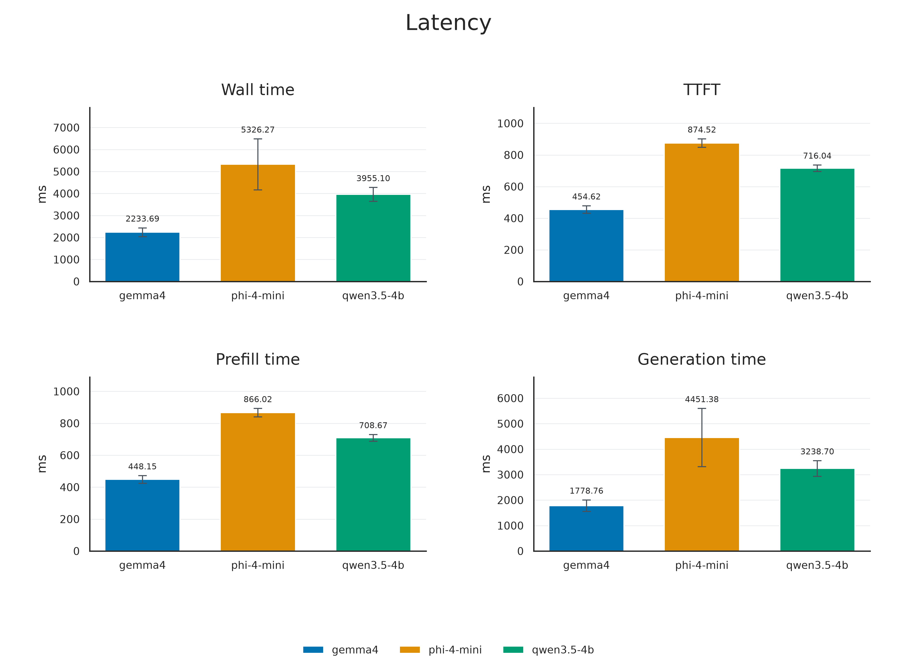

###### Per Token Latency

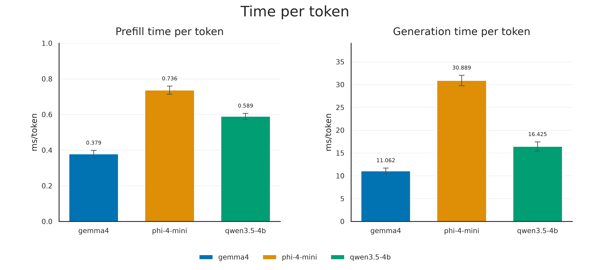

###### Throughput

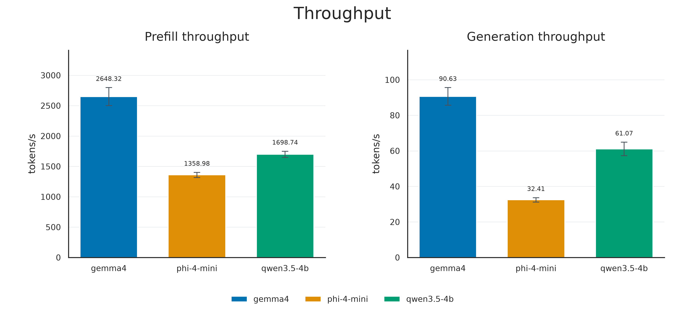

###### Token Counts

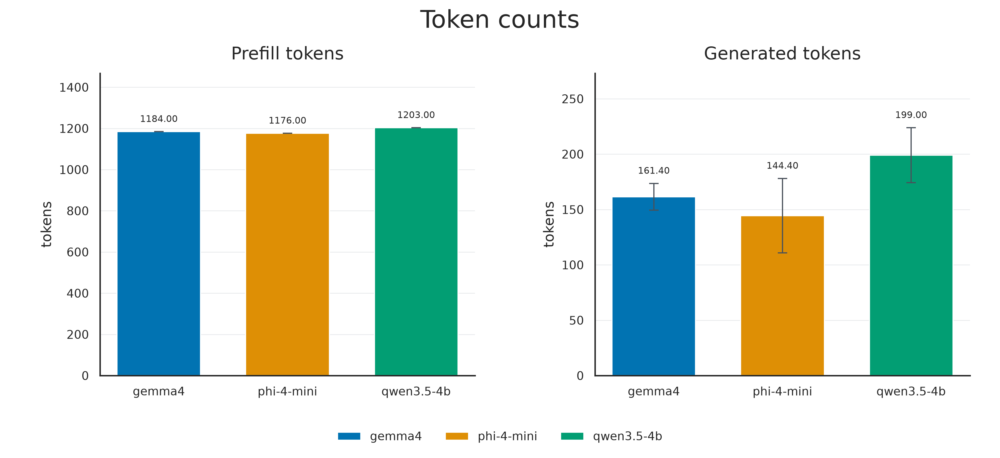

###### Token Usage

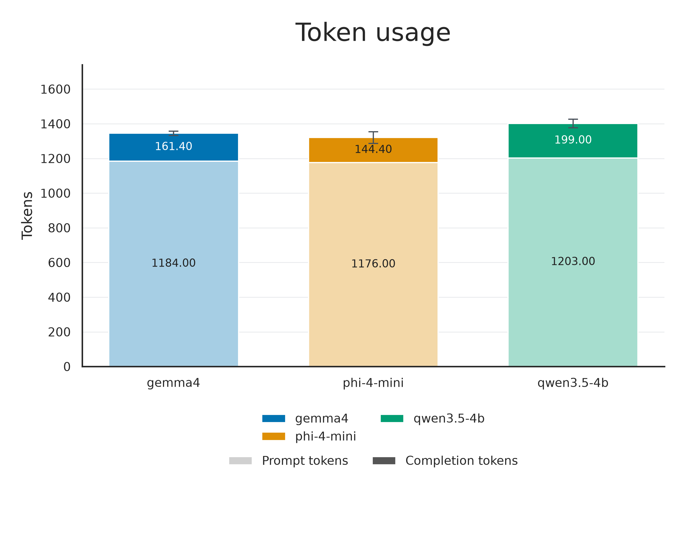

###### Timings Table

| Model | Cached input tokens (tokens) | Wall time (ms) | TTFT (ms) | Prefill tokens (tokens) | Prefill time (ms) | Prefill time per token (ms/token) | Prefill throughput (tokens/s) | Generated tokens (tokens) | Generation time (ms) | Generation time per token (ms/token) | Generation throughput (tokens/s) |
| --- | --- | --- | --- | --- | --- | --- | --- | --- | --- | --- | --- |
| gemma4 | 0.00 +- 0.00 | **2233.69 +- 202.36** | **454.62 +- 23.79** | 1184.00 +- 0.00 | **448.15 +- 23.82** | **0.379 +- 0.020** | **2648.32 +- 148.90** | 161.40 +- 12.10 | **1778.76 +- 225.21** | **11.062 +- 0.648** | **90.63 +- 4.96** |
| phi-4-mini | 0.00 +- 0.00 | 5326.27 +- 1157.52 | 874.52 +- 27.01 | 1176.00 +- 0.00 | 866.02 +- 26.70 | 0.736 +- 0.023 | 1358.98 +- 42.27 | 144.40 +- 33.60 | 4451.38 +- 1144.16 | 30.889 +- 1.137 | 32.41 +- 1.25 |
| qwen3.5-4b | 0.00 +- 0.00 | 3955.10 +- 317.68 | 716.04 +- 20.54 | 1203.00 +- 0.00 | 708.67 +- 20.77 | 0.589 +- 0.017 | 1698.74 +- 50.32 | 199.00 +- 24.79 | 3238.70 +- 306.90 | 16.425 +- 1.026 | 61.07 +- 3.81 |

Порядок моделей по времени сохраняется: Gemma — **2233.69 ± 202.36 мс**, Qwen — **3955.10 ± 317.68 мс**, Phi — **5326.27 ± 1157.52 мс**. По сравнению с `conservative` wall time Gemma изменяется лишь на 0.3%, Qwen увеличивается на **24.8%**, Phi — на **19.9%**. Теперь Qwen требуется примерно в 1.77 раза, Phi — в 2.38 раза больше времени, чем Gemma.

У Gemma средняя длина уменьшается с 170.60 до **161.40 ± 12.10 токена**, скорость decode — с 94.86 до **90.63 ± 4.96 токена/с**. Время генерации остаётся близким: **1778.76 ± 225.21 мс** против 1788.39 ± 135.97 мс. TTFT возрастает до **454.62 ± 23.79 мс**, скорость prefill составляет **2648.32 ± 148.90 токена/с**. В результате меньший выходной объём сопровождается почти тем же средним временем завершения.

У Qwen средняя длина увеличивается с 173.40 до **199.00 ± 24.79 токена** — на 14.8%, а скорость decode уменьшается с 68.05 до **61.07 ± 3.81 токена/с**. Оба изменения согласуются с увеличением времени генерации до **3238.70 ± 306.90 мс**. TTFT составляет **716.04 ± 20.54 мс**, скорость prefill — **1698.74 ± 50.32 токена/с**. У Phi средняя длина возрастает с 138.40 до **144.40 ± 33.60 токена**, скорость decode падает с 37.02 до **32.41 ± 1.25 токена/с**; генерация занимает **4451.38 ± 1144.16 мс**. TTFT Phi увеличивается до **874.52 ± 27.01 мс**, скорость prefill снижается до **1358.98 ± 42.27 токена/с**. Таким образом, увеличение задержки Qwen и Phi наблюдается одновременно с изменением длины ответа и скорости инференса; эти серии не позволяют приписать всю разницу одному sampling-параметру.

Суммарное число токенов составляет 1345.40 ± 12.10 у Gemma, 1402.00 ± 24.79 у Qwen и 1320.40 ± 33.60 у Phi. Средний полный токенный расход Phi по-прежнему минимален, но её wall time максимален. Std wall time увеличивается у всех трёх моделей: со 135.98 до 202.36 мс у Gemma, с 242.86 до 317.68 мс у Qwen и с 983.69 до 1157.52 мс у Phi.

**Вывод по суммаризации.** Gemma имеет минимальные средние задержки и максимальную токенную скорость в обеих конфигурациях. Qwen следует за ней по времени, Phi требует больше всего времени при меньшем среднем числе выходных токенов. Переход к `creative` почти не меняет среднюю задержку Gemma, но в сохранённых сериях сопровождается более длительным выполнением Qwen и Phi. Это вывод о производительности измеренных запусков; он не оценивает содержательную полноту или достоверность суммаризации.

## Заключение

В работе развёрнуты три локальные LLM в Q4_K_M через OpenAI-совместимый API llama.cpp и выполнены эксперименты по генерации, классификации и суммаризации. Для каждой модели исследованы четыре пресета и пять повторов: всего сохранено 180 измеряемых ответов вместе с метриками. Код запуска, исходные промпты и результаты позволяют воспроизвести процедуру и отдельно проверить текстовые ответы и измерения производительности.

Анализ в роли **LLM as a judge** показывает, что выполнение смысловой задачи и соблюдение инструкции необходимо оценивать раздельно. Ответ может передавать основные мысли, но превышать лимит длины, терять детали или искажать отношения между персонажами. Более ограниченное семплирование иногда делает формулировки устойчивее, однако не устраняет такие ошибки. Повышение temperature и top_p тоже не гарантирует ни улучшения текста, ни изменения каждого ответа.

По объективным показателям в сравниваемых conservative и creative Gemma 4 имеет минимальные средние TTFT и полное время запроса во всех трёх задачах. Phi-4-mini достигает максимальной средней точности классификации на выбранных 18 отзывах, но требует больше времени; Qwen занимает промежуточное положение по задержке. Особенно важно учитывать объём выходных токенов вместе со скоростью decode: меньший токенный расход или высокая скорость по отдельности не определяют время получения готового ответа.

Выводы ограничены тремя промптами, пятью повторами и фактически использованными настройками, часть которых наследуется от серверов. Среднее и выборочное стандартное отклонение описывают наблюдаемые результаты, но не доказывают универсальное превосходство модели или причинный эффект отдельного sampling-параметра.
